# Compliance Workflows Specification
## Banking RAG Compliance System

## Table of Contents
1. [Workflow Overview](#1-workflow-overview)
2. [Regulatory Document Processing Workflows](#2-regulatory-document-processing-workflows)
3. [Query Processing Workflows](#3-query-processing-workflows)
4. [Compliance Analysis Workflows](#4-compliance-analysis-workflows)
5. [Report Generation Workflows](#5-report-generation-workflows)
6. [Regulatory Monitoring Workflows](#6-regulatory-monitoring-workflows)
7. [Alert and Notification Workflows](#7-alert-and-notification-workflows)
8. [Audit and Compliance Tracking Workflows](#8-audit-and-compliance-tracking-workflows)
9. [Workflow Orchestration](#9-workflow-orchestration)
10. [Error Handling and Recovery](#10-error-handling-and-recovery)

---

## 1. Workflow Overview

### 1.1 Workflow Categories

The Banking RAG Compliance System implements several categories of automated workflows to ensure comprehensive regulatory compliance management:

```mermaid
graph TB
    subgraph "Document Workflows"
        DW1[Document Ingestion]
        DW2[Document Processing]
        DW3[Content Extraction]
        DW4[Embedding Generation]
    end

    subgraph "Query Workflows"
        QW1[Query Processing]
        QW2[Context Retrieval]
        QW3[Response Generation]
        QW4[Citation Management]
    end

    subgraph "Compliance Workflows"
        CW1[GAP Analysis]
        CW2[Risk Assessment]
        CW3[Compliance Tracking]
        CW4[Remediation Planning]
    end

    subgraph "Monitoring Workflows"
        MW1[Source Monitoring]
        MW2[Change Detection]
        MW3[Impact Analysis]
        MW4[Alert Generation]
    end

    subgraph "Reporting Workflows"
        RW1[Data Collection]
        RW2[Report Generation]
        RW3[Template Processing]
        RW4[Export & Delivery]
    end

    DW1 --> DW2 --> DW3 --> DW4
    QW1 --> QW2 --> QW3 --> QW4
    CW1 --> CW2 --> CW3 --> CW4
    MW1 --> MW2 --> MW3 --> MW4
    RW1 --> RW2 --> RW3 --> RW4
```

### 1.2 Workflow Orchestration Principles

**Event-Driven Architecture:**
- Workflows are triggered by domain events
- Asynchronous processing for improved scalability
- Loose coupling between workflow steps
- Resilient to service failures with retry mechanisms

**State Management:**
- Each workflow maintains state throughout execution
- State persistence for recovery and monitoring
- Checkpoint-based execution for long-running workflows
- Idempotent operations for safe retries

---

## 2. Regulatory Document Processing Workflows

### 2.1 Document Ingestion Workflow

**Workflow Trigger:** Document upload or automated scraping

**Workflow Steps:**

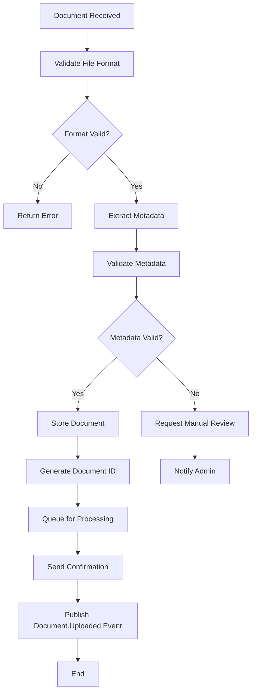

**Implementation:**
```python
class DocumentIngestionWorkflow:
    def __init__(self):
        self.storage_service = DocumentStorageService()
        self.metadata_validator = MetadataValidator()
        self.event_publisher = EventPublisher()
        self.processing_queue = ProcessingQueue()

    async def execute(self, file_data: UploadFile, metadata: DocumentMetadata) -> WorkflowResult:
        """Execute document ingestion workflow"""

        workflow_id = str(uuid.uuid4())

        try:
            # Step 1: Validate file format
            await self.validate_file_format(file_data)

            # Step 2: Extract and validate metadata
            validated_metadata = await self.metadata_validator.validate(metadata)

            # Step 3: Store document
            document_id = await self.storage_service.store_document(
                file_data, validated_metadata
            )

            # Step 4: Queue for processing
            await self.processing_queue.enqueue(DocumentProcessingTask(
                document_id=document_id,
                priority=self.calculate_priority(validated_metadata),
                workflow_id=workflow_id
            ))

            # Step 5: Publish event
            await self.event_publisher.publish(DocumentUploadedEvent(
                document_id=document_id,
                metadata=validated_metadata,
                workflow_id=workflow_id
            ))

            return WorkflowResult(
                status=WorkflowStatus.COMPLETED,
                document_id=document_id,
                workflow_id=workflow_id
            )

        except ValidationError as e:
            # Handle validation errors
            await self.handle_validation_error(workflow_id, e)
            return WorkflowResult(
                status=WorkflowStatus.FAILED,
                error=str(e),
                workflow_id=workflow_id
            )

    async def validate_file_format(self, file_data: UploadFile):
        """Validate uploaded file format and size"""

        allowed_formats = ['.pdf', '.doc', '.docx', '.txt', '.html']
        max_size = 100 * 1024 * 1024  # 100MB

        # Check file extension
        file_extension = Path(file_data.filename).suffix.lower()
        if file_extension not in allowed_formats:
            raise ValidationError(f"Unsupported file format: {file_extension}")

        # Check file size
        if file_data.size > max_size:
            raise ValidationError(f"File too large: {file_data.size} bytes")

        # Additional file content validation
        await self.validate_file_content(file_data, file_extension)

    def calculate_priority(self, metadata: DocumentMetadata) -> ProcessingPriority:
        """Calculate processing priority based on document characteristics"""

        priority_factors = {
            'authority': {
                'EBA': 100,
                'ESMA': 90,
                'ECB': 85,
                'CNMV': 70,
                'BankOfSpain': 65
            },
            'document_type': {
                'regulation': 100,
                'directive': 90,
                'guideline': 80,
                'recommendation': 60,
                'consultation': 40
            },
            'recency': self.calculate_recency_score(metadata.publication_date)
        }

        total_score = (
            priority_factors['authority'].get(metadata.authority, 50) * 0.4 +
            priority_factors['document_type'].get(metadata.document_type, 50) * 0.4 +
            priority_factors['recency'] * 0.2
        )

        if total_score >= 90:
            return ProcessingPriority.HIGH
        elif total_score >= 70:
            return ProcessingPriority.MEDIUM
        else:
            return ProcessingPriority.LOW
```

### 2.2 Document Processing Workflow

**Workflow Trigger:** Document.Uploaded event

**Workflow Steps:**

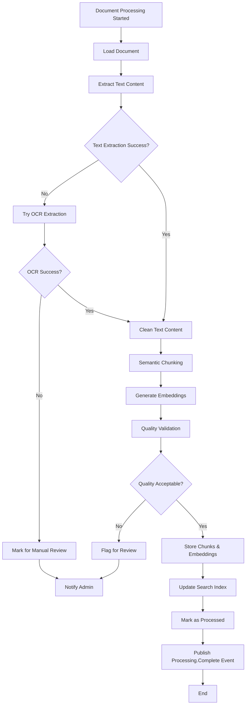

**Implementation:**
```python
class DocumentProcessingWorkflow:
    def __init__(self):
        self.text_extractor = TextExtractor()
        self.chunking_service = SemanticChunkingService()
        self.embedding_service = EmbeddingService()
        self.quality_validator = QualityValidator()
        self.vector_db = VectorDatabase()
        self.search_index = SearchIndex()

    async def execute(self, task: DocumentProcessingTask) -> WorkflowResult:
        """Execute document processing workflow"""

        workflow_state = WorkflowState(
            workflow_id=task.workflow_id,
            document_id=task.document_id,
            status=WorkflowStatus.RUNNING
        )

        try:
            # Step 1: Load document
            document = await self.load_document(task.document_id)

            # Step 2: Extract text content
            text_content = await self.extract_text_content(document)

            # Step 3: Clean and prepare content
            cleaned_content = await self.clean_content(text_content)

            # Step 4: Create semantic chunks
            chunks = await self.chunking_service.create_chunks(
                content=cleaned_content,
                document_metadata=document.metadata,
                chunk_size=1024,
                overlap_size=102
            )

            # Step 5: Generate embeddings
            embeddings = await self.embedding_service.generate_embeddings(
                chunks, model="text-embedding-3-large"
            )

            # Step 6: Quality validation
            quality_report = await self.quality_validator.validate_processing(
                document, chunks, embeddings
            )

            if quality_report.overall_score < 0.7:
                await self.handle_quality_issue(workflow_state, quality_report)
                return WorkflowResult(
                    status=WorkflowStatus.REQUIRES_REVIEW,
                    quality_report=quality_report
                )

            # Step 7: Store processed data
            await self.store_processed_data(document.id, chunks, embeddings)

            # Step 8: Update search index
            await self.update_search_index(document, chunks)

            # Step 9: Mark as processed
            await self.mark_document_processed(document.id, quality_report)

            # Step 10: Publish completion event
            await self.publish_processing_complete_event(document.id, workflow_state.workflow_id)

            return WorkflowResult(
                status=WorkflowStatus.COMPLETED,
                chunks_created=len(chunks),
                quality_score=quality_report.overall_score
            )

        except Exception as e:
            await self.handle_processing_error(workflow_state, e)
            raise WorkflowExecutionError(f"Document processing failed: {str(e)}")

    async def extract_text_content(self, document: Document) -> str:
        """Extract text content with fallback to OCR"""

        try:
            # Primary text extraction
            content = await self.text_extractor.extract(document.file_path)

            if not content or len(content.strip()) < 100:
                # Fallback to OCR
                logger.warning(f"Primary extraction failed for {document.id}, trying OCR")
                content = await self.text_extractor.extract_with_ocr(document.file_path)

            return content

        except Exception as e:
            logger.error(f"Text extraction failed for {document.id}: {e}")
            raise TextExtractionError(f"Could not extract text from document: {e}")

    async def create_semantic_chunks(self, content: str, metadata: dict) -> List[DocumentChunk]:
        """Create semantically meaningful chunks"""

        # Use different chunking strategies based on document type
        if metadata.get('document_type') == 'regulation':
            # Structure-aware chunking for regulations
            chunks = await self.chunking_service.chunk_by_structure(
                content, preserve_sections=True
            )
        else:
            # Semantic chunking for other document types
            chunks = await self.chunking_service.chunk_by_semantics(
                content, max_chunk_size=1024
            )

        # Enhance chunks with metadata
        for i, chunk in enumerate(chunks):
            chunk.metadata.update({
                'document_type': metadata.get('document_type'),
                'authority': metadata.get('authority'),
                'section_number': chunk.section_number,
                'chunk_index': i
            })

        return chunks
```

### 2.3 Document Update Workflow

**Workflow Trigger:** Document.Updated event or manual update

**Workflow Steps:**

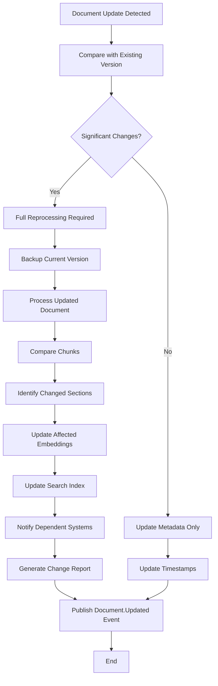

**Implementation:**
```python
class DocumentUpdateWorkflow:
    def __init__(self):
        self.version_manager = DocumentVersionManager()
        self.change_detector = DocumentChangeDetector()
        self.impact_analyzer = ChangeImpactAnalyzer()

    async def execute(self, update_request: DocumentUpdateRequest) -> WorkflowResult:
        """Execute document update workflow"""

        workflow_id = str(uuid.uuid4())

        try:
            # Step 1: Get current document version
            current_document = await self.get_current_document(update_request.document_id)

            # Step 2: Detect changes
            changes = await self.change_detector.detect_changes(
                current_document, update_request.new_content
            )

            if not changes.has_significant_changes:
                # Minor update - metadata only
                return await self.handle_minor_update(current_document, update_request)

            # Step 3: Create new version
            new_version = await self.version_manager.create_new_version(
                current_document, update_request
            )

            # Step 4: Process updated content
            processing_result = await self.process_updated_content(
                new_version, changes
            )

            # Step 5: Analyze impact on dependent systems
            impact_analysis = await self.impact_analyzer.analyze_impact(
                current_document, new_version, changes
            )

            # Step 6: Update related components
            await self.update_dependent_components(impact_analysis)

            # Step 7: Generate change report
            change_report = await self.generate_change_report(
                current_document, new_version, changes, impact_analysis
            )

            # Step 8: Notify stakeholders
            await self.notify_stakeholders(change_report)

            return WorkflowResult(
                status=WorkflowStatus.COMPLETED,
                new_version_id=new_version.id,
                changes_detected=len(changes.change_items),
                impact_level=impact_analysis.impact_level
            )

        except Exception as e:
            logger.error(f"Document update workflow failed: {e}")
            raise WorkflowExecutionError(f"Document update failed: {str(e)}")
```

---

## 3. Query Processing Workflows

### 3.1 Standard Query Processing Workflow

**Workflow Trigger:** User query submission

**Workflow Steps:**

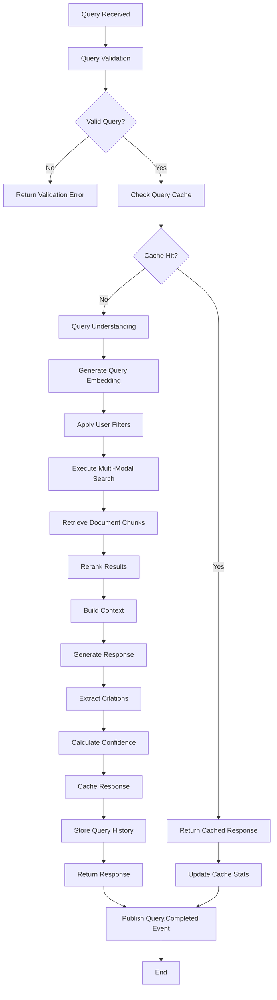

**Implementation:**
```python
class QueryProcessingWorkflow:
    def __init__(self):
        self.query_cache = QueryCache()
        self.query_understanding = QueryUnderstandingService()
        self.retrieval_engine = DocumentRetrievalEngine()
        self.response_generator = ResponseGenerationService()
        self.citation_extractor = CitationExtractionService()

    async def execute(self, query_request: QueryRequest) -> QueryResponse:
        """Execute query processing workflow"""

        query_id = str(uuid.uuid4())
        start_time = time.time()

        try:
            # Step 1: Validate query
            await self.validate_query(query_request)

            # Step 2: Check cache
            cached_response = await self.query_cache.get(query_request.query_hash)
            if cached_response and not query_request.force_refresh:
                await self.update_cache_stats(cached_response)
                return cached_response

            # Step 3: Query understanding
            query_intent = await self.query_understanding.analyze_intent(
                query_request.query, query_request.user_context
            )

            # Step 4: Generate query embedding
            query_embedding = await self.generate_query_embedding(
                query_request.query, query_intent
            )

            # Step 5: Execute retrieval
            retrieval_results = await self.retrieval_engine.retrieve(
                query_embedding=query_embedding,
                filters=query_request.filters,
                user_permissions=query_request.user_permissions,
                context=query_intent
            )

            # Step 6: Generate response
            response_text = await self.response_generator.generate(
                query=query_request.query,
                context_documents=retrieval_results.documents,
                user_role=query_request.user_role,
                query_intent=query_intent
            )

            # Step 7: Extract citations
            citations = await self.citation_extractor.extract_citations(
                response_text, retrieval_results.documents
            )

            # Step 8: Calculate confidence
            confidence_score = await self.calculate_confidence_score(
                query_request.query, response_text, retrieval_results
            )

            # Step 9: Create response object
            query_response = QueryResponse(
                query_id=query_id,
                query=query_request.query,
                response=response_text,
                confidence_score=confidence_score,
                citations=citations,
                processing_time=time.time() - start_time,
                context_documents_count=len(retrieval_results.documents),
                query_intent=query_intent
            )

            # Step 10: Cache response
            await self.query_cache.set(query_request.query_hash, query_response)

            # Step 11: Store in history
            await self.store_query_history(query_request.user_id, query_response)

            # Step 12: Publish completion event
            await self.publish_query_completed_event(query_response)

            return query_response

        except Exception as e:
            await self.handle_query_error(query_id, query_request, e)
            raise QueryProcessingError(f"Query processing failed: {str(e)}")

    async def generate_query_embedding(self, query: str, intent: QueryIntent) -> List[float]:
        """Generate enhanced query embedding with intent information"""

        # Enhance query with intent context
        enhanced_query = await self.enhance_query_with_intent(query, intent)

        # Generate embedding
        embedding = await self.embedding_service.create_embedding(
            text=enhanced_query,
            model="text-embedding-3-large"
        )

        return embedding

    async def enhance_query_with_intent(self, query: str, intent: QueryIntent) -> str:
        """Enhance query text with intent-specific context"""

        enhancement_strategies = {
            QueryIntentType.DEFINITION: f"Define and explain: {query}",
            QueryIntentType.COMPLIANCE_CHECK: f"Compliance requirements for: {query}",
            QueryIntentType.COMPARISON: f"Compare and contrast: {query}",
            QueryIntentType.PROCEDURE: f"Step-by-step process for: {query}",
            QueryIntentType.RISK_ASSESSMENT: f"Risk factors and assessment for: {query}"
        }

        return enhancement_strategies.get(intent.type, query)
```

### 3.2 Complex Query Processing Workflow

**Workflow Trigger:** Multi-part or complex analytical queries

**Workflow Steps:**

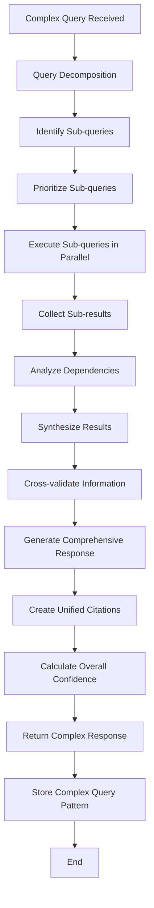

**Implementation:**
```python
class ComplexQueryWorkflow:
    def __init__(self):
        self.query_decomposer = QueryDecomposer()
        self.parallel_executor = ParallelQueryExecutor()
        self.result_synthesizer = ResultSynthesizer()

    async def execute(self, complex_query: ComplexQueryRequest) -> ComplexQueryResponse:
        """Execute complex query processing workflow"""

        workflow_id = str(uuid.uuid4())

        try:
            # Step 1: Decompose complex query
            sub_queries = await self.query_decomposer.decompose(
                complex_query.query, complex_query.complexity_hints
            )

            # Step 2: Execute sub-queries in parallel
            sub_results = await self.parallel_executor.execute_parallel(
                sub_queries, complex_query.user_context
            )

            # Step 3: Synthesize results
            synthesized_response = await self.result_synthesizer.synthesize(
                original_query=complex_query.query,
                sub_results=sub_results,
                synthesis_strategy=complex_query.synthesis_strategy
            )

            # Step 4: Validate and enhance
            validated_response = await self.validate_complex_response(
                synthesized_response, complex_query
            )

            return ComplexQueryResponse(
                workflow_id=workflow_id,
                original_query=complex_query.query,
                sub_queries=sub_queries,
                synthesized_response=validated_response,
                confidence_score=validated_response.confidence_score,
                processing_metadata={
                    'sub_query_count': len(sub_queries),
                    'parallel_execution_time': validated_response.processing_time,
                    'synthesis_strategy': complex_query.synthesis_strategy
                }
            )

        except Exception as e:
            logger.error(f"Complex query workflow failed: {e}")
            raise ComplexQueryError(f"Complex query processing failed: {str(e)}")
```

---

## 4. Compliance Analysis Workflows

### 4.1 GAP Analysis Workflow

**Workflow Trigger:** GAP analysis request submission

**Workflow Steps:**

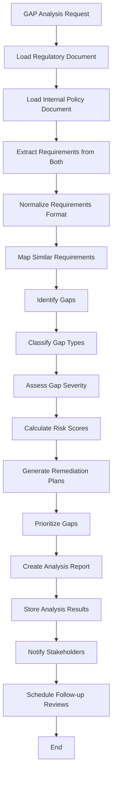

**Implementation:**
```python
class GapAnalysisWorkflow:
    def __init__(self):
        self.requirement_extractor = RequirementExtractor()
        self.gap_identifier = GapIdentificationEngine()
        self.risk_assessor = RiskAssessmentService()
        self.remediation_planner = RemediationPlanningService()

    async def execute(self, gap_request: GapAnalysisRequest) -> GapAnalysisResult:
        """Execute GAP analysis workflow"""

        analysis_id = str(uuid.uuid4())

        try:
            # Step 1: Load and validate documents
            regulatory_doc = await self.load_document(gap_request.regulatory_document_id)
            policy_doc = await self.load_document(gap_request.policy_document_id)

            # Step 2: Extract requirements
            regulatory_requirements = await self.requirement_extractor.extract(
                regulatory_doc, requirement_type='regulatory'
            )

            policy_requirements = await self.requirement_extractor.extract(
                policy_doc, requirement_type='policy'
            )

            # Step 3: Normalize requirements
            normalized_regulatory = await self.normalize_requirements(
                regulatory_requirements
            )
            normalized_policy = await self.normalize_requirements(
                policy_requirements
            )

            # Step 4: Map requirements
            requirement_mapping = await self.map_requirements(
                normalized_regulatory, normalized_policy
            )

            # Step 5: Identify gaps
            identified_gaps = await self.gap_identifier.identify_gaps(
                requirement_mapping, gap_request.analysis_parameters
            )

            # Step 6: Assess gaps
            assessed_gaps = []
            for gap in identified_gaps:
                severity = await self.assess_gap_severity(gap, gap_request.context)
                risk_score = await self.risk_assessor.assess_risk(gap, severity)
                remediation_plan = await self.remediation_planner.create_plan(gap)

                assessed_gaps.append(AssessedGap(
                    gap=gap,
                    severity=severity,
                    risk_score=risk_score,
                    remediation_plan=remediation_plan,
                    estimated_effort=remediation_plan.estimated_effort,
                    target_completion=remediation_plan.target_completion_date
                ))

            # Step 7: Generate analysis summary
            analysis_summary = await self.generate_analysis_summary(
                assessed_gaps, regulatory_doc, policy_doc
            )

            # Step 8: Create final result
            gap_analysis_result = GapAnalysisResult(
                analysis_id=analysis_id,
                regulatory_document_id=gap_request.regulatory_document_id,
                policy_document_id=gap_request.policy_document_id,
                gaps=assessed_gaps,
                summary=analysis_summary,
                analysis_metadata={
                    'total_regulatory_requirements': len(normalized_regulatory),
                    'total_policy_requirements': len(normalized_policy),
                    'mapping_confidence': requirement_mapping.average_confidence,
                    'analysis_timestamp': datetime.utcnow()
                }
            )

            # Step 9: Store results
            await self.store_gap_analysis_result(gap_analysis_result)

            # Step 10: Schedule follow-up
            if gap_request.schedule_follow_up:
                await self.schedule_follow_up_analysis(analysis_id, gap_request)

            return gap_analysis_result

        except Exception as e:
            logger.error(f"GAP analysis workflow failed: {e}")
            raise GapAnalysisError(f"GAP analysis failed: {str(e)}")

    async def map_requirements(self, regulatory_reqs: List[Requirement],
                             policy_reqs: List[Requirement]) -> RequirementMapping:
        """Map regulatory requirements to policy requirements"""

        mapping = RequirementMapping()

        for reg_req in regulatory_reqs:
            # Find potential matches using semantic similarity
            potential_matches = []

            for policy_req in policy_reqs:
                similarity_score = await self.calculate_semantic_similarity(
                    reg_req.content, policy_req.content
                )

                if similarity_score > 0.6:  # Threshold for potential match
                    potential_matches.append(RequirementMatch(
                        policy_requirement=policy_req,
                        similarity_score=similarity_score,
                        match_confidence=self.calculate_match_confidence(
                            reg_req, policy_req, similarity_score
                        )
                    ))

            # Sort by confidence and keep top matches
            potential_matches.sort(key=lambda x: x.match_confidence, reverse=True)
            mapping.add_requirement_mapping(reg_req, potential_matches[:3])

        return mapping

    async def assess_gap_severity(self, gap: IdentifiedGap,
                                context: AnalysisContext) -> GapSeverity:
        """Assess the severity of an identified gap"""

        severity_factors = {
            'regulatory_importance': await self.assess_regulatory_importance(
                gap.regulatory_requirement
            ),
            'compliance_deadline': await self.assess_deadline_urgency(
                gap.regulatory_requirement.effective_date
            ),
            'potential_penalties': await self.assess_penalty_risk(
                gap.regulatory_requirement
            ),
            'implementation_complexity': await self.assess_implementation_complexity(
                gap
            ),
            'business_impact': await self.assess_business_impact(
                gap, context.business_context
            )
        }

        # Weight the factors
        weights = {
            'regulatory_importance': 0.25,
            'compliance_deadline': 0.25,
            'potential_penalties': 0.20,
            'implementation_complexity': 0.15,
            'business_impact': 0.15
        }

        weighted_score = sum(
            severity_factors[factor] * weights[factor]
            for factor in severity_factors
        )

        if weighted_score >= 0.9:
            return GapSeverity.CRITICAL
        elif weighted_score >= 0.7:
            return GapSeverity.HIGH
        elif weighted_score >= 0.5:
            return GapSeverity.MEDIUM
        else:
            return GapSeverity.LOW
```

### 4.2 Continuous Compliance Monitoring Workflow

**Workflow Trigger:** Scheduled monitoring or regulatory change detection

**Workflow Steps:**

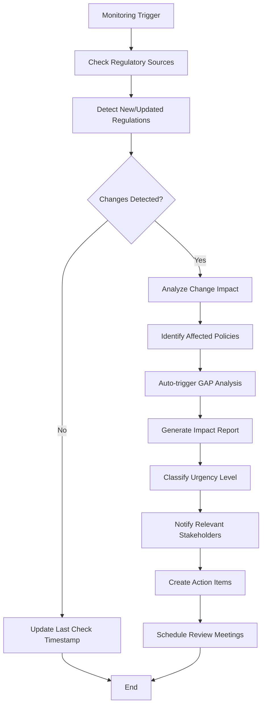

**Implementation:**
```python
class ContinuousComplianceWorkflow:
    def __init__(self):
        self.regulatory_monitor = RegulatoryMonitoringService()
        self.change_analyzer = ChangeAnalysisService()
        self.policy_matcher = PolicyMatchingService()
        self.notification_service = NotificationService()

    async def execute(self, monitoring_config: MonitoringConfiguration) -> MonitoringResult:
        """Execute continuous compliance monitoring workflow"""

        monitoring_session_id = str(uuid.uuid4())

        try:
            # Step 1: Check all configured regulatory sources
            monitoring_results = await self.regulatory_monitor.check_sources(
                monitoring_config.sources, monitoring_config.check_parameters
            )

            if not monitoring_results.has_changes:
                return MonitoringResult(
                    session_id=monitoring_session_id,
                    status=MonitoringStatus.NO_CHANGES,
                    last_check_timestamp=datetime.utcnow()
                )

            # Step 2: Analyze detected changes
            change_analysis = await self.change_analyzer.analyze_changes(
                monitoring_results.detected_changes
            )

            # Step 3: Identify affected internal policies
            affected_policies = await self.policy_matcher.find_affected_policies(
                change_analysis.regulatory_changes
            )

            # Step 4: Trigger automatic GAP analyses
            triggered_analyses = []
            for policy in affected_policies:
                if policy.auto_analysis_enabled:
                    analysis_request = GapAnalysisRequest(
                        regulatory_document_id=change_analysis.updated_regulation_id,
                        policy_document_id=policy.document_id,
                        analysis_type=AnalysisType.IMPACT_ASSESSMENT,
                        priority=self.calculate_analysis_priority(
                            change_analysis.impact_level, policy.criticality
                        )
                    )

                    analysis_result = await self.gap_analysis_workflow.execute(
                        analysis_request
                    )
                    triggered_analyses.append(analysis_result)

            # Step 5: Generate comprehensive impact report
            impact_report = await self.generate_impact_report(
                change_analysis, affected_policies, triggered_analyses
            )

            # Step 6: Notify stakeholders
            notifications_sent = await self.notify_stakeholders(
                impact_report, monitoring_config.notification_rules
            )

            return MonitoringResult(
                session_id=monitoring_session_id,
                status=MonitoringStatus.CHANGES_DETECTED,
                detected_changes=monitoring_results.detected_changes,
                impact_analysis=change_analysis,
                affected_policies=affected_policies,
                triggered_analyses=triggered_analyses,
                impact_report=impact_report,
                notifications_sent=notifications_sent
            )

        except Exception as e:
            logger.error(f"Continuous compliance monitoring failed: {e}")
            raise MonitoringError(f"Monitoring workflow failed: {str(e)}")
```

---

## 5. Report Generation Workflows

### 5.1 Compliance Report Generation Workflow

**Workflow Trigger:** Report generation request

**Workflow Steps:**

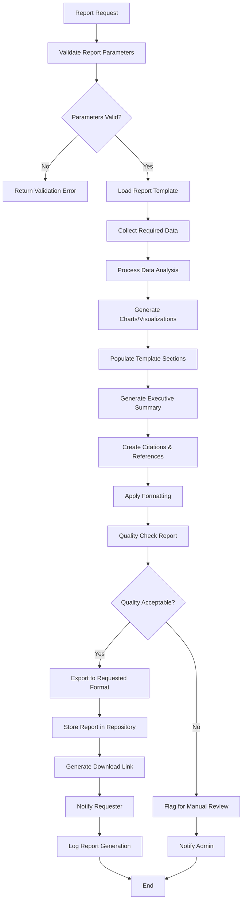

**Implementation:**
```python
class ReportGenerationWorkflow:
    def __init__(self):
        self.template_engine = ReportTemplateEngine()
        self.data_collector = ComplianceDataCollector()
        self.chart_generator = ChartGenerationService()
        self.document_formatter = DocumentFormatter()
        self.quality_checker = ReportQualityChecker()

    async def execute(self, report_request: ReportGenerationRequest) -> ReportGenerationResult:
        """Execute report generation workflow"""

        report_id = str(uuid.uuid4())

        try:
            # Step 1: Validate request parameters
            await self.validate_report_request(report_request)

            # Step 2: Load report template
            template = await self.template_engine.load_template(
                report_request.template_id
            )

            # Step 3: Collect required data
            report_data = await self.data_collector.collect_data(
                report_request.data_requirements,
                report_request.filters,
                report_request.date_range
            )

            # Step 4: Generate visualizations
            charts = []
            if report_request.include_charts:
                charts = await self.chart_generator.generate_charts(
                    report_data, report_request.chart_specifications
                )

            # Step 5: Populate template
            populated_template = await self.template_engine.populate_template(
                template=template,
                data=report_data,
                charts=charts,
                metadata=report_request.metadata
            )

            # Step 6: Generate executive summary
            if report_request.include_executive_summary:
                executive_summary = await self.generate_executive_summary(
                    report_data, template.summary_template
                )
                populated_template.add_executive_summary(executive_summary)

            # Step 7: Create citations and references
            citations = await self.create_citations(report_data.source_documents)
            populated_template.add_citations(citations)

            # Step 8: Format document
            formatted_document = await self.document_formatter.format_document(
                populated_template, report_request.format_specifications
            )

            # Step 9: Quality check
            quality_report = await self.quality_checker.check_report_quality(
                formatted_document, report_request.quality_criteria
            )

            if quality_report.overall_score < 0.8:
                return await self.handle_quality_issues(
                    report_id, formatted_document, quality_report
                )

            # Step 10: Export to requested format
            exported_document = await self.export_report(
                formatted_document, report_request.output_format
            )

            # Step 11: Store report
            storage_result = await self.store_report(
                report_id, exported_document, report_request
            )

            # Step 12: Generate download link
            download_url = await self.generate_download_link(
                storage_result.file_path, report_request.access_permissions
            )

            return ReportGenerationResult(
                report_id=report_id,
                status=ReportStatus.COMPLETED,
                download_url=download_url,
                file_size=exported_document.size,
                generation_time=time.time() - start_time,
                quality_score=quality_report.overall_score,
                metadata={
                    'template_used': template.id,
                    'data_points_included': len(report_data.items),
                    'charts_generated': len(charts)
                }
            )

        except Exception as e:
            logger.error(f"Report generation workflow failed: {e}")
            raise ReportGenerationError(f"Report generation failed: {str(e)}")

    async def generate_executive_summary(self, report_data: ReportData,
                                       summary_template: SummaryTemplate) -> ExecutiveSummary:
        """Generate executive summary using AI"""

        # Extract key insights from report data
        key_insights = await self.extract_key_insights(report_data)

        # Generate summary using LLM
        summary_prompt = self.build_summary_prompt(key_insights, summary_template)

        summary_text = await self.llm_service.generate_completion(
            prompt=summary_prompt,
            max_tokens=1000,
            temperature=0.3
        )

        return ExecutiveSummary(
            content=summary_text,
            key_insights=key_insights,
            generation_timestamp=datetime.utcnow()
        )
```

### 5.2 Automated Periodic Reporting Workflow

**Workflow Trigger:** Scheduled execution (daily/weekly/monthly)

**Workflow Steps:**

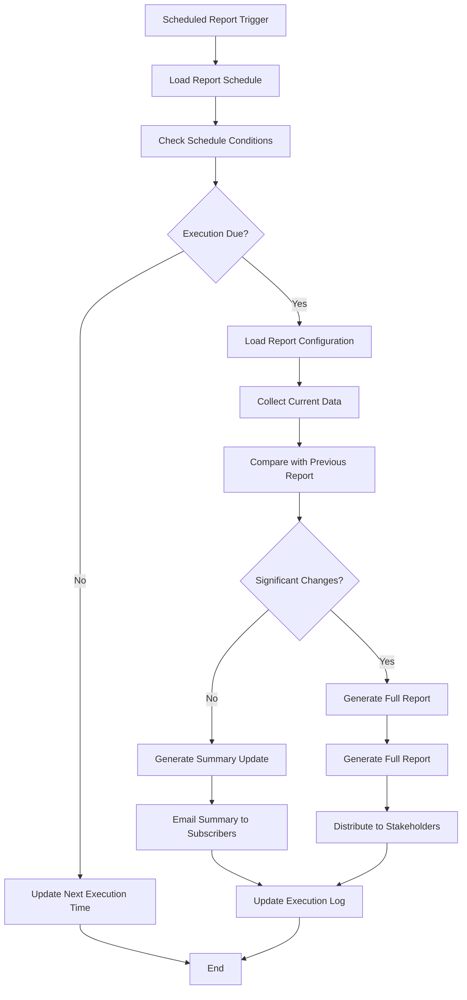

**Implementation:**
```python
class AutomatedReportingWorkflow:
    def __init__(self):
        self.schedule_manager = ReportScheduleManager()
        self.report_generator = ReportGenerationWorkflow()
        self.distribution_service = ReportDistributionService()
        self.change_detector = ReportChangeDetector()

    async def execute(self, schedule_check_time: datetime) -> ScheduledReportResult:
        """Execute automated periodic reporting workflow"""

        execution_id = str(uuid.uuid4())

        try:
            # Step 1: Get due scheduled reports
            due_reports = await self.schedule_manager.get_due_reports(
                schedule_check_time
            )

            if not due_reports:
                return ScheduledReportResult(
                    execution_id=execution_id,
                    status=ScheduledReportStatus.NO_REPORTS_DUE,
                    execution_time=schedule_check_time
                )

            execution_results = []

            for scheduled_report in due_reports:
                try:
                    # Step 2: Collect current data
                    current_data = await self.collect_report_data(
                        scheduled_report.data_configuration
                    )

                    # Step 3: Check for significant changes
                    previous_report = await self.get_previous_report(
                        scheduled_report.report_id
                    )

                    changes = await self.change_detector.detect_changes(
                        previous_report, current_data
                    )

                    # Step 4: Generate report based on change level
                    if changes.significance_level >= scheduled_report.change_threshold:
                        # Generate full report
                        report_result = await self.report_generator.execute(
                            scheduled_report.generation_config
                        )

                        # Distribute full report
                        distribution_result = await self.distribution_service.distribute_report(
                            report_result, scheduled_report.distribution_config
                        )
                    else:
                        # Generate summary update
                        summary_result = await self.generate_summary_update(
                            changes, scheduled_report
                        )

                        distribution_result = await self.distribution_service.distribute_summary(
                            summary_result, scheduled_report.distribution_config
                        )

                    execution_results.append(ScheduledReportExecution(
                        scheduled_report_id=scheduled_report.id,
                        execution_status=ExecutionStatus.SUCCESS,
                        report_generated=report_result if changes.significance_level >= scheduled_report.change_threshold else None,
                        summary_generated=summary_result if changes.significance_level < scheduled_report.change_threshold else None,
                        distribution_result=distribution_result
                    ))

                    # Update next execution time
                    await self.schedule_manager.update_next_execution(
                        scheduled_report.id, schedule_check_time
                    )

                except Exception as e:
                    logger.error(f"Scheduled report {scheduled_report.id} failed: {e}")
                    execution_results.append(ScheduledReportExecution(
                        scheduled_report_id=scheduled_report.id,
                        execution_status=ExecutionStatus.FAILED,
                        error_message=str(e)
                    ))

            return ScheduledReportResult(
                execution_id=execution_id,
                status=ScheduledReportStatus.COMPLETED,
                execution_time=schedule_check_time,
                executed_reports=execution_results,
                total_reports_processed=len(due_reports),
                successful_executions=len([r for r in execution_results if r.execution_status == ExecutionStatus.SUCCESS])
            )

        except Exception as e:
            logger.error(f"Automated reporting workflow failed: {e}")
            raise AutomatedReportingError(f"Scheduled reporting failed: {str(e)}")
```

---

## 6. Regulatory Monitoring Workflows

### 6.1 Source Monitoring Workflow

**Workflow Trigger:** Scheduled monitoring job

**Workflow Steps:**

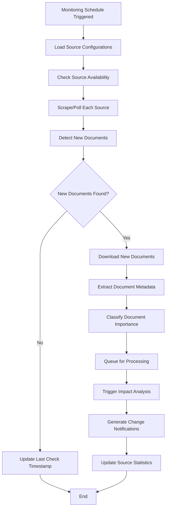

**Implementation:**
```python
class SourceMonitoringWorkflow:
    def __init__(self):
        self.source_manager = RegulatorySourceManager()
        self.document_scraper = DocumentScrapingService()
        self.metadata_extractor = MetadataExtractionService()
        self.impact_analyzer = ImpactAnalysisService()

    async def execute(self, monitoring_session: MonitoringSession) -> MonitoringResult:
        """Execute source monitoring workflow"""

        session_id = str(uuid.uuid4())

        try:
            # Step 1: Load configured sources
            sources = await self.source_manager.get_active_sources(
                monitoring_session.source_filter
            )

            monitoring_results = []

            for source in sources:
                try:
                    # Step 2: Check source availability
                    availability = await self.check_source_availability(source)

                    if not availability.is_available:
                        logger.warning(f"Source {source.name} is unavailable: {availability.reason}")
                        continue

                    # Step 3: Scrape source for new documents
                    scraping_result = await self.document_scraper.scrape_source(
                        source, monitoring_session.last_check_time
                    )

                    if not scraping_result.new_documents:
                        monitoring_results.append(SourceMonitoringResult(
                            source_id=source.id,
                            status=MonitoringStatus.NO_CHANGES,
                            documents_found=0
                        ))
                        continue

                    # Step 4: Process new documents
                    processed_documents = []
                    for document_url in scraping_result.new_documents:
                        try:
                            # Download document
                            document_content = await self.download_document(document_url)

                            # Extract metadata
                            metadata = await self.metadata_extractor.extract_metadata(
                                document_content, source.metadata_schema
                            )

                            # Classify importance
                            importance = await self.classify_document_importance(
                                metadata, source.importance_criteria
                            )

                            # Store document
                            document_id = await self.store_new_document(
                                document_content, metadata, source.id
                            )

                            processed_documents.append(ProcessedDocument(
                                document_id=document_id,
                                metadata=metadata,
                                importance_level=importance,
                                source_url=document_url
                            ))

                            # Queue for full processing
                            await self.queue_document_processing(
                                document_id, importance
                            )

                        except Exception as e:
                            logger.error(f"Failed to process document {document_url}: {e}")

                    # Step 5: Trigger impact analysis for important documents
                    impact_analyses = []
                    for doc in processed_documents:
                        if doc.importance_level >= ImportanceLevel.HIGH:
                            impact_analysis = await self.impact_analyzer.analyze_impact(
                                doc.document_id, doc.metadata
                            )
                            impact_analyses.append(impact_analysis)

                    monitoring_results.append(SourceMonitoringResult(
                        source_id=source.id,
                        status=MonitoringStatus.DOCUMENTS_FOUND,
                        documents_found=len(processed_documents),
                        processed_documents=processed_documents,
                        impact_analyses=impact_analyses
                    ))

                except Exception as e:
                    logger.error(f"Monitoring failed for source {source.name}: {e}")
                    monitoring_results.append(SourceMonitoringResult(
                        source_id=source.id,
                        status=MonitoringStatus.ERROR,
                        error_message=str(e)
                    ))

            # Step 6: Generate overall monitoring summary
            monitoring_summary = await self.generate_monitoring_summary(
                monitoring_results, monitoring_session
            )

            return MonitoringResult(
                session_id=session_id,
                monitoring_timestamp=datetime.utcnow(),
                sources_monitored=len(sources),
                source_results=monitoring_results,
                summary=monitoring_summary,
                total_documents_found=sum(r.documents_found for r in monitoring_results)
            )

        except Exception as e:
            logger.error(f"Source monitoring workflow failed: {e}")
            raise SourceMonitoringError(f"Monitoring workflow failed: {str(e)}")

    async def classify_document_importance(self, metadata: DocumentMetadata,
                                         criteria: ImportanceCriteria) -> ImportanceLevel:
        """Classify document importance based on configured criteria"""

        importance_score = 0

        # Authority weight
        authority_weight = criteria.authority_weights.get(metadata.authority, 0.5)
        importance_score += authority_weight * 0.4

        # Document type weight
        type_weight = criteria.type_weights.get(metadata.document_type, 0.5)
        importance_score += type_weight * 0.3

        # Recency factor
        days_since_publication = (datetime.utcnow().date() - metadata.publication_date).days
        recency_factor = max(0, 1 - (days_since_publication / 365))  # Decay over a year
        importance_score += recency_factor * 0.2

        # Keyword relevance
        keyword_relevance = await self.calculate_keyword_relevance(
            metadata.title + " " + metadata.summary, criteria.important_keywords
        )
        importance_score += keyword_relevance * 0.1

        if importance_score >= 0.8:
            return ImportanceLevel.CRITICAL
        elif importance_score >= 0.6:
            return ImportanceLevel.HIGH
        elif importance_score >= 0.4:
            return ImportanceLevel.MEDIUM
        else:
            return ImportanceLevel.LOW
```

---

## 7. Alert and Notification Workflows

### 7.1 Real-time Alert Workflow

**Workflow Trigger:** High-priority event detection

**Workflow Steps:**

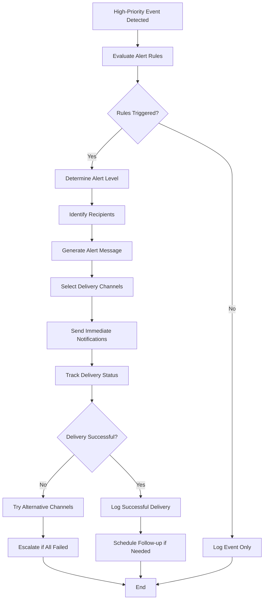

**Implementation:**
```python
class RealTimeAlertWorkflow:
    def __init__(self):
        self.alert_rule_engine = AlertRuleEngine()
        self.notification_service = NotificationService()
        self.escalation_manager = EscalationManager()

    async def execute(self, trigger_event: AlertTriggerEvent) -> AlertResult:
        """Execute real-time alert workflow"""

        alert_id = str(uuid.uuid4())

        try:
            # Step 1: Evaluate alert rules
            triggered_rules = await self.alert_rule_engine.evaluate_rules(
                trigger_event
            )

            if not triggered_rules:
                return AlertResult(
                    alert_id=alert_id,
                    status=AlertStatus.NO_RULES_TRIGGERED,
                    trigger_event=trigger_event
                )

            # Step 2: Determine alert level
            alert_level = await self.determine_alert_level(
                triggered_rules, trigger_event
            )

            # Step 3: Generate alert message
            alert_message = await self.generate_alert_message(
                trigger_event, triggered_rules, alert_level
            )

            # Step 4: Identify recipients
            recipients = await self.identify_recipients(
                triggered_rules, alert_level
            )

            # Step 5: Send notifications
            delivery_results = []

            for recipient in recipients:
                for channel in recipient.notification_channels:
                    try:
                        delivery_result = await self.notification_service.send_notification(
                            Notification(
                                recipient_id=recipient.id,
                                channel=channel,
                                message=alert_message,
                                priority=alert_level,
                                alert_id=alert_id
                            )
                        )
                        delivery_results.append(delivery_result)

                    except NotificationError as e:
                        logger.error(f"Notification delivery failed: {e}")
                        delivery_results.append(DeliveryResult(
                            recipient_id=recipient.id,
                            channel=channel,
                            status=DeliveryStatus.FAILED,
                            error=str(e)
                        ))

            # Step 6: Handle failed deliveries
            failed_deliveries = [r for r in delivery_results if r.status == DeliveryStatus.FAILED]

            if failed_deliveries:
                await self.handle_failed_deliveries(
                    alert_id, failed_deliveries, alert_level
                )

            # Step 7: Schedule follow-up if needed
            follow_up_scheduled = None
            if alert_level >= AlertLevel.HIGH:
                follow_up_scheduled = await self.schedule_follow_up(
                    alert_id, trigger_event, alert_level
                )

            return AlertResult(
                alert_id=alert_id,
                status=AlertStatus.SENT,
                trigger_event=trigger_event,
                alert_level=alert_level,
                recipients_notified=len(recipients),
                delivery_results=delivery_results,
                follow_up_scheduled=follow_up_scheduled
            )

        except Exception as e:
            logger.error(f"Real-time alert workflow failed: {e}")
            raise AlertWorkflowError(f"Alert workflow failed: {str(e)}")

    async def generate_alert_message(self, trigger_event: AlertTriggerEvent,
                                   triggered_rules: List[AlertRule],
                                   alert_level: AlertLevel) -> AlertMessage:
        """Generate contextual alert message"""

        # Build alert context
        context = {
            'event_type': trigger_event.event_type,
            'severity': alert_level,
            'triggered_rules': [rule.name for rule in triggered_rules],
            'event_data': trigger_event.data
        }

        # Select message template based on event type and severity
        template = await self.select_message_template(
            trigger_event.event_type, alert_level
        )

        # Generate message content
        message_content = await self.template_engine.render_template(
            template, context
        )

        return AlertMessage(
            subject=f"{alert_level.value.upper()}: {trigger_event.event_type}",
            content=message_content,
            alert_level=alert_level,
            timestamp=datetime.utcnow(),
            context=context
        )
```

### 7.2 Digest Notification Workflow

**Workflow Trigger:** Scheduled digest generation

**Workflow Steps:**

```mermaid
flowchart TD
    A[Digest Schedule Triggered] --> B[Load Subscriber Preferences]
    B --> C[Collect Events Since Last Digest]
    C --> D{Events Available?}
    D -->|No| E[Send "No Updates" Notification]
    D -->|Yes| F[Group Events by Category]
    F --> G[Prioritize Event Groups]
    G --> H[Generate Digest Content]
    H --> I[Apply User Preferences]
    I --> J[Format for Each Channel]
    J --> K[Send Digest Notifications]
    K --> L[Track Engagement Metrics]
    L --> M[Update Next Digest Schedule]
    E --> N[End]
    M --> N
```

**Implementation:**
```python
class DigestNotificationWorkflow:
    def __init__(self):
        self.subscription_manager = SubscriptionManager()
        self.event_aggregator = EventAggregator()
        self.digest_generator = DigestGenerator()
        self.engagement_tracker = EngagementTracker()

    async def execute(self, digest_schedule: DigestSchedule) -> DigestResult:
        """Execute digest notification workflow"""

        digest_id = str(uuid.uuid4())

        try:
            # Step 1: Load subscribers for this digest type
            subscribers = await self.subscription_manager.get_subscribers(
                digest_schedule.digest_type, digest_schedule.frequency
            )

            if not subscribers:
                return DigestResult(
                    digest_id=digest_id,
                    status=DigestStatus.NO_SUBSCRIBERS,
                    digest_schedule=digest_schedule
                )

            # Step 2: Collect events since last digest
            events = await self.event_aggregator.collect_events(
                since=digest_schedule.last_sent_time,
                event_types=digest_schedule.included_event_types,
                filters=digest_schedule.event_filters
            )

            digest_results = []

            for subscriber in subscribers:
                try:
                    # Step 3: Filter events based on subscriber preferences
                    filtered_events = await self.filter_events_for_subscriber(
                        events, subscriber.preferences
                    )

                    if not filtered_events and not subscriber.preferences.send_empty_digest:
                        continue

                    # Step 4: Generate personalized digest
                    digest_content = await self.digest_generator.generate_digest(
                        events=filtered_events,
                        subscriber=subscriber,
                        digest_template=digest_schedule.template
                    )

                    # Step 5: Send digest notification
                    notification_result = await self.send_digest_notification(
                        subscriber, digest_content, digest_schedule
                    )

                    digest_results.append(SubscriberDigestResult(
                        subscriber_id=subscriber.id,
                        events_included=len(filtered_events),
                        notification_result=notification_result
                    ))

                    # Track engagement for future personalization
                    await self.engagement_tracker.track_digest_sent(
                        subscriber.id, digest_id, len(filtered_events)
                    )

                except Exception as e:
                    logger.error(f"Digest generation failed for subscriber {subscriber.id}: {e}")
                    digest_results.append(SubscriberDigestResult(
                        subscriber_id=subscriber.id,
                        status=DigestStatus.FAILED,
                        error=str(e)
                    ))

            # Step 6: Update digest schedule
            await self.update_digest_schedule(
                digest_schedule, datetime.utcnow()
            )

            return DigestResult(
                digest_id=digest_id,
                status=DigestStatus.COMPLETED,
                digest_schedule=digest_schedule,
                total_subscribers=len(subscribers),
                digests_sent=len([r for r in digest_results if r.status == DigestStatus.SENT]),
                total_events_processed=len(events),
                subscriber_results=digest_results
            )

        except Exception as e:
            logger.error(f"Digest notification workflow failed: {e}")
            raise DigestWorkflowError(f"Digest workflow failed: {str(e)}")
```

---

## 8. Audit and Compliance Tracking Workflows

### 8.1 Audit Trail Generation Workflow

**Workflow Trigger:** System activity or scheduled audit compilation

**Workflow Steps:**

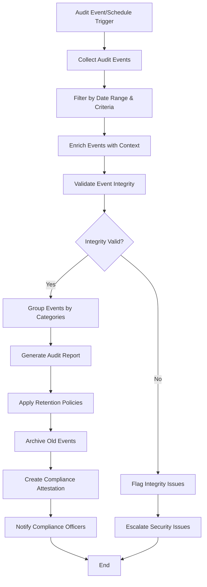

**Implementation:**
```python
class AuditTrailWorkflow:
    def __init__(self):
        self.audit_logger = AuditLogger()
        self.integrity_validator = AuditIntegrityValidator()
        self.compliance_reporter = ComplianceReporter()
        self.retention_manager = RetentionManager()

    async def execute(self, audit_request: AuditTrailRequest) -> AuditTrailResult:
        """Execute audit trail generation workflow"""

        audit_session_id = str(uuid.uuid4())

        try:
            # Step 1: Collect audit events
            audit_events = await self.audit_logger.get_events(
                start_date=audit_request.start_date,
                end_date=audit_request.end_date,
                event_types=audit_request.event_types,
                user_filters=audit_request.user_filters
            )

            # Step 2: Validate event integrity
            integrity_report = await self.integrity_validator.validate_events(
                audit_events
            )

            if integrity_report.has_integrity_issues:
                await self.handle_integrity_issues(
                    audit_session_id, integrity_report
                )

            # Step 3: Enrich events with additional context
            enriched_events = []
            for event in audit_events:
                enriched_event = await self.enrich_audit_event(event)
                enriched_events.append(enriched_event)

            # Step 4: Group events by categories
            categorized_events = await self.categorize_events(enriched_events)

            # Step 5: Generate audit report
            audit_report = await self.compliance_reporter.generate_audit_report(
                events=categorized_events,
                report_parameters=audit_request.report_parameters,
                compliance_frameworks=audit_request.compliance_frameworks
            )

            # Step 6: Apply retention policies
            retention_actions = await self.retention_manager.apply_retention_policies(
                audit_events, audit_request.retention_policy
            )

            # Step 7: Create compliance attestation
            compliance_attestation = await self.create_compliance_attestation(
                audit_report, integrity_report, retention_actions
            )

            return AuditTrailResult(
                audit_session_id=audit_session_id,
                events_processed=len(audit_events),
                integrity_report=integrity_report,
                audit_report=audit_report,
                compliance_attestation=compliance_attestation,
                retention_actions=retention_actions,
                generation_timestamp=datetime.utcnow()
            )

        except Exception as e:
            logger.error(f"Audit trail workflow failed: {e}")
            raise AuditWorkflowError(f"Audit trail generation failed: {str(e)}")

    async def enrich_audit_event(self, event: AuditEvent) -> EnrichedAuditEvent:
        """Enrich audit event with additional context"""

        enrichment_data = {}

        # Add user context
        if event.user_id:
            user_info = await self.get_user_context(event.user_id)
            enrichment_data['user_context'] = user_info

        # Add resource context
        if event.resource_id:
            resource_info = await self.get_resource_context(
                event.resource_type, event.resource_id
            )
            enrichment_data['resource_context'] = resource_info

        # Add geographic context
        if event.ip_address:
            geo_info = await self.get_geographic_context(event.ip_address)
            enrichment_data['geographic_context'] = geo_info

        # Add compliance context
        compliance_tags = await self.get_compliance_tags(event)
        enrichment_data['compliance_tags'] = compliance_tags

        return EnrichedAuditEvent(
            original_event=event,
            enrichment_data=enrichment_data,
            enrichment_timestamp=datetime.utcnow()
        )
```

---

## 9. Workflow Orchestration

### 9.1 Workflow Engine Architecture

**Core Components:**

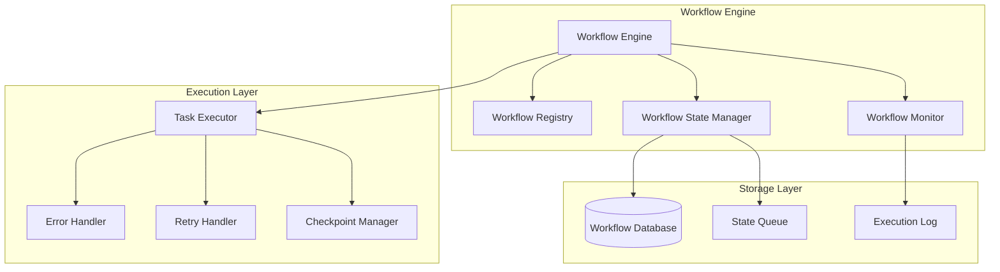

**Implementation:**
```python
class WorkflowEngine:
    def __init__(self):
        self.workflow_registry = WorkflowRegistry()
        self.state_manager = WorkflowStateManager()
        self.task_executor = TaskExecutor()
        self.monitor = WorkflowMonitor()

    async def execute_workflow(self, workflow_request: WorkflowRequest) -> WorkflowResult:
        """Execute workflow with state management and monitoring"""

        workflow_instance = await self.create_workflow_instance(workflow_request)

        try:
            # Initialize workflow state
            await self.state_manager.initialize_workflow(workflow_instance)

            # Execute workflow steps
            while not workflow_instance.is_complete():
                current_step = workflow_instance.get_current_step()

                # Execute step with monitoring
                step_result = await self.task_executor.execute_step(
                    current_step, workflow_instance.context
                )

                # Update workflow state
                await self.state_manager.update_step_status(
                    workflow_instance.id, current_step.id, step_result.status
                )

                # Handle step result
                if step_result.status == StepStatus.COMPLETED:
                    workflow_instance.advance_to_next_step()
                elif step_result.status == StepStatus.FAILED:
                    await self.handle_step_failure(
                        workflow_instance, current_step, step_result
                    )
                elif step_result.status == StepStatus.RETRY:
                    await self.schedule_step_retry(
                        workflow_instance, current_step, step_result
                    )

            # Complete workflow
            await self.complete_workflow(workflow_instance)

            return WorkflowResult(
                workflow_id=workflow_instance.id,
                status=WorkflowStatus.COMPLETED,
                execution_time=workflow_instance.total_execution_time,
                steps_executed=len(workflow_instance.completed_steps)
            )

        except Exception as e:
            await self.handle_workflow_failure(workflow_instance, e)
            raise WorkflowExecutionError(f"Workflow execution failed: {str(e)}")

class WorkflowDefinition:
    """Base class for workflow definitions"""

    def __init__(self, workflow_id: str, name: str):
        self.workflow_id = workflow_id
        self.name = name
        self.steps = []
        self.error_handlers = {}
        self.retry_policies = {}

    def add_step(self, step: WorkflowStep):
        """Add step to workflow"""
        self.steps.append(step)

    def add_error_handler(self, error_type: type, handler: ErrorHandler):
        """Add error handler for specific error types"""
        self.error_handlers[error_type] = handler

    def add_retry_policy(self, step_id: str, policy: RetryPolicy):
        """Add retry policy for specific step"""
        self.retry_policies[step_id] = policy
```

### 9.2 Workflow State Management

**State Persistence:**
```python
class WorkflowStateManager:
    def __init__(self):
        self.db = WorkflowDatabase()
        self.state_queue = StateQueue()

    async def initialize_workflow(self, workflow_instance: WorkflowInstance):
        """Initialize workflow state in database"""

        workflow_state = WorkflowState(
            workflow_id=workflow_instance.id,
            definition_id=workflow_instance.definition.workflow_id,
            status=WorkflowStatus.RUNNING,
            current_step_index=0,
            context=workflow_instance.context,
            created_at=datetime.utcnow()
        )

        await self.db.insert_workflow_state(workflow_state)

    async def create_checkpoint(self, workflow_instance: WorkflowInstance):
        """Create checkpoint for workflow recovery"""

        checkpoint = WorkflowCheckpoint(
            workflow_id=workflow_instance.id,
            step_index=workflow_instance.current_step_index,
            context_snapshot=workflow_instance.context.copy(),
            execution_state=workflow_instance.get_execution_state(),
            checkpoint_time=datetime.utcnow()
        )

        await self.db.insert_checkpoint(checkpoint)

    async def recover_workflow(self, workflow_id: str) -> WorkflowInstance:
        """Recover workflow from last checkpoint"""

        # Get latest checkpoint
        checkpoint = await self.db.get_latest_checkpoint(workflow_id)

        if not checkpoint:
            raise WorkflowRecoveryError(f"No checkpoint found for workflow {workflow_id}")

        # Recreate workflow instance
        workflow_state = await self.db.get_workflow_state(workflow_id)
        workflow_definition = await self.workflow_registry.get_definition(
            workflow_state.definition_id
        )

        recovered_instance = WorkflowInstance.from_checkpoint(
            workflow_definition, checkpoint
        )

        return recovered_instance
```

---

## 10. Error Handling and Recovery

### 10.1 Error Handling Strategies

**Error Classification:**

```python
class WorkflowError(Exception):
    """Base class for workflow errors"""

    def __init__(self, message: str, error_code: str = None,
                 recoverable: bool = True):
        super().__init__(message)
        self.error_code = error_code
        self.recoverable = recoverable
        self.timestamp = datetime.utcnow()

class RetryableError(WorkflowError):
    """Error that can be retried"""

    def __init__(self, message: str, retry_delay: int = 60):
        super().__init__(message, recoverable=True)
        self.retry_delay = retry_delay

class FatalError(WorkflowError):
    """Error that cannot be recovered"""

    def __init__(self, message: str):
        super().__init__(message, recoverable=False)

class BusinessLogicError(WorkflowError):
    """Error in business logic that requires manual intervention"""

    def __init__(self, message: str, requires_manual_review: bool = True):
        super().__init__(message)
        self.requires_manual_review = requires_manual_review

class ErrorHandler:
    """Centralized error handling for workflows"""

    def __init__(self):
        self.retry_manager = RetryManager()
        self.notification_service = NotificationService()
        self.escalation_manager = EscalationManager()

    async def handle_error(self, workflow_instance: WorkflowInstance,
                          error: Exception) -> ErrorHandlingResult:
        """Handle workflow error based on error type and context"""

        if isinstance(error, RetryableError):
            return await self.handle_retryable_error(workflow_instance, error)
        elif isinstance(error, BusinessLogicError):
            return await self.handle_business_logic_error(workflow_instance, error)
        elif isinstance(error, FatalError):
            return await self.handle_fatal_error(workflow_instance, error)
        else:
            return await self.handle_unknown_error(workflow_instance, error)

    async def handle_retryable_error(self, workflow_instance: WorkflowInstance,
                                   error: RetryableError) -> ErrorHandlingResult:
        """Handle retryable errors with exponential backoff"""

        current_step = workflow_instance.get_current_step()
        retry_policy = workflow_instance.definition.retry_policies.get(current_step.id)

        if not retry_policy:
            retry_policy = RetryPolicy.default()

        retry_count = workflow_instance.get_step_retry_count(current_step.id)

        if retry_count >= retry_policy.max_retries:
            return await self.escalate_error(workflow_instance, error)

        # Schedule retry with exponential backoff
        retry_delay = retry_policy.calculate_delay(retry_count)

        await self.retry_manager.schedule_retry(
            workflow_instance.id,
            current_step.id,
            retry_delay
        )

        return ErrorHandlingResult(
            action=ErrorAction.RETRY_SCHEDULED,
            retry_delay=retry_delay,
            message=f"Retry scheduled for step {current_step.id} in {retry_delay} seconds"
        )
```

### 10.2 Recovery Mechanisms

**Automatic Recovery:**
```python
class WorkflowRecoveryService:
    def __init__(self):
        self.state_manager = WorkflowStateManager()
        self.workflow_engine = WorkflowEngine()

    async def recover_failed_workflows(self) -> RecoveryResult:
        """Recover all failed workflows that can be recovered"""

        # Get failed workflows
        failed_workflows = await self.state_manager.get_failed_workflows(
            recoverable=True, age_limit=timedelta(hours=24)
        )

        recovery_results = []

        for workflow_id in failed_workflows:
            try:
                # Attempt recovery
                recovered_instance = await self.state_manager.recover_workflow(
                    workflow_id
                )

                # Resume execution
                resume_result = await self.workflow_engine.resume_workflow(
                    recovered_instance
                )

                recovery_results.append(WorkflowRecoveryResult(
                    workflow_id=workflow_id,
                    status=RecoveryStatus.RECOVERED,
                    resume_result=resume_result
                ))

            except Exception as e:
                logger.error(f"Failed to recover workflow {workflow_id}: {e}")
                recovery_results.append(WorkflowRecoveryResult(
                    workflow_id=workflow_id,
                    status=RecoveryStatus.FAILED,
                    error=str(e)
                ))

        return RecoveryResult(
            total_workflows=len(failed_workflows),
            recovered_count=len([r for r in recovery_results if r.status == RecoveryStatus.RECOVERED]),
            recovery_results=recovery_results
        )
```

This comprehensive compliance workflows specification provides a complete framework for implementing automated regulatory compliance processes in the banking RAG system. The workflows are designed to be resilient, auditable, and scalable while maintaining strict compliance with regulatory requirements.

The workflows cover the entire compliance lifecycle from document ingestion through monitoring, analysis, reporting, and ongoing compliance tracking. Each workflow includes proper error handling, state management, and recovery mechanisms to ensure reliable operation in production environments.