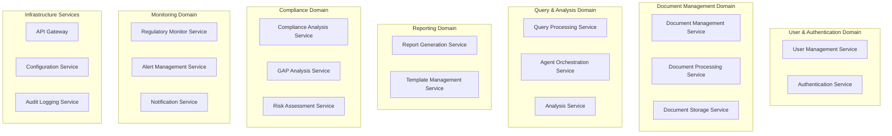

# Microservices Design Specification
## Banking RAG Compliance System

## Table of Contents
1. [Service Overview](#1-service-overview)
2. [Service Specifications](#2-service-specifications)
3. [API Contracts](#3-api-contracts)
4. [Data Models](#4-data-models)
5. [Inter-Service Communication](#5-inter-service-communication)
6. [Service Dependencies](#6-service-dependencies)
7. [Deployment Specifications](#7-deployment-specifications)
8. [Testing Strategy](#8-testing-strategy)

---

## 1. Service Overview

### 1.1 Service Decomposition Strategy

The Banking RAG Compliance System follows Domain-Driven Design principles with bounded contexts for each regulatory compliance domain:



### 1.2 Service Responsibilities Matrix

| Service | Primary Responsibility | Secondary Responsibilities |
|---------|----------------------|---------------------------|
| **User Management** | User lifecycle, profiles, roles | Organization management, preferences |
| **Authentication** | Identity verification, session management | MFA, SSO integration |
| **Document Management** | Document metadata, lifecycle | Versioning, permissions |
| **Document Processing** | Text extraction, chunking, embeddings | OCR, quality validation |
| **Query Processing** | Natural language queries, response generation | Context management, history |
| **Agent Orchestration** | Multi-agent coordination, task routing | Resource allocation, monitoring |
| **Analysis** | Content analysis, summarization | Entity extraction, relationships |
| **Report Generation** | Automated report creation | Template rendering, export |
| **Compliance Analysis** | GAP analysis, compliance tracking | Risk scoring, remediation |
| **Regulatory Monitor** | Source monitoring, change detection | Update classification, alerting |
| **Notification** | Multi-channel notifications | Delivery tracking, preferences |

---

## 2. Service Specifications

### 2.1 User Management Service

**Technology Stack:**
- Framework: FastAPI (Python 3.11)
- Database: Supabase PostgreSQL
- Cache: Redis
- Authentication: Supabase Auth

**Service Configuration:**
```yaml
service:
  name: user-management-service
  port: 8001
  health_check: /health
  metrics: /metrics

resources:
  cpu:
    requests: 200m
    limits: 500m
  memory:
    requests: 256Mi
    limits: 512Mi

scaling:
  min_replicas: 2
  max_replicas: 10
  target_cpu: 70%
```

**Core Functionality:**
```python
class UserManagementService:
    def __init__(self):
        self.db = SupabaseClient()
        self.cache = RedisClient()
        self.audit_logger = AuditLogger()

    async def create_user(self, user_data: CreateUserRequest) -> UserResponse:
        """Create new user with role assignment"""

        # Validate user data
        validated_data = await self.validate_user_data(user_data)

        # Check if user exists
        existing_user = await self.get_user_by_email(validated_data.email)
        if existing_user:
            raise UserAlreadyExistsError("User already exists")

        # Create user in database
        user = await self.db.table('users').insert({
            'email': validated_data.email,
            'role': validated_data.role,
            'organization_id': validated_data.organization_id,
            'profile': validated_data.profile
        }).execute()

        # Cache user data
        await self.cache.set(f"user:{user.id}", user.dict(), ex=3600)

        # Log user creation
        await self.audit_logger.log_user_event(
            event_type="user_created",
            user_id=user.id,
            details={"role": user.role}
        )

        return UserResponse.from_orm(user)

    async def update_user_permissions(self, user_id: str,
                                    permissions: List[Permission]) -> UserResponse:
        """Update user permissions with validation"""

        # Verify user exists
        user = await self.get_user(user_id)
        if not user:
            raise UserNotFoundError("User not found")

        # Validate permissions for user role
        valid_permissions = await self.validate_permissions(user.role, permissions)

        # Update user permissions
        updated_user = await self.db.table('users').update({
            'permissions': [p.value for p in valid_permissions],
            'updated_at': datetime.utcnow()
        }).eq('id', user_id).execute()

        # Invalidate cache
        await self.cache.delete(f"user:{user_id}")

        return UserResponse.from_orm(updated_user)
```

### 2.2 Document Management Service

**Technology Stack:**
- Framework: FastAPI (Python 3.11)
- Storage: Azure Blob Storage
- Database: Supabase PostgreSQL
- Search: Elasticsearch

**Service Configuration:**
```yaml
service:
  name: document-management-service
  port: 8002

resources:
  cpu:
    requests: 500m
    limits: 2000m
  memory:
    requests: 1Gi
    limits: 4Gi

volumes:
  - name: temp-storage
    size: 10Gi
    mount_path: /tmp/documents

environment:
  - name: BLOB_STORAGE_CONNECTION
    valueFrom:
      secretKeyRef:
        name: azure-storage-secret
        key: connection-string
```

**Core Functionality:**
```python
class DocumentManagementService:
    def __init__(self):
        self.blob_client = BlobStorageClient()
        self.db = SupabaseClient()
        self.search_client = ElasticsearchClient()
        self.processing_queue = RedisQueue("document_processing")

    async def upload_document(self, file: UploadFile,
                            metadata: DocumentMetadata) -> DocumentResponse:
        """Upload and store document with metadata"""

        # Generate unique document ID
        document_id = str(uuid.uuid4())

        # Validate file type and size
        await self.validate_document(file)

        # Upload to blob storage
        file_path = f"documents/{metadata.authority}/{metadata.jurisdiction}/{document_id}.{file.filename.split('.')[-1]}"
        blob_url = await self.blob_client.upload_file(file_path, file.file)

        # Store metadata in database
        document_record = await self.db.table('documents').insert({
            'id': document_id,
            'title': metadata.title,
            'document_type': metadata.document_type,
            'authority': metadata.authority,
            'jurisdiction': metadata.jurisdiction,
            'publication_date': metadata.publication_date,
            'file_path': file_path,
            'file_size': file.size,
            'content_type': file.content_type,
            'status': 'uploaded'
        }).execute()

        # Queue for processing
        await self.processing_queue.enqueue({
            'document_id': document_id,
            'file_path': file_path,
            'processing_type': 'full'
        })

        # Index in Elasticsearch for search
        await self.search_client.index(
            index='documents',
            id=document_id,
            body={
                'title': metadata.title,
                'authority': metadata.authority,
                'jurisdiction': metadata.jurisdiction,
                'publication_date': metadata.publication_date,
                'content_type': file.content_type
            }
        )

        return DocumentResponse.from_orm(document_record)

    async def search_documents(self, query: DocumentSearchQuery) -> DocumentSearchResponse:
        """Search documents with advanced filtering"""

        # Build Elasticsearch query
        es_query = {
            "query": {
                "bool": {
                    "must": [],
                    "filter": []
                }
            },
            "sort": [{"publication_date": {"order": "desc"}}],
            "from": query.offset,
            "size": query.limit
        }

        # Add text search
        if query.text:
            es_query["query"]["bool"]["must"].append({
                "multi_match": {
                    "query": query.text,
                    "fields": ["title^2", "content", "summary"]
                }
            })

        # Add filters
        if query.authority:
            es_query["query"]["bool"]["filter"].append({
                "term": {"authority": query.authority}
            })

        if query.date_range:
            es_query["query"]["bool"]["filter"].append({
                "range": {
                    "publication_date": {
                        "gte": query.date_range.start,
                        "lte": query.date_range.end
                    }
                }
            })

        # Execute search
        response = await self.search_client.search(
            index='documents',
            body=es_query
        )

        # Transform results
        documents = []
        for hit in response['hits']['hits']:
            doc_data = hit['_source']
            doc_data['id'] = hit['_id']
            doc_data['relevance_score'] = hit['_score']
            documents.append(DocumentSummary.from_dict(doc_data))

        return DocumentSearchResponse(
            documents=documents,
            total=response['hits']['total']['value'],
            page=query.offset // query.limit + 1,
            has_more=response['hits']['total']['value'] > query.offset + query.limit
        )
```

### 2.3 Query Processing Service

**Technology Stack:**
- Framework: FastAPI (Python 3.11)
- AI Integration: Azure OpenAI
- Vector Database: Supabase with pgvector
- Cache: Redis

**Service Configuration:**
```yaml
service:
  name: query-processing-service
  port: 8003

resources:
  cpu:
    requests: 1000m
    limits: 2000m
  memory:
    requests: 2Gi
    limits: 4Gi

scaling:
  min_replicas: 3
  max_replicas: 20
  target_cpu: 70%
  target_memory: 80%

environment:
  - name: OPENAI_API_KEY
    valueFrom:
      secretKeyRef:
        name: openai-secret
        key: api-key
  - name: OPENAI_ENDPOINT
    value: "https://banking-compliance.openai.azure.com/"
```

**Core Functionality:**
```python
class QueryProcessingService:
    def __init__(self):
        self.openai_client = AzureOpenAIClient()
        self.vector_db = SupabaseVectorClient()
        self.cache = RedisClient()
        self.agent_orchestrator = AgentOrchestratorClient()

    async def process_query(self, query_request: QueryRequest) -> QueryResponse:
        """Process natural language query with RAG"""

        # Generate query ID for tracking
        query_id = str(uuid.uuid4())

        # Check cache for similar queries
        cached_result = await self.check_query_cache(query_request.query)
        if cached_result and not query_request.force_refresh:
            return cached_result

        # Generate query embedding
        query_embedding = await self.openai_client.create_embedding(
            text=query_request.query,
            model="text-embedding-3-large"
        )

        # Retrieve relevant documents
        documents = await self.vector_db.similarity_search(
            embedding=query_embedding,
            filters={
                'authority': query_request.filters.authority,
                'jurisdiction': query_request.filters.jurisdiction,
                'date_range': query_request.filters.date_range
            },
            top_k=10,
            similarity_threshold=0.7
        )

        # Enhance context with cross-references
        enhanced_context = await self.enhance_context(documents)

        # Generate response using LLM
        response_text = await self.generate_response(
            query=query_request.query,
            context=enhanced_context,
            user_role=query_request.user_role
        )

        # Extract citations
        citations = await self.extract_citations(documents, response_text)

        # Calculate confidence score
        confidence_score = await self.calculate_confidence(
            query_request.query,
            response_text,
            documents
        )

        # Create response
        query_response = QueryResponse(
            query_id=query_id,
            query=query_request.query,
            response=response_text,
            confidence_score=confidence_score,
            citations=citations,
            processing_time=time.time() - start_time,
            context_documents_count=len(documents)
        )

        # Cache response
        await self.cache_query_response(query_request.query, query_response)

        # Store in conversation history
        await self.store_query_history(query_request.user_id, query_response)

        return query_response

    async def generate_response(self, query: str, context: List[Document],
                              user_role: str) -> str:
        """Generate contextual response using Azure OpenAI"""

        # Build context-aware prompt based on user role
        system_prompt = self.build_system_prompt(user_role)
        context_text = self.format_context(context)

        messages = [
            {"role": "system", "content": system_prompt},
            {"role": "user", "content": f"""
                Query: {query}

                Relevant regulatory context:
                {context_text}

                Please provide a comprehensive answer based on the regulatory context provided.
                Include specific references to regulations, articles, and sections where applicable.
            """}
        ]

        response = await self.openai_client.create_chat_completion(
            model="gpt-4-turbo",
            messages=messages,
            temperature=0.1,
            max_tokens=2048
        )

        return response.choices[0].message.content

    def build_system_prompt(self, user_role: str) -> str:
        """Build role-specific system prompt"""

        base_prompt = """You are an expert banking regulatory compliance assistant.
        Provide accurate, detailed responses based only on the regulatory context provided.
        Always cite specific regulations, articles, and sections.
        """

        role_prompts = {
            "analyst": base_prompt + "Focus on detailed analysis and technical requirements.",
            "manager": base_prompt + "Provide executive summaries with key implications.",
            "executive": base_prompt + "Focus on high-level impacts and strategic considerations.",
            "viewer": base_prompt + "Provide clear, accessible explanations."
        }

        return role_prompts.get(user_role, base_prompt)
```

### 2.4 Agent Orchestration Service

**Technology Stack:**
- Framework: FastAPI (Python 3.11)
- Message Queue: Redis Streams
- Task Management: Celery
- State Management: Redis

**Core Functionality:**
```python
class AgentOrchestrationService:
    def __init__(self):
        self.agents = {}
        self.task_queue = RedisStreams()
        self.state_manager = RedisStateManager()
        self.performance_monitor = AgentMonitor()

    async def register_agent(self, agent_type: str, agent_config: AgentConfig):
        """Register specialized agent with orchestrator"""

        agent_instance = await self.create_agent_instance(agent_type, agent_config)
        self.agents[agent_type] = agent_instance

        # Start agent health monitoring
        await self.performance_monitor.start_monitoring(agent_type, agent_instance)

    async def execute_complex_workflow(self, workflow: WorkflowRequest) -> WorkflowResponse:
        """Execute multi-agent workflow"""

        workflow_id = str(uuid.uuid4())

        # Decompose workflow into tasks
        tasks = await self.decompose_workflow(workflow)

        # Create execution plan
        execution_plan = await self.create_execution_plan(tasks)

        # Initialize workflow state
        await self.state_manager.initialize_workflow(workflow_id, execution_plan)

        # Execute tasks in parallel/sequential based on dependencies
        results = {}
        for stage in execution_plan.stages:
            stage_tasks = []

            for task in stage.tasks:
                if self.check_dependencies_satisfied(task, results):
                    stage_tasks.append(self.execute_agent_task(task))

            # Execute stage tasks in parallel
            stage_results = await asyncio.gather(*stage_tasks)

            # Update results
            for task, result in zip(stage.tasks, stage_results):
                results[task.id] = result

                # Update workflow state
                await self.state_manager.update_task_status(
                    workflow_id, task.id, TaskStatus.COMPLETED
                )

        # Synthesize final result
        final_result = await self.synthesize_results(workflow, results)

        return WorkflowResponse(
            workflow_id=workflow_id,
            status=WorkflowStatus.COMPLETED,
            result=final_result,
            execution_time=time.time() - start_time
        )

    async def execute_agent_task(self, task: AgentTask) -> TaskResult:
        """Execute task on appropriate agent"""

        agent = self.agents.get(task.agent_type)
        if not agent:
            raise AgentNotAvailableError(f"Agent {task.agent_type} not available")

        # Check agent health and load
        agent_status = await self.performance_monitor.get_agent_status(task.agent_type)
        if agent_status.load > 0.9:  # 90% load threshold
            # Queue task for later execution
            await self.task_queue.enqueue(task)
            return TaskResult(status=TaskStatus.QUEUED)

        # Execute task with timeout
        try:
            result = await asyncio.wait_for(
                agent.process_task(task),
                timeout=task.timeout or 300
            )

            # Record performance metrics
            await self.performance_monitor.record_execution(
                task.agent_type,
                task.task_type,
                result.execution_time,
                result.success
            )

            return result

        except asyncio.TimeoutError:
            logger.error(f"Task {task.id} timed out on agent {task.agent_type}")
            return TaskResult(
                status=TaskStatus.FAILED,
                error="Task timeout",
                execution_time=task.timeout
            )
```

### 2.5 Report Generation Service

**Technology Stack:**
- Framework: FastAPI (Python 3.11)
- Template Engine: Jinja2
- Document Generation: python-docx, WeasyPrint
- Storage: Azure Blob Storage

**Core Functionality:**
```python
class ReportGenerationService:
    def __init__(self):
        self.template_engine = Jinja2Templates()
        self.document_generators = {
            'docx': DocxGenerator(),
            'pdf': PdfGenerator(),
            'html': HtmlGenerator()
        }
        self.blob_storage = BlobStorageClient()
        self.data_collector = ReportDataCollector()

    async def generate_report(self, report_request: ReportRequest) -> ReportResponse:
        """Generate compliance report based on template and parameters"""

        report_id = str(uuid.uuid4())

        # Validate report request
        await self.validate_report_request(report_request)

        # Collect data for report
        report_data = await self.data_collector.collect_data(report_request)

        # Load report template
        template = await self.load_template(report_request.template_id)

        # Generate report content
        content = await self.generate_content(template, report_data, report_request)

        # Generate document in requested format
        document = await self.generate_document(
            content,
            report_request.format,
            report_request.formatting_options
        )

        # Upload to storage
        file_path = f"reports/{report_request.user_id}/{report_id}.{report_request.format}"
        download_url = await self.blob_storage.upload_file(file_path, document)

        # Store report metadata
        report_metadata = await self.store_report_metadata(
            report_id,
            report_request,
            file_path,
            len(document)
        )

        return ReportResponse(
            report_id=report_id,
            status=ReportStatus.COMPLETED,
            download_url=download_url,
            file_size=len(document),
            generation_time=time.time() - start_time,
            metadata=report_metadata
        )

    async def generate_content(self, template: ReportTemplate,
                             data: ReportData,
                             request: ReportRequest) -> ReportContent:
        """Generate report content from template and data"""

        # Create template context
        context = {
            'report_data': data,
            'generation_date': datetime.utcnow(),
            'user_info': request.user_info,
            'filters': request.filters,
            'company_info': request.company_info
        }

        # Generate sections
        sections = []
        for section_template in template.sections:
            section_content = await self.generate_section(
                section_template,
                context,
                data
            )
            sections.append(section_content)

        # Generate executive summary if requested
        executive_summary = None
        if request.include_executive_summary:
            executive_summary = await self.generate_executive_summary(data, request)

        # Generate visualizations
        charts = []
        if request.include_charts:
            charts = await self.generate_charts(data, request.chart_types)

        return ReportContent(
            title=template.title,
            executive_summary=executive_summary,
            sections=sections,
            charts=charts,
            metadata={
                'template_id': template.id,
                'data_points': len(data.items),
                'generation_timestamp': datetime.utcnow().isoformat()
            }
        )

    async def generate_charts(self, data: ReportData,
                            chart_types: List[ChartType]) -> List[Chart]:
        """Generate data visualizations for report"""

        charts = []

        for chart_type in chart_types:
            if chart_type == ChartType.COMPLIANCE_TIMELINE:
                chart = await self.create_compliance_timeline_chart(data)
                charts.append(chart)

            elif chart_type == ChartType.GAP_ANALYSIS_MATRIX:
                chart = await self.create_gap_analysis_matrix(data)
                charts.append(chart)

            elif chart_type == ChartType.REGULATORY_DISTRIBUTION:
                chart = await self.create_regulatory_distribution_chart(data)
                charts.append(chart)

        return charts
```

### 2.6 Compliance Analysis Service

**Technology Stack:**
- Framework: FastAPI (Python 3.11)
- ML Libraries: scikit-learn, spaCy
- Database: Supabase PostgreSQL
- Cache: Redis

**Core Functionality:**
```python
class ComplianceAnalysisService:
    def __init__(self):
        self.nlp_processor = spacy.load("en_core_web_lg")
        self.similarity_calculator = SimilarityCalculator()
        self.risk_assessor = RiskAssessor()
        self.db = SupabaseClient()

    async def perform_gap_analysis(self, analysis_request: GapAnalysisRequest) -> GapAnalysisResponse:
        """Perform comprehensive GAP analysis between regulations and policies"""

        analysis_id = str(uuid.uuid4())

        # Load regulatory requirements
        regulatory_requirements = await self.extract_requirements(
            analysis_request.regulatory_document_id
        )

        # Load internal policy requirements
        policy_requirements = await self.extract_requirements(
            analysis_request.policy_document_id
        )

        # Perform requirement mapping
        requirement_mapping = await self.map_requirements(
            regulatory_requirements,
            policy_requirements
        )

        # Identify gaps
        gaps = await self.identify_gaps(requirement_mapping)

        # Assess gap severity and risk
        assessed_gaps = []
        for gap in gaps:
            severity = await self.assess_gap_severity(gap)
            risk_score = await self.calculate_risk_score(gap)
            remediation = await self.generate_remediation_plan(gap)

            assessed_gaps.append(AssessedGap(
                gap=gap,
                severity=severity,
                risk_score=risk_score,
                remediation_plan=remediation
            ))

        # Generate analysis summary
        summary = await self.generate_analysis_summary(assessed_gaps)

        # Store analysis results
        await self.store_analysis_results(analysis_id, assessed_gaps, summary)

        return GapAnalysisResponse(
            analysis_id=analysis_id,
            gaps=assessed_gaps,
            summary=summary,
            total_gaps=len(assessed_gaps),
            critical_gaps=len([g for g in assessed_gaps if g.severity == Severity.CRITICAL]),
            analysis_timestamp=datetime.utcnow()
        )

    async def extract_requirements(self, document_id: str) -> List[Requirement]:
        """Extract structured requirements from document"""

        # Get document content
        document = await self.db.table('documents').select('*').eq('id', document_id).execute()
        if not document.data:
            raise DocumentNotFoundError(f"Document {document_id} not found")

        # Get document chunks
        chunks = await self.db.table('document_chunks').select('*').eq('document_id', document_id).execute()

        requirements = []
        for chunk in chunks.data:
            # Use NLP to identify requirement sentences
            doc = self.nlp_processor(chunk['content'])

            for sent in doc.sents:
                if self.is_requirement_sentence(sent):
                    requirement = await self.parse_requirement(sent, chunk)
                    requirements.append(requirement)

        return requirements

    def is_requirement_sentence(self, sentence) -> bool:
        """Identify if sentence contains a regulatory requirement"""

        requirement_indicators = [
            "shall", "must", "should", "required", "mandatory",
            "obligation", "comply", "ensure", "implement",
            "establish", "maintain", "document", "report"
        ]

        sentence_text = sentence.text.lower()
        return any(indicator in sentence_text for indicator in requirement_indicators)

    async def map_requirements(self, regulatory_reqs: List[Requirement],
                             policy_reqs: List[Requirement]) -> RequirementMapping:
        """Map regulatory requirements to policy requirements"""

        mapping = RequirementMapping()

        for reg_req in regulatory_reqs:
            best_matches = []

            for policy_req in policy_reqs:
                # Calculate semantic similarity
                similarity = await self.similarity_calculator.calculate_similarity(
                    reg_req.content,
                    policy_req.content
                )

                if similarity > 0.7:  # Threshold for considering a match
                    best_matches.append(RequirementMatch(
                        policy_requirement=policy_req,
                        similarity_score=similarity,
                        match_type=self.classify_match_type(similarity)
                    ))

            # Sort by similarity score
            best_matches.sort(key=lambda x: x.similarity_score, reverse=True)

            mapping.add_mapping(reg_req, best_matches[:3])  # Keep top 3 matches

        return mapping

    async def assess_gap_severity(self, gap: Gap) -> Severity:
        """Assess the severity of a compliance gap"""

        severity_factors = {
            'regulatory_importance': self.assess_regulatory_importance(gap.requirement),
            'potential_penalties': self.assess_potential_penalties(gap.requirement),
            'implementation_complexity': self.assess_implementation_complexity(gap),
            'business_impact': self.assess_business_impact(gap)
        }

        # Calculate weighted severity score
        weights = {
            'regulatory_importance': 0.4,
            'potential_penalties': 0.3,
            'implementation_complexity': 0.2,
            'business_impact': 0.1
        }

        severity_score = sum(
            severity_factors[factor] * weights[factor]
            for factor in severity_factors
        )

        if severity_score >= 0.8:
            return Severity.CRITICAL
        elif severity_score >= 0.6:
            return Severity.HIGH
        elif severity_score >= 0.4:
            return Severity.MEDIUM
        else:
            return Severity.LOW
```

---

## 3. API Contracts

### 3.1 OpenAPI Specifications

#### 3.1.1 Query Processing API

```yaml
openapi: 3.0.3
info:
  title: Query Processing Service API
  version: 1.0.0
  description: Natural language query processing for regulatory compliance

paths:
  /queries:
    post:
      summary: Submit regulatory query
      operationId: submitQuery
      requestBody:
        required: true
        content:
          application/json:
            schema:
              $ref: '#/components/schemas/QueryRequest'
      responses:
        '200':
          description: Query processed successfully
          content:
            application/json:
              schema:
                $ref: '#/components/schemas/QueryResponse'
        '400':
          description: Invalid query format
        '429':
          description: Rate limit exceeded
        '503':
          description: Service unavailable

  /queries/{queryId}/feedback:
    post:
      summary: Provide feedback on query response
      parameters:
        - name: queryId
          in: path
          required: true
          schema:
            type: string
            format: uuid
      requestBody:
        required: true
        content:
          application/json:
            schema:
              $ref: '#/components/schemas/FeedbackRequest'
      responses:
        '200':
          description: Feedback recorded
        '404':
          description: Query not found

components:
  schemas:
    QueryRequest:
      type: object
      required:
        - query
        - user_id
      properties:
        query:
          type: string
          maxLength: 5000
          example: "What are the capital requirements for market risk under Basel III?"
        user_id:
          type: string
          format: uuid
        filters:
          $ref: '#/components/schemas/QueryFilters'
        context:
          type: object
          properties:
            conversation_id:
              type: string
              format: uuid
            previous_queries:
              type: array
              items:
                type: string

    QueryFilters:
      type: object
      properties:
        authority:
          type: array
          items:
            type: string
            enum: [ESMA, EBA, EIOPA, ECB, CNMV, BankOfSpain]
        jurisdiction:
          type: array
          items:
            type: string
            enum: [EU, Spain, International]
        date_range:
          type: object
          properties:
            start:
              type: string
              format: date
            end:
              type: string
              format: date
        document_types:
          type: array
          items:
            type: string
            enum: [Regulation, Directive, Guideline, Recommendation, Consultation]

    QueryResponse:
      type: object
      properties:
        query_id:
          type: string
          format: uuid
        response:
          type: string
        confidence_score:
          type: number
          minimum: 0
          maximum: 1
        citations:
          type: array
          items:
            $ref: '#/components/schemas/Citation'
        processing_time:
          type: number
          description: Processing time in seconds
        context_documents_count:
          type: integer
          description: Number of documents used for context

    Citation:
      type: object
      properties:
        document_id:
          type: string
          format: uuid
        title:
          type: string
        authority:
          type: string
        publication_date:
          type: string
          format: date
        section:
          type: string
        page_number:
          type: integer
        relevance_score:
          type: number
          minimum: 0
          maximum: 1
        excerpt:
          type: string
          maxLength: 500
```

#### 3.1.2 Document Management API

```yaml
openapi: 3.0.3
info:
  title: Document Management Service API
  version: 1.0.0

paths:
  /documents:
    post:
      summary: Upload regulatory document
      requestBody:
        required: true
        content:
          multipart/form-data:
            schema:
              type: object
              properties:
                file:
                  type: string
                  format: binary
                metadata:
                  $ref: '#/components/schemas/DocumentMetadata'
      responses:
        '201':
          description: Document uploaded successfully
          content:
            application/json:
              schema:
                $ref: '#/components/schemas/DocumentResponse'

    get:
      summary: Search documents
      parameters:
        - name: query
          in: query
          schema:
            type: string
        - name: authority
          in: query
          schema:
            type: string
        - name: jurisdiction
          in: query
          schema:
            type: string
        - name: date_from
          in: query
          schema:
            type: string
            format: date
        - name: date_to
          in: query
          schema:
            type: string
            format: date
        - name: limit
          in: query
          schema:
            type: integer
            default: 20
            maximum: 100
        - name: offset
          in: query
          schema:
            type: integer
            default: 0
      responses:
        '200':
          description: Documents retrieved successfully
          content:
            application/json:
              schema:
                $ref: '#/components/schemas/DocumentSearchResponse'

  /documents/{documentId}:
    get:
      summary: Get document details
      parameters:
        - name: documentId
          in: path
          required: true
          schema:
            type: string
            format: uuid
      responses:
        '200':
          description: Document details
          content:
            application/json:
              schema:
                $ref: '#/components/schemas/DocumentResponse'
        '404':
          description: Document not found

components:
  schemas:
    DocumentMetadata:
      type: object
      required:
        - title
        - authority
        - document_type
      properties:
        title:
          type: string
          maxLength: 500
        authority:
          type: string
          enum: [ESMA, EBA, EIOPA, ECB, CNMV, BankOfSpain, IOSCO]
        jurisdiction:
          type: string
          enum: [EU, Spain, International]
        document_type:
          type: string
          enum: [Regulation, Directive, Guideline, Recommendation, Consultation, Report]
        publication_date:
          type: string
          format: date
        effective_date:
          type: string
          format: date
        language:
          type: string
          enum: [en, es]
          default: en
        tags:
          type: array
          items:
            type: string
        summary:
          type: string
          maxLength: 1000

    DocumentResponse:
      type: object
      properties:
        id:
          type: string
          format: uuid
        title:
          type: string
        authority:
          type: string
        jurisdiction:
          type: string
        document_type:
          type: string
        publication_date:
          type: string
          format: date
        file_size:
          type: integer
        page_count:
          type: integer
        processing_status:
          type: string
          enum: [uploaded, processing, processed, failed]
        download_url:
          type: string
          format: uri
        created_at:
          type: string
          format: date-time
        updated_at:
          type: string
          format: date-time
```

### 3.2 Inter-Service Communication Contracts

#### 3.2.1 Message Schemas

**Document Processing Events:**
```json
{
  "event_type": "document.uploaded",
  "event_id": "uuid",
  "timestamp": "2024-01-29T10:30:00Z",
  "data": {
    "document_id": "uuid",
    "file_path": "string",
    "metadata": {
      "title": "string",
      "authority": "string",
      "size": "integer"
    }
  }
}
```

**Query Processing Events:**
```json
{
  "event_type": "query.completed",
  "event_id": "uuid",
  "timestamp": "2024-01-29T10:30:00Z",
  "data": {
    "query_id": "uuid",
    "user_id": "uuid",
    "processing_time": "number",
    "confidence_score": "number",
    "documents_used": "integer"
  }
}
```

#### 3.2.2 Service Discovery

```yaml
# Service Registry Configuration
services:
  user-management:
    instances:
      - host: user-management-service
        port: 8001
        health_check: /health
        weight: 100

  document-management:
    instances:
      - host: document-management-service
        port: 8002
        health_check: /health
        weight: 100

  query-processing:
    instances:
      - host: query-processing-service
        port: 8003
        health_check: /health
        weight: 100

load_balancing:
  algorithm: round_robin
  health_check_interval: 30s
  timeout: 5s
```

---

## 4. Data Models

### 4.1 Core Domain Models

#### 4.1.1 User Domain

```python
from sqlalchemy import Column, String, DateTime, JSON, Enum
from sqlalchemy.dialects.postgresql import UUID
import uuid

class User(BaseModel):
    __tablename__ = 'users'

    id = Column(UUID(as_uuid=True), primary_key=True, default=uuid.uuid4)
    email = Column(String(255), unique=True, nullable=False)
    role = Column(Enum(UserRole), nullable=False, default=UserRole.VIEWER)
    organization_id = Column(UUID(as_uuid=True), ForeignKey('organizations.id'))
    profile = Column(JSON, default={})
    preferences = Column(JSON, default={})
    last_login = Column(DateTime(timezone=True))
    created_at = Column(DateTime(timezone=True), default=datetime.utcnow)
    updated_at = Column(DateTime(timezone=True), default=datetime.utcnow, onupdate=datetime.utcnow)

class UserRole(Enum):
    VIEWER = "viewer"
    ANALYST = "analyst"
    MANAGER = "manager"
    ADMIN = "admin"

class Organization(BaseModel):
    __tablename__ = 'organizations'

    id = Column(UUID(as_uuid=True), primary_key=True, default=uuid.uuid4)
    name = Column(String(255), nullable=False)
    subscription_tier = Column(Enum(SubscriptionTier), default=SubscriptionTier.BASIC)
    settings = Column(JSON, default={})
    created_at = Column(DateTime(timezone=True), default=datetime.utcnow)
```

#### 4.1.2 Document Domain

```python
class Document(BaseModel):
    __tablename__ = 'documents'

    id = Column(UUID(as_uuid=True), primary_key=True, default=uuid.uuid4)
    title = Column(String(500), nullable=False)
    document_type = Column(Enum(DocumentType), nullable=False)
    authority = Column(Enum(RegulatoryAuthority))
    jurisdiction = Column(Enum(Jurisdiction))
    publication_date = Column(Date)
    effective_date = Column(Date)
    file_path = Column(String(1000))
    file_size = Column(BigInteger)
    page_count = Column(Integer)
    language = Column(Enum(Language), default=Language.EN)
    status = Column(Enum(DocumentStatus), default=DocumentStatus.ACTIVE)
    metadata = Column(JSON, default={})
    processing_status = Column(Enum(ProcessingStatus), default=ProcessingStatus.UPLOADED)
    created_at = Column(DateTime(timezone=True), default=datetime.utcnow)
    updated_at = Column(DateTime(timezone=True), default=datetime.utcnow)

class DocumentChunk(BaseModel):
    __tablename__ = 'document_chunks'

    id = Column(UUID(as_uuid=True), primary_key=True, default=uuid.uuid4)
    document_id = Column(UUID(as_uuid=True), ForeignKey('documents.id', ondelete='CASCADE'))
    chunk_index = Column(Integer, nullable=False)
    content = Column(Text, nullable=False)
    embedding = Column(Vector(1536))  # OpenAI embedding dimension
    token_count = Column(Integer)
    metadata = Column(JSON, default={})
    created_at = Column(DateTime(timezone=True), default=datetime.utcnow)

class DocumentType(Enum):
    REGULATION = "regulation"
    DIRECTIVE = "directive"
    GUIDELINE = "guideline"
    RECOMMENDATION = "recommendation"
    CONSULTATION = "consultation"
    REPORT = "report"
    POLICY = "policy"
    PROCEDURE = "procedure"

class RegulatoryAuthority(Enum):
    ESMA = "esma"
    EBA = "eba"
    EIOPA = "eiopa"
    ECB = "ecb"
    CNMV = "cnmv"
    BANK_OF_SPAIN = "bank_of_spain"
    IOSCO = "iosco"
    INTERNAL = "internal"
```

#### 4.1.3 Query Domain

```python
class Query(BaseModel):
    __tablename__ = 'queries'

    id = Column(UUID(as_uuid=True), primary_key=True, default=uuid.uuid4)
    user_id = Column(UUID(as_uuid=True), ForeignKey('users.id'))
    query_text = Column(Text, nullable=False)
    query_hash = Column(String(64), index=True)  # For caching
    response_text = Column(Text)
    confidence_score = Column(Float)
    processing_time = Column(Float)
    filters_applied = Column(JSON)
    context_documents_count = Column(Integer)
    feedback_score = Column(Integer)  # 1-5 rating
    conversation_id = Column(UUID(as_uuid=True))
    created_at = Column(DateTime(timezone=True), default=datetime.utcnow)

class QueryCitation(BaseModel):
    __tablename__ = 'query_citations'

    id = Column(UUID(as_uuid=True), primary_key=True, default=uuid.uuid4)
    query_id = Column(UUID(as_uuid=True), ForeignKey('queries.id', ondelete='CASCADE'))
    document_id = Column(UUID(as_uuid=True), ForeignKey('documents.id'))
    chunk_id = Column(UUID(as_uuid=True), ForeignKey('document_chunks.id'))
    relevance_score = Column(Float)
    excerpt = Column(Text)
    section = Column(String(100))
    page_number = Column(Integer)
```

#### 4.1.4 Compliance Domain

```python
class GapAnalysis(BaseModel):
    __tablename__ = 'gap_analyses'

    id = Column(UUID(as_uuid=True), primary_key=True, default=uuid.uuid4)
    name = Column(String(255), nullable=False)
    regulatory_document_id = Column(UUID(as_uuid=True), ForeignKey('documents.id'))
    policy_document_id = Column(UUID(as_uuid=True), ForeignKey('documents.id'))
    analysis_type = Column(Enum(AnalysisType))
    status = Column(Enum(AnalysisStatus), default=AnalysisStatus.IN_PROGRESS)
    total_requirements = Column(Integer)
    gaps_identified = Column(Integer)
    critical_gaps = Column(Integer)
    high_gaps = Column(Integer)
    medium_gaps = Column(Integer)
    low_gaps = Column(Integer)
    overall_compliance_score = Column(Float)
    created_by = Column(UUID(as_uuid=True), ForeignKey('users.id'))
    created_at = Column(DateTime(timezone=True), default=datetime.utcnow)
    completed_at = Column(DateTime(timezone=True))

class ComplianceGap(BaseModel):
    __tablename__ = 'compliance_gaps'

    id = Column(UUID(as_uuid=True), primary_key=True, default=uuid.uuid4)
    analysis_id = Column(UUID(as_uuid=True), ForeignKey('gap_analyses.id', ondelete='CASCADE'))
    requirement_text = Column(Text, nullable=False)
    requirement_section = Column(String(100))
    gap_type = Column(Enum(GapType))
    severity = Column(Enum(Severity))
    risk_score = Column(Float)
    impact_description = Column(Text)
    remediation_plan = Column(Text)
    estimated_effort = Column(String(50))
    target_completion_date = Column(Date)
    status = Column(Enum(GapStatus), default=GapStatus.OPEN)
    assigned_to = Column(UUID(as_uuid=True), ForeignKey('users.id'))

class GapType(Enum):
    MISSING_REQUIREMENT = "missing_requirement"
    PARTIAL_COVERAGE = "partial_coverage"
    OUTDATED_POLICY = "outdated_policy"
    CONFLICTING_REQUIREMENT = "conflicting_requirement"

class Severity(Enum):
    CRITICAL = "critical"
    HIGH = "high"
    MEDIUM = "medium"
    LOW = "low"
```

### 4.2 Data Transfer Objects (DTOs)

#### 4.2.1 Request DTOs

```python
from pydantic import BaseModel, Field, validator
from typing import Optional, List
from datetime import date, datetime

class QueryRequest(BaseModel):
    query: str = Field(..., min_length=1, max_length=5000)
    user_id: UUID
    filters: Optional[QueryFilters] = None
    context: Optional[QueryContext] = None
    force_refresh: bool = False

class QueryFilters(BaseModel):
    authority: Optional[List[RegulatoryAuthority]] = None
    jurisdiction: Optional[List[Jurisdiction]] = None
    date_range: Optional[DateRange] = None
    document_types: Optional[List[DocumentType]] = None
    language: Optional[Language] = None

class DateRange(BaseModel):
    start: Optional[date] = None
    end: Optional[date] = None

    @validator('end')
    def end_after_start(cls, v, values):
        if 'start' in values and v and values['start'] and v < values['start']:
            raise ValueError('End date must be after start date')
        return v

class DocumentUploadRequest(BaseModel):
    metadata: DocumentMetadata

    class Config:
        schema_extra = {
            "example": {
                "metadata": {
                    "title": "EBA Guidelines on loan origination and monitoring",
                    "authority": "eba",
                    "document_type": "guideline",
                    "jurisdiction": "eu",
                    "publication_date": "2020-05-29",
                    "language": "en"
                }
            }
        }

class GapAnalysisRequest(BaseModel):
    name: str = Field(..., min_length=1, max_length=255)
    regulatory_document_id: UUID
    policy_document_id: UUID
    analysis_type: AnalysisType = AnalysisType.COMPREHENSIVE
    include_remediation_plan: bool = True
    severity_threshold: Severity = Severity.LOW
```

#### 4.2.2 Response DTOs

```python
class QueryResponse(BaseModel):
    query_id: UUID
    query: str
    response: str
    confidence_score: float = Field(..., ge=0, le=1)
    citations: List[Citation]
    processing_time: float
    context_documents_count: int
    created_at: datetime

class Citation(BaseModel):
    document_id: UUID
    title: str
    authority: str
    publication_date: Optional[date]
    section: Optional[str]
    page_number: Optional[int]
    relevance_score: float = Field(..., ge=0, le=1)
    excerpt: str = Field(..., max_length=500)

class DocumentResponse(BaseModel):
    id: UUID
    title: str
    authority: RegulatoryAuthority
    jurisdiction: Optional[Jurisdiction]
    document_type: DocumentType
    publication_date: Optional[date]
    file_size: Optional[int]
    page_count: Optional[int]
    processing_status: ProcessingStatus
    download_url: Optional[str]
    created_at: datetime
    updated_at: datetime

class GapAnalysisResponse(BaseModel):
    analysis_id: UUID
    name: str
    status: AnalysisStatus
    gaps: List[AssessedGap]
    summary: AnalysisSummary
    total_gaps: int
    critical_gaps: int
    high_gaps: int
    medium_gaps: int
    low_gaps: int
    overall_compliance_score: float
    analysis_timestamp: datetime

class AssessedGap(BaseModel):
    id: UUID
    requirement_text: str
    requirement_section: Optional[str]
    gap_type: GapType
    severity: Severity
    risk_score: float
    impact_description: str
    remediation_plan: Optional[str]
    estimated_effort: Optional[str]
    target_completion_date: Optional[date]
```

---

## 5. Inter-Service Communication

### 5.1 Communication Patterns

#### 5.1.1 Synchronous Communication

**Service-to-Service HTTP Calls:**
```python
class ServiceClient:
    def __init__(self, service_name: str, base_url: str):
        self.service_name = service_name
        self.base_url = base_url
        self.session = aiohttp.ClientSession(
            timeout=aiohttp.ClientTimeout(total=30),
            connector=aiohttp.TCPConnector(limit=100)
        )
        self.circuit_breaker = CircuitBreaker(
            failure_threshold=5,
            recovery_timeout=60
        )

    @circuit_breaker.call
    async def call_service(self, endpoint: str, method: str = 'GET',
                          data: dict = None, headers: dict = None) -> dict:
        """Make HTTP call to another service with circuit breaker"""

        url = f"{self.base_url}{endpoint}"

        try:
            async with self.session.request(
                method=method,
                url=url,
                json=data,
                headers=headers or {}
            ) as response:

                if response.status >= 400:
                    raise ServiceCallError(
                        f"Service {self.service_name} returned {response.status}"
                    )

                return await response.json()

        except aiohttp.ClientError as e:
            logger.error(f"Service call failed: {self.service_name} - {e}")
            raise ServiceUnavailableError(f"Service {self.service_name} unavailable")

# Service client implementations
class DocumentServiceClient(ServiceClient):
    def __init__(self):
        super().__init__("document-service", "http://document-management-service:8002")

    async def get_document(self, document_id: str) -> DocumentResponse:
        response = await self.call_service(f"/documents/{document_id}")
        return DocumentResponse(**response)

    async def search_documents(self, query: DocumentSearchQuery) -> DocumentSearchResponse:
        response = await self.call_service("/documents/search", "POST", query.dict())
        return DocumentSearchResponse(**response)

class UserServiceClient(ServiceClient):
    def __init__(self):
        super().__init__("user-service", "http://user-management-service:8001")

    async def get_user(self, user_id: str) -> UserResponse:
        response = await self.call_service(f"/users/{user_id}")
        return UserResponse(**response)

    async def verify_permissions(self, user_id: str, permission: str) -> bool:
        response = await self.call_service(
            f"/users/{user_id}/permissions/{permission}",
            "GET"
        )
        return response.get("has_permission", False)
```

#### 5.1.2 Asynchronous Communication

**Event-Driven Architecture with Redis Streams:**
```python
class EventPublisher:
    def __init__(self):
        self.redis = redis.Redis(
            host=os.getenv('REDIS_HOST'),
            port=int(os.getenv('REDIS_PORT', 6379)),
            decode_responses=True
        )

    async def publish_event(self, stream_name: str, event_data: dict):
        """Publish event to Redis stream"""

        event_id = await self.redis.xadd(
            stream_name,
            event_data,
            maxlen=10000  # Keep last 10k events
        )

        logger.info(f"Published event {event_id} to stream {stream_name}")
        return event_id

class EventConsumer:
    def __init__(self, consumer_group: str, consumer_name: str):
        self.redis = redis.Redis(
            host=os.getenv('REDIS_HOST'),
            port=int(os.getenv('REDIS_PORT', 6379)),
            decode_responses=True
        )
        self.consumer_group = consumer_group
        self.consumer_name = consumer_name

    async def consume_events(self, streams: List[str],
                           handler: Callable[[str, dict], Awaitable[None]]):
        """Consume events from multiple streams"""

        # Create consumer group if it doesn't exist
        for stream in streams:
            try:
                await self.redis.xgroup_create(stream, self.consumer_group, id='0', mkstream=True)
            except redis.ResponseError:
                pass  # Group already exists

        while True:
            try:
                # Read from streams
                messages = await self.redis.xreadgroup(
                    self.consumer_group,
                    self.consumer_name,
                    {stream: '>' for stream in streams},
                    count=10,
                    block=1000  # 1 second timeout
                )

                for stream, events in messages:
                    for event_id, event_data in events:
                        try:
                            await handler(stream, event_data)
                            # Acknowledge message
                            await self.redis.xack(stream, self.consumer_group, event_id)
                        except Exception as e:
                            logger.error(f"Error processing event {event_id}: {e}")

            except Exception as e:
                logger.error(f"Error consuming events: {e}")
                await asyncio.sleep(5)

# Event handlers
class DocumentEventHandler:
    def __init__(self):
        self.query_service = QueryServiceClient()
        self.compliance_service = ComplianceServiceClient()

    async def handle_document_processed(self, event_data: dict):
        """Handle document processing completion"""

        document_id = event_data['document_id']

        # Update search index
        await self.update_search_index(document_id)

        # Trigger compliance analysis if needed
        if event_data.get('document_type') == 'regulation':
            await self.compliance_service.trigger_gap_analysis_update(document_id)

class QueryEventHandler:
    def __init__(self):
        self.analytics_service = AnalyticsServiceClient()
        self.notification_service = NotificationServiceClient()

    async def handle_query_completed(self, event_data: dict):
        """Handle query completion"""

        # Record analytics
        await self.analytics_service.record_query_metrics(event_data)

        # Send notifications if needed
        if event_data.get('confidence_score', 0) < 0.7:
            await self.notification_service.send_low_confidence_alert(event_data)
```

### 5.2 Service Mesh Configuration

**Istio Service Mesh Setup:**
```yaml
# istio-gateway.yaml
apiVersion: networking.istio.io/v1alpha3
kind: Gateway
metadata:
  name: banking-compliance-gateway
spec:
  selector:
    istio: ingressgateway
  servers:
  - port:
      number: 443
      name: https
      protocol: HTTPS
    tls:
      mode: SIMPLE
      credentialName: banking-compliance-tls
    hosts:
    - api.banking-compliance.com

---
# virtual-service.yaml
apiVersion: networking.istio.io/v1alpha3
kind: VirtualService
metadata:
  name: banking-compliance-vs
spec:
  hosts:
  - api.banking-compliance.com
  gateways:
  - banking-compliance-gateway
  http:
  - match:
    - uri:
        prefix: /api/v1/queries
    route:
    - destination:
        host: query-processing-service
        port:
          number: 8003
  - match:
    - uri:
        prefix: /api/v1/documents
    route:
    - destination:
        host: document-management-service
        port:
          number: 8002
  - match:
    - uri:
        prefix: /api/v1/users
    route:
    - destination:
        host: user-management-service
        port:
          number: 8001

---
# destination-rule.yaml
apiVersion: networking.istio.io/v1alpha3
kind: DestinationRule
metadata:
  name: query-processing-dr
spec:
  host: query-processing-service
  trafficPolicy:
    connectionPool:
      tcp:
        maxConnections: 100
      http:
        http1MaxPendingRequests: 50
        maxRequestsPerConnection: 2
    circuitBreaker:
      consecutiveErrors: 5
      interval: 30s
      baseEjectionTime: 30s
      maxEjectionPercent: 50
    retryPolicy:
      attempts: 3
      perTryTimeout: 30s
```

---

## 6. Service Dependencies

### 6.1 Dependency Matrix

| Service | Dependencies | Optional Dependencies |
|---------|-------------|----------------------|
| **User Management** | Supabase Auth, Redis | Email Service |
| **Document Management** | Azure Blob, Elasticsearch, Supabase | OCR Service |
| **Query Processing** | Azure OpenAI, Supabase Vector, Redis | Document Service |
| **Agent Orchestration** | Redis Streams, All Agent Services | Monitoring Service |
| **Report Generation** | Document Service, Template Engine | Chart Generation |
| **Compliance Analysis** | Document Service, ML Models | Risk Assessment |
| **Regulatory Monitor** | Web Scrapers, Document Service | Notification Service |

### 6.2 Dependency Management

**Service Health Checks:**
```python
class HealthChecker:
    def __init__(self):
        self.dependencies = {
            'database': self.check_database,
            'redis': self.check_redis,
            'azure_openai': self.check_openai,
            'blob_storage': self.check_blob_storage
        }

    async def check_health(self) -> HealthStatus:
        """Check health of all dependencies"""

        results = {}
        overall_status = HealthStatus.HEALTHY

        for service, check_func in self.dependencies.items():
            try:
                status = await asyncio.wait_for(check_func(), timeout=5.0)
                results[service] = status

                if status == HealthStatus.UNHEALTHY:
                    overall_status = HealthStatus.UNHEALTHY
                elif status == HealthStatus.DEGRADED and overall_status == HealthStatus.HEALTHY:
                    overall_status = HealthStatus.DEGRADED

            except asyncio.TimeoutError:
                results[service] = HealthStatus.UNHEALTHY
                overall_status = HealthStatus.UNHEALTHY

        return HealthCheckResponse(
            status=overall_status,
            dependencies=results,
            timestamp=datetime.utcnow()
        )

    async def check_database(self) -> HealthStatus:
        """Check database connectivity"""
        try:
            await self.db.execute("SELECT 1")
            return HealthStatus.HEALTHY
        except Exception:
            return HealthStatus.UNHEALTHY

    async def check_redis(self) -> HealthStatus:
        """Check Redis connectivity"""
        try:
            await self.redis.ping()
            return HealthStatus.HEALTHY
        except Exception:
            return HealthStatus.UNHEALTHY
```

**Circuit Breaker Pattern:**
```python
class CircuitBreaker:
    def __init__(self, failure_threshold: int = 5,
                 recovery_timeout: int = 60,
                 expected_exception: type = Exception):
        self.failure_threshold = failure_threshold
        self.recovery_timeout = recovery_timeout
        self.expected_exception = expected_exception
        self.failure_count = 0
        self.last_failure_time = None
        self.state = CircuitState.CLOSED

    def call(self, func):
        """Decorator for circuit breaker"""
        async def wrapper(*args, **kwargs):
            if self.state == CircuitState.OPEN:
                if self.should_attempt_reset():
                    self.state = CircuitState.HALF_OPEN
                else:
                    raise CircuitBreakerOpenError("Circuit breaker is open")

            try:
                result = await func(*args, **kwargs)
                self.on_success()
                return result

            except self.expected_exception as e:
                self.on_failure()
                raise e

        return wrapper

    def on_success(self):
        """Handle successful call"""
        self.failure_count = 0
        self.state = CircuitState.CLOSED

    def on_failure(self):
        """Handle failed call"""
        self.failure_count += 1
        self.last_failure_time = time.time()

        if self.failure_count >= self.failure_threshold:
            self.state = CircuitState.OPEN

    def should_attempt_reset(self) -> bool:
        """Check if circuit breaker should attempt reset"""
        return (time.time() - self.last_failure_time) >= self.recovery_timeout
```

---

## 7. Deployment Specifications

### 7.1 Container Orchestration

**Kubernetes Deployment Manifests:**
```yaml
# query-processing-deployment.yaml
apiVersion: apps/v1
kind: Deployment
metadata:
  name: query-processing-service
  labels:
    app: query-processing-service
    version: v1.0.0
spec:
  replicas: 3
  strategy:
    type: RollingUpdate
    rollingUpdate:
      maxSurge: 1
      maxUnavailable: 0
  selector:
    matchLabels:
      app: query-processing-service
  template:
    metadata:
      labels:
        app: query-processing-service
      annotations:
        prometheus.io/scrape: "true"
        prometheus.io/port: "8003"
        prometheus.io/path: "/metrics"
    spec:
      serviceAccountName: query-processing-sa
      containers:
      - name: query-processing
        image: bancompliance.azurecr.io/query-processing:v1.0.0
        ports:
        - containerPort: 8003
          name: http
        env:
        - name: DATABASE_URL
          valueFrom:
            secretKeyRef:
              name: database-secret
              key: url
        - name: REDIS_URL
          valueFrom:
            secretKeyRef:
              name: redis-secret
              key: url
        - name: OPENAI_API_KEY
          valueFrom:
            secretKeyRef:
              name: openai-secret
              key: api-key
        resources:
          requests:
            memory: "2Gi"
            cpu: "1000m"
          limits:
            memory: "4Gi"
            cpu: "2000m"
        livenessProbe:
          httpGet:
            path: /health
            port: http
          initialDelaySeconds: 30
          periodSeconds: 10
        readinessProbe:
          httpGet:
            path: /ready
            port: http
          initialDelaySeconds: 5
          periodSeconds: 5

---
# service.yaml
apiVersion: v1
kind: Service
metadata:
  name: query-processing-service
  labels:
    app: query-processing-service
spec:
  type: ClusterIP
  ports:
  - port: 8003
    targetPort: http
    protocol: TCP
    name: http
  selector:
    app: query-processing-service

---
# hpa.yaml
apiVersion: autoscaling/v2
kind: HorizontalPodAutoscaler
metadata:
  name: query-processing-hpa
spec:
  scaleTargetRef:
    apiVersion: apps/v1
    kind: Deployment
    name: query-processing-service
  minReplicas: 3
  maxReplicas: 20
  metrics:
  - type: Resource
    resource:
      name: cpu
      target:
        type: Utilization
        averageUtilization: 70
  - type: Resource
    resource:
      name: memory
      target:
        type: Utilization
        averageUtilization: 80
  behavior:
    scaleDown:
      stabilizationWindowSeconds: 300
      policies:
      - type: Pods
        value: 2
        periodSeconds: 60
    scaleUp:
      stabilizationWindowSeconds: 60
      policies:
      - type: Pods
        value: 4
        periodSeconds: 60
```

### 7.2 Configuration Management

**Helm Values for Environment-Specific Configuration:**
```yaml
# values-production.yaml
global:
  environment: production
  imageRegistry: bancompliance.azurecr.io
  imageTag: v1.0.0

services:
  queryProcessing:
    replicaCount: 5
    resources:
      requests:
        memory: 2Gi
        cpu: 1000m
      limits:
        memory: 4Gi
        cpu: 2000m
    autoscaling:
      enabled: true
      minReplicas: 5
      maxReplicas: 20
      targetCPUUtilization: 70

  documentManagement:
    replicaCount: 3
    resources:
      requests:
        memory: 1Gi
        cpu: 500m
      limits:
        memory: 2Gi
        cpu: 1000m

database:
  host: postgres-banking-compliance-prod.postgres.database.azure.com
  port: 5432
  name: banking_compliance
  ssl: true
  connectionPool:
    minSize: 5
    maxSize: 20

redis:
  host: redis-banking-compliance-prod.redis.cache.windows.net
  port: 6380
  ssl: true
  connectionPool:
    maxConnections: 100

monitoring:
  prometheus:
    enabled: true
    retention: 15d
  jaeger:
    enabled: true
    sampling: 0.1
  grafana:
    enabled: true

security:
  networkPolicies:
    enabled: true
  podSecurityPolicy:
    enabled: true
  rbac:
    enabled: true
```

---

## 8. Testing Strategy

### 8.1 Unit Testing

**Service Layer Testing:**
```python
import pytest
from unittest.mock import AsyncMock, MagicMock
from query_processing_service import QueryProcessingService

class TestQueryProcessingService:
    @pytest.fixture
    async def service(self):
        service = QueryProcessingService()
        service.openai_client = AsyncMock()
        service.vector_db = AsyncMock()
        service.cache = AsyncMock()
        return service

    @pytest.mark.asyncio
    async def test_process_query_success(self, service):
        # Arrange
        query_request = QueryRequest(
            query="What are the capital requirements?",
            user_id="test-user-id"
        )

        service.vector_db.similarity_search.return_value = [
            Document(id="doc1", content="Capital requirements..."),
            Document(id="doc2", content="Basel III requirements...")
        ]

        service.openai_client.create_chat_completion.return_value = MagicMock(
            choices=[MagicMock(message=MagicMock(content="Capital requirements are..."))]
        )

        # Act
        result = await service.process_query(query_request)

        # Assert
        assert result.query_id is not None
        assert result.response == "Capital requirements are..."
        assert result.confidence_score > 0
        assert len(result.citations) > 0
        service.vector_db.similarity_search.assert_called_once()
        service.openai_client.create_chat_completion.assert_called_once()

    @pytest.mark.asyncio
    async def test_process_query_with_cache(self, service):
        # Arrange
        query_request = QueryRequest(
            query="cached query",
            user_id="test-user-id"
        )

        cached_response = QueryResponse(
            query_id="cached-id",
            query="cached query",
            response="cached response",
            confidence_score=0.9,
            citations=[],
            processing_time=0.1,
            context_documents_count=0
        )

        service.check_query_cache.return_value = cached_response

        # Act
        result = await service.process_query(query_request)

        # Assert
        assert result.query_id == "cached-id"
        assert result.response == "cached response"
        service.vector_db.similarity_search.assert_not_called()
```

### 8.2 Integration Testing

**API Integration Tests:**
```python
import pytest
from httpx import AsyncClient
from main import app

class TestQueryProcessingAPI:
    @pytest.fixture
    async def client(self):
        async with AsyncClient(app=app, base_url="http://test") as client:
            yield client

    @pytest.mark.asyncio
    async def test_submit_query_endpoint(self, client):
        # Arrange
        query_data = {
            "query": "What are the minimum capital requirements?",
            "user_id": "test-user-id",
            "filters": {
                "authority": ["EBA"],
                "jurisdiction": ["EU"]
            }
        }

        # Act
        response = await client.post("/queries", json=query_data)

        # Assert
        assert response.status_code == 200
        data = response.json()
        assert "query_id" in data
        assert "response" in data
        assert "confidence_score" in data
        assert data["confidence_score"] >= 0 and data["confidence_score"] <= 1

    @pytest.mark.asyncio
    async def test_query_feedback_endpoint(self, client):
        # First submit a query
        query_data = {
            "query": "Test query",
            "user_id": "test-user-id"
        }
        query_response = await client.post("/queries", json=query_data)
        query_id = query_response.json()["query_id"]

        # Submit feedback
        feedback_data = {
            "rating": 4,
            "comment": "Good response"
        }

        feedback_response = await client.post(
            f"/queries/{query_id}/feedback",
            json=feedback_data
        )

        assert feedback_response.status_code == 200
```

### 8.3 Load Testing

**Performance Test Scenarios:**
```python
# load_test.py using locust
from locust import HttpUser, task, between

class QueryProcessingUser(HttpUser):
    wait_time = between(1, 3)

    def on_start(self):
        """Setup user session"""
        self.user_id = "load-test-user"
        self.auth_headers = {"Authorization": "Bearer test-token"}

    @task(3)
    def submit_simple_query(self):
        """Submit simple regulatory query"""
        query_data = {
            "query": "What are the capital adequacy requirements?",
            "user_id": self.user_id
        }

        with self.client.post(
            "/queries",
            json=query_data,
            headers=self.auth_headers,
            catch_response=True
        ) as response:
            if response.status_code == 200:
                response.success()
            else:
                response.failure(f"Query failed with status {response.status_code}")

    @task(2)
    def submit_complex_query(self):
        """Submit complex multi-part query"""
        query_data = {
            "query": "Compare capital requirements between EBA and Basel III for market risk",
            "user_id": self.user_id,
            "filters": {
                "authority": ["EBA"],
                "jurisdiction": ["EU"],
                "document_types": ["regulation", "guideline"]
            }
        }

        with self.client.post(
            "/queries",
            json=query_data,
            headers=self.auth_headers,
            catch_response=True
        ) as response:
            if response.status_code == 200 and response.elapsed.total_seconds() < 10:
                response.success()
            else:
                response.failure("Complex query too slow or failed")

    @task(1)
    def search_documents(self):
        """Search for documents"""
        params = {
            "query": "capital requirements",
            "authority": "EBA",
            "limit": 20
        }

        with self.client.get(
            "/documents",
            params=params,
            headers=self.auth_headers,
            catch_response=True
        ) as response:
            if response.status_code == 200:
                response.success()
            else:
                response.failure("Document search failed")

# Run with: locust -f load_test.py --host=https://api.banking-compliance.com
```

### 8.4 Contract Testing

**API Contract Tests with Pact:**
```python
# pact_tests.py
import pytest
from pact import Consumer, Provider, Like, EachLike

# Consumer test (Query Service consuming Document Service)
def test_document_service_contract():
    pact = Consumer('query-service').has_pact_with(Provider('document-service'))

    pact.given('documents exist').upon_receiving(
        'a request for document search'
    ).with_request(
        method='POST',
        path='/documents/search',
        headers={'Content-Type': 'application/json'},
        body={
            'query': 'capital requirements',
            'filters': Like({
                'authority': ['EBA'],
                'limit': 20
            })
        }
    ).will_respond_with(200, body={
        'documents': EachLike({
            'id': Like('uuid'),
            'title': Like('Document Title'),
            'authority': Like('EBA'),
            'relevance_score': Like(0.95)
        }),
        'total': Like(5),
        'page': Like(1),
        'has_more': Like(False)
    })

    with pact:
        # Test implementation
        document_client = DocumentServiceClient()
        search_query = DocumentSearchQuery(
            query='capital requirements',
            filters={'authority': ['EBA'], 'limit': 20}
        )
        result = await document_client.search_documents(search_query)

        assert len(result.documents) > 0
        assert result.total >= 0
```

This comprehensive microservices design provides a solid foundation for implementing the banking RAG compliance system with clear service boundaries, well-defined APIs, and robust communication patterns. The architecture supports scalability, maintainability, and testability while ensuring high performance and reliability.