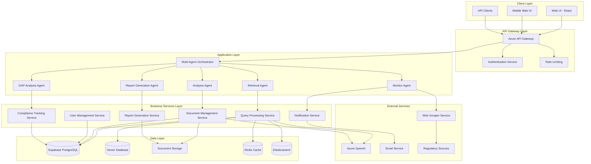
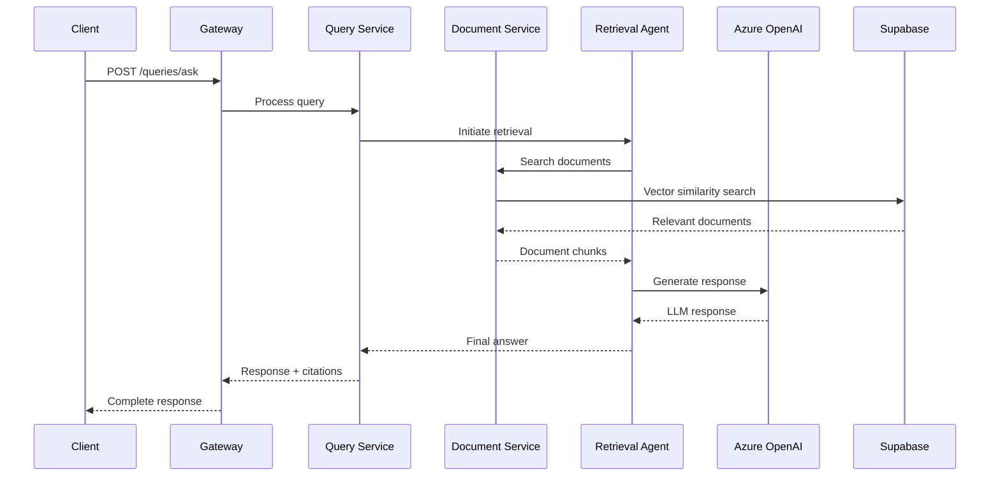
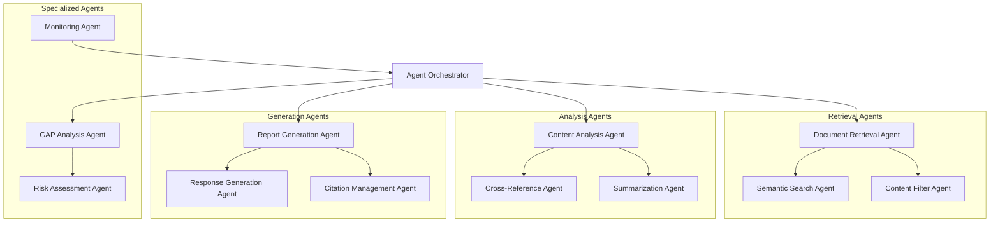
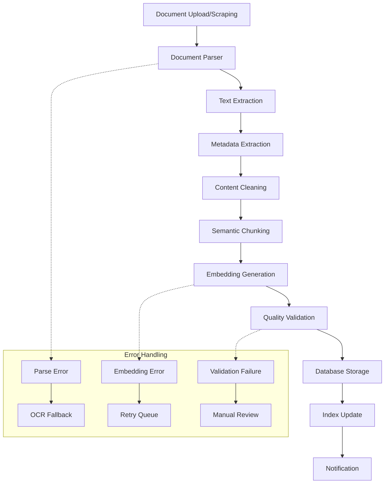
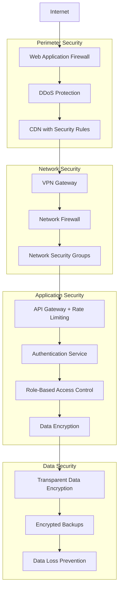
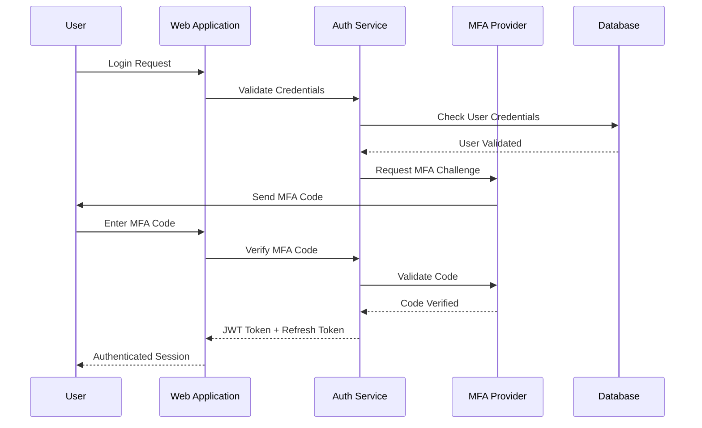
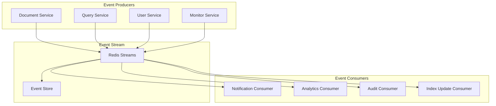
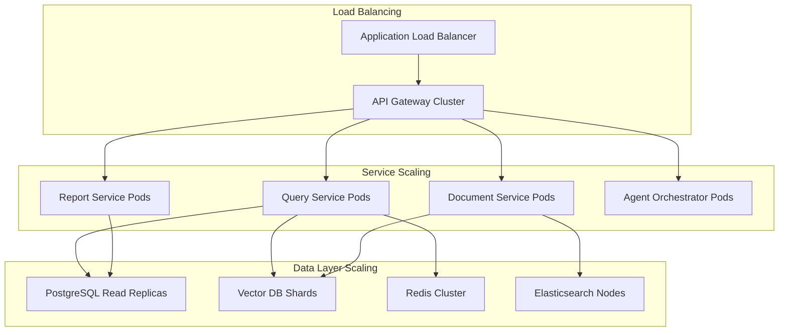

# Banking RAG Compliance System Architecture

## Table of Contents
1. [Executive Summary](#1-executive-summary)
2. [System Architecture Overview](#2-system-architecture-overview)
3. [Microservices Architecture](#3-microservices-architecture)
4. [Multi-Agent System Design](#4-multi-agent-system-design)
5. [Data Architecture](#5-data-architecture)
6. [Security Architecture](#6-security-architecture)
7. [Integration Architecture](#7-integration-architecture)
8. [Deployment Architecture](#8-deployment-architecture)
9. [Performance & Scalability](#9-performance--scalability)
10. [Monitoring & Observability](#10-monitoring--observability)
11. [Disaster Recovery](#11-disaster-recovery)

---

## 1. Executive Summary

### 1.1 Architecture Overview

The Banking RAG Compliance System is designed as a cloud-native, microservices-based platform leveraging multi-agent architecture for intelligent regulatory compliance automation. The system integrates Azure OpenAI for advanced language processing with Supabase for scalable data management, creating a robust foundation for regulatory document analysis and compliance workflow automation.

### 1.2 Key Architectural Decisions

| Decision | Rationale | Impact |
|----------|-----------|---------|
| **Microservices Architecture** | Independent scaling, fault isolation, technology diversity | High maintainability, team autonomy |
| **Multi-Agent Design** | Specialized task handling, parallel processing | Enhanced accuracy, faster processing |
| **Event-Driven Communication** | Asynchronous processing, loose coupling | Better resilience, scalability |
| **Cloud-Native Design** | Managed services, auto-scaling, global reach | Reduced operational overhead |
| **API-First Approach** | Integration flexibility, mobile support | Future-proof, ecosystem ready |

### 1.3 Technology Stack

**Core Technologies:**
- **Backend Framework**: FastAPI (Python) with async/await support
- **Frontend Framework**: React 18 with TypeScript and Material-UI
- **Language Models**: Azure OpenAI GPT-4 Turbo, text-embedding-3-large
- **Database**: Supabase (PostgreSQL) with vector extensions
- **Vector Database**: Supabase Vector/pgvector for embeddings
- **Message Queue**: Redis with Redis Streams
- **Cache**: Redis for session and query caching
- **Search Engine**: Elasticsearch for full-text search
- **Container Platform**: Docker with Kubernetes orchestration
- **Cloud Provider**: Azure (primary) with multi-cloud capability

### 1.4 Scalability Targets

- **Concurrent Users**: 1,000+ simultaneous users
- **Document Volume**: 1M+ regulatory documents
- **Query Throughput**: 10K+ queries per minute
- **Response Time**: <2 seconds for 95th percentile
- **Availability**: 99.9% uptime SLA

---

## 2. System Architecture Overview

### 2.1 High-Level Architecture Diagram



### 2.2 Architecture Layers

#### 2.2.1 Presentation Layer
- **Web UI**: React-based SPA with TypeScript for type safety
- **Mobile Web**: Progressive Web App with responsive design
- **API Layer**: RESTful APIs with OpenAPI 3.0 specification

#### 2.2.2 Application Layer
- **Multi-Agent Orchestrator**: Coordinates agent interactions and workflows
- **Specialized Agents**: Domain-specific processing agents
- **Business Logic Services**: Core business functionality

#### 2.2.3 Data Layer
- **Relational Data**: User management, metadata, relationships
- **Vector Data**: Document embeddings, semantic search
- **Document Storage**: Original documents and processed content
- **Caching**: Session data, query results, embeddings

#### 2.2.4 Integration Layer
- **External AI Services**: Azure OpenAI for LLM capabilities
- **Data Sources**: Regulatory authority websites and APIs
- **Notification Systems**: Email, webhooks, real-time updates

---

## 3. Microservices Architecture

### 3.1 Service Decomposition Strategy

The system follows Domain-Driven Design principles with bounded contexts for each regulatory compliance domain:

#### 3.1.1 Core Business Services

**1. User Management Service**
- **Responsibility**: Authentication, authorization, user profiles
- **Technology**: FastAPI + Supabase Auth
- **Database**: Supabase PostgreSQL
- **Scaling**: Horizontal with session affinity

```yaml
# user-management-service
endpoints:
  - POST /auth/login
  - POST /auth/logout
  - GET /users/{user_id}/profile
  - PUT /users/{user_id}/profile
  - GET /users/{user_id}/permissions
```

**2. Document Management Service**
- **Responsibility**: Document ingestion, processing, storage
- **Technology**: FastAPI + async processing
- **Storage**: Azure Blob Storage + Supabase metadata
- **Scaling**: Horizontal with queue-based processing

```yaml
# document-management-service
endpoints:
  - POST /documents/upload
  - GET /documents/{document_id}
  - GET /documents/search
  - PUT /documents/{document_id}/metadata
  - DELETE /documents/{document_id}
```

**3. Query Processing Service**
- **Responsibility**: Natural language query processing and response generation
- **Technology**: FastAPI + Azure OpenAI integration
- **Database**: Supabase + pgvector for embeddings
- **Scaling**: Auto-scaling based on queue depth

```yaml
# query-processing-service
endpoints:
  - POST /queries/ask
  - GET /queries/{query_id}/response
  - GET /queries/history
  - POST /queries/{query_id}/feedback
```

**4. Report Generation Service**
- **Responsibility**: Automated report creation and export
- **Technology**: FastAPI + report templates
- **Storage**: Temporary file storage + user workspace
- **Scaling**: Background job processing with Redis

```yaml
# report-generation-service
endpoints:
  - POST /reports/generate
  - GET /reports/{report_id}/status
  - GET /reports/{report_id}/download
  - GET /reports/templates
  - POST /reports/templates/custom
```

**5. Compliance Analysis Service**
- **Responsibility**: GAP analysis, compliance tracking, risk assessment
- **Technology**: FastAPI + specialized ML models
- **Database**: Supabase with compliance data models
- **Scaling**: CPU-intensive workload optimization

```yaml
# compliance-analysis-service
endpoints:
  - POST /compliance/gap-analysis
  - GET /compliance/gaps/{analysis_id}
  - POST /compliance/risk-assessment
  - GET /compliance/status/dashboard
  - PUT /compliance/gaps/{gap_id}/remediation
```

**6. Monitoring & Alerting Service**
- **Responsibility**: Regulatory update tracking, notification delivery
- **Technology**: FastAPI + scheduled jobs
- **Integration**: Web scrapers + notification providers
- **Scaling**: Event-driven with message queues

```yaml
# monitoring-alerting-service
endpoints:
  - GET /monitoring/sources
  - POST /monitoring/sources/configure
  - GET /monitoring/updates/recent
  - POST /alerts/configure
  - GET /alerts/history
```

### 3.2 Service Communication Patterns

#### 3.2.1 Synchronous Communication
- **API Gateway to Services**: REST/HTTP for request-response patterns
- **Service-to-Service**: Direct HTTP calls for immediate data needs
- **Client-to-API**: REST APIs with JWT authentication

#### 3.2.2 Asynchronous Communication
- **Event Streaming**: Redis Streams for real-time events
- **Message Queues**: Redis with job queues for background processing
- **Pub/Sub**: Event broadcasting for loose coupling

#### 3.2.3 Communication Flow Example



### 3.3 Service Deployment Specifications

#### 3.3.1 Container Specifications

```dockerfile
# Example: Query Processing Service
FROM python:3.11-slim

WORKDIR /app

COPY requirements.txt .
RUN pip install --no-cache-dir -r requirements.txt

COPY . .

EXPOSE 8000

CMD ["uvicorn", "main:app", "--host", "0.0.0.0", "--port", "8000", "--workers", "4"]
```

#### 3.3.2 Kubernetes Deployment

```yaml
apiVersion: apps/v1
kind: Deployment
metadata:
  name: query-processing-service
  labels:
    app: query-processing-service
spec:
  replicas: 3
  selector:
    matchLabels:
      app: query-processing-service
  template:
    metadata:
      labels:
        app: query-processing-service
    spec:
      containers:
      - name: query-processing
        image: bancompliance/query-processing:latest
        ports:
        - containerPort: 8000
        env:
        - name: DATABASE_URL
          valueFrom:
            secretKeyRef:
              name: supabase-secret
              key: database-url
        - name: OPENAI_API_KEY
          valueFrom:
            secretKeyRef:
              name: openai-secret
              key: api-key
        resources:
          requests:
            memory: "512Mi"
            cpu: "500m"
          limits:
            memory: "1Gi"
            cpu: "1000m"
        livenessProbe:
          httpGet:
            path: /health
            port: 8000
          initialDelaySeconds: 30
          periodSeconds: 10
        readinessProbe:
          httpGet:
            path: /ready
            port: 8000
          initialDelaySeconds: 5
          periodSeconds: 5
```

---

## 4. Multi-Agent System Design

### 4.1 Agent Architecture Overview

The system employs a hierarchical multi-agent architecture with a central orchestrator managing specialized agents for different compliance tasks.



### 4.2 Agent Specifications

#### 4.2.1 Agent Orchestrator

**Purpose**: Central coordinator for all agent activities and workflow management.

**Capabilities:**
- Task routing and prioritization
- Agent lifecycle management
- Resource allocation and load balancing
- Error handling and recovery
- Performance monitoring

**Implementation:**
```python
class AgentOrchestrator:
    def __init__(self):
        self.agents = {}
        self.task_queue = asyncio.Queue()
        self.result_store = {}

    async def register_agent(self, agent_type: str, agent_instance):
        """Register a specialized agent with the orchestrator"""
        self.agents[agent_type] = agent_instance

    async def route_task(self, task: Task) -> TaskResult:
        """Route task to appropriate agent based on task type"""
        agent_type = self.determine_agent_type(task)
        agent = self.agents.get(agent_type)

        if not agent:
            raise AgentNotFoundError(f"Agent {agent_type} not available")

        return await agent.process_task(task)
```

#### 4.2.2 Document Retrieval Agent

**Purpose**: Intelligent document retrieval with multi-strategy search capabilities.

**Tools:**
- Vector similarity search (pgvector)
- Keyword search (Elasticsearch)
- Metadata filtering
- Relevance scoring
- Context preservation

**Workflow:**
1. Query understanding and intent classification
2. Multi-modal search execution (vector + keyword + metadata)
3. Result reranking and filtering
4. Context enrichment and chunk aggregation
5. Relevance scoring and final selection

**Implementation:**
```python
class DocumentRetrievalAgent:
    def __init__(self, vector_db, search_engine, embedding_service):
        self.vector_db = vector_db
        self.search_engine = search_engine
        self.embedding_service = embedding_service

    async def retrieve_documents(self, query: str, filters: dict = None) -> List[Document]:
        # Multi-strategy retrieval
        embedding = await self.embedding_service.embed(query)

        # Vector search
        vector_results = await self.vector_db.similarity_search(
            embedding, top_k=20, filters=filters
        )

        # Keyword search
        keyword_results = await self.search_engine.search(
            query, filters=filters, top_k=20
        )

        # Hybrid ranking
        combined_results = self.hybrid_rank(vector_results, keyword_results)

        return combined_results[:10]
```

#### 4.2.3 Analysis Agent

**Purpose**: Deep content analysis and insight generation for regulatory documents.

**Capabilities:**
- Document summarization
- Entity extraction (regulations, dates, authorities)
- Relationship mapping
- Impact analysis
- Cross-reference detection

**Specialized Prompts:**
```python
ANALYSIS_PROMPTS = {
    "summarize": """
    Analyze the following regulatory document and provide:
    1. Executive summary (2-3 sentences)
    2. Key requirements and obligations
    3. Affected entities and sectors
    4. Implementation deadlines
    5. Potential business impact

    Document: {document_content}
    """,

    "extract_requirements": """
    Extract all specific regulatory requirements from this document.
    For each requirement, identify:
    - Requirement text
    - Affected parties
    - Compliance deadline
    - Penalty for non-compliance (if specified)

    Document: {document_content}
    """
}
```

#### 4.2.4 Report Generation Agent

**Purpose**: Automated generation of compliance reports with professional formatting.

**Templates Supported:**
- Compliance Status Reports
- Regulatory Update Summaries
- GAP Analysis Reports
- Risk Assessment Reports
- Executive Briefings

**Implementation:**
```python
class ReportGenerationAgent:
    def __init__(self, template_engine, document_service):
        self.template_engine = template_engine
        self.document_service = document_service
        self.formatters = {
            'docx': DocxFormatter(),
            'pdf': PdfFormatter(),
            'html': HtmlFormatter()
        }

    async def generate_report(self, report_config: ReportConfig) -> Report:
        # Data collection
        data = await self.collect_report_data(report_config)

        # Content generation
        content = await self.generate_content(data, report_config.template)

        # Formatting and export
        formatted_report = await self.format_report(content, report_config.format)

        return Report(
            id=report_config.id,
            content=formatted_report,
            metadata=self.generate_metadata(report_config)
        )
```

#### 4.2.5 GAP Analysis Agent

**Purpose**: Specialized compliance gap identification and remediation planning.

**Analysis Framework:**
1. **Document Parsing**: Extract requirements from both regulatory and internal documents
2. **Requirement Mapping**: Align similar requirements across documents
3. **Gap Identification**: Identify missing or partially covered requirements
4. **Severity Assessment**: Risk-based prioritization of gaps
5. **Remediation Planning**: Actionable recommendations for gap closure

**Implementation:**
```python
class GapAnalysisAgent:
    def __init__(self, nlp_service, compliance_rules):
        self.nlp_service = nlp_service
        self.compliance_rules = compliance_rules

    async def perform_gap_analysis(self, regulatory_doc: Document,
                                 internal_policy: Document) -> GapAnalysisResult:
        # Extract requirements
        reg_requirements = await self.extract_requirements(regulatory_doc)
        policy_requirements = await self.extract_requirements(internal_policy)

        # Map and compare
        mapping = await self.map_requirements(reg_requirements, policy_requirements)
        gaps = self.identify_gaps(mapping)

        # Assess severity
        assessed_gaps = [self.assess_severity(gap) for gap in gaps]

        # Generate recommendations
        recommendations = [self.generate_recommendation(gap) for gap in assessed_gaps]

        return GapAnalysisResult(
            gaps=assessed_gaps,
            recommendations=recommendations,
            summary=self.generate_summary(assessed_gaps)
        )
```

### 4.3 Agent Communication Protocols

#### 4.3.1 Message Format

```python
@dataclass
class AgentMessage:
    message_id: str
    sender_agent: str
    receiver_agent: str
    message_type: MessageType
    payload: dict
    timestamp: datetime
    priority: Priority

class MessageType(Enum):
    TASK_REQUEST = "task_request"
    TASK_RESPONSE = "task_response"
    STATUS_UPDATE = "status_update"
    ERROR_REPORT = "error_report"
    COORDINATION = "coordination"
```

#### 4.3.2 Coordination Patterns

**Task Delegation Pattern:**
```python
async def delegate_complex_query(self, query: ComplexQuery):
    # Decompose query into subtasks
    subtasks = self.decompose_query(query)

    # Delegate to specialized agents
    retrieval_task = Task(type="retrieval", data=subtasks.search_params)
    analysis_task = Task(type="analysis", data=subtasks.analysis_params)

    # Execute in parallel
    retrieval_result, analysis_result = await asyncio.gather(
        self.delegate_to_agent("retrieval", retrieval_task),
        self.delegate_to_agent("analysis", analysis_task)
    )

    # Synthesize results
    final_response = self.synthesize_results(retrieval_result, analysis_result)
    return final_response
```

### 4.4 Agent Performance Monitoring

#### 4.4.1 Key Performance Indicators

| Agent Type | Primary KPIs | Target Values |
|------------|-------------|---------------|
| **Retrieval** | Precision@10, Recall@10, Response Time | >90%, >85%, <1s |
| **Analysis** | Accuracy Score, Processing Time | >95%, <30s |
| **Report Generation** | Generation Success Rate, Time to Complete | >99%, <2min |
| **GAP Analysis** | Gap Detection Accuracy, False Positive Rate | >92%, <8% |

#### 4.4.2 Monitoring Implementation

```python
class AgentMonitor:
    def __init__(self):
        self.metrics_collector = MetricsCollector()
        self.performance_tracker = PerformanceTracker()

    async def track_agent_performance(self, agent_id: str, task: Task, result: TaskResult):
        # Collect performance metrics
        metrics = {
            'execution_time': result.execution_time,
            'success_rate': result.success,
            'resource_usage': result.resource_usage,
            'quality_score': await self.evaluate_quality(result)
        }

        # Store metrics
        await self.metrics_collector.record(agent_id, metrics)

        # Check for performance issues
        if metrics['execution_time'] > self.get_threshold(agent_id, 'max_execution_time'):
            await self.alert_performance_issue(agent_id, 'high_latency', metrics)
```

---

## 5. Data Architecture

### 5.1 Data Storage Strategy

The system employs a polyglot persistence approach, selecting optimal storage technologies for different data types and access patterns.

#### 5.1.1 Primary Database: Supabase PostgreSQL

**Use Cases:**
- User management and authentication
- Document metadata and relationships
- Configuration and system settings
- Audit logs and compliance tracking

**Schema Design:**

```sql
-- Users and Authentication
CREATE TABLE users (
    id UUID PRIMARY KEY DEFAULT gen_random_uuid(),
    email VARCHAR(255) UNIQUE NOT NULL,
    role user_role NOT NULL DEFAULT 'viewer',
    organization_id UUID REFERENCES organizations(id),
    created_at TIMESTAMP WITH TIME ZONE DEFAULT NOW(),
    last_login TIMESTAMP WITH TIME ZONE
);

-- Organizations and Multi-tenancy
CREATE TABLE organizations (
    id UUID PRIMARY KEY DEFAULT gen_random_uuid(),
    name VARCHAR(255) NOT NULL,
    subscription_tier subscription_tier NOT NULL DEFAULT 'basic',
    settings JSONB DEFAULT '{}',
    created_at TIMESTAMP WITH TIME ZONE DEFAULT NOW()
);

-- Document Metadata
CREATE TABLE documents (
    id UUID PRIMARY KEY DEFAULT gen_random_uuid(),
    title VARCHAR(500) NOT NULL,
    document_type document_type NOT NULL,
    authority regulatory_authority,
    jurisdiction jurisdiction_type,
    publication_date DATE,
    effective_date DATE,
    file_path VARCHAR(1000),
    file_size BIGINT,
    page_count INTEGER,
    language language_code DEFAULT 'en',
    status document_status DEFAULT 'active',
    metadata JSONB DEFAULT '{}',
    created_at TIMESTAMP WITH TIME ZONE DEFAULT NOW(),
    updated_at TIMESTAMP WITH TIME ZONE DEFAULT NOW()
);

-- Document Chunks for RAG
CREATE TABLE document_chunks (
    id UUID PRIMARY KEY DEFAULT gen_random_uuid(),
    document_id UUID REFERENCES documents(id) ON DELETE CASCADE,
    chunk_index INTEGER NOT NULL,
    content TEXT NOT NULL,
    embedding vector(1536), -- OpenAI embedding dimension
    token_count INTEGER,
    metadata JSONB DEFAULT '{}',
    created_at TIMESTAMP WITH TIME ZONE DEFAULT NOW()
);

-- Vector similarity search index
CREATE INDEX ON document_chunks USING ivfflat (embedding vector_cosine_ops)
WITH (lists = 100);

-- Full-text search index
CREATE INDEX document_chunks_fts_idx ON document_chunks
USING GIN (to_tsvector('english', content));
```

#### 5.1.2 Vector Database: Supabase with pgvector

**Configuration:**
- **Embedding Model**: OpenAI text-embedding-3-large (1536 dimensions)
- **Similarity Metric**: Cosine similarity
- **Index Type**: IVFFLAT for production, HNSW for development
- **Chunk Size**: 512-1024 tokens with 10% overlap

**Vector Operations:**
```sql
-- Semantic search function
CREATE OR REPLACE FUNCTION semantic_search(
    query_embedding vector(1536),
    similarity_threshold FLOAT DEFAULT 0.7,
    max_results INTEGER DEFAULT 10,
    filter_conditions JSONB DEFAULT '{}'::JSONB
)
RETURNS TABLE(
    chunk_id UUID,
    document_id UUID,
    content TEXT,
    similarity_score FLOAT,
    metadata JSONB
) AS $$
BEGIN
    RETURN QUERY
    SELECT
        dc.id,
        dc.document_id,
        dc.content,
        1 - (dc.embedding <=> query_embedding) AS similarity,
        dc.metadata
    FROM document_chunks dc
    JOIN documents d ON dc.document_id = d.id
    WHERE
        (1 - (dc.embedding <=> query_embedding)) > similarity_threshold
        AND (filter_conditions = '{}'::JSONB OR d.metadata @> filter_conditions)
    ORDER BY dc.embedding <=> query_embedding
    LIMIT max_results;
END;
$$ LANGUAGE plpgsql;
```

#### 5.1.3 Document Storage: Azure Blob Storage

**Storage Strategy:**
```
banking-compliance-docs/
├── regulatory/
│   ├── eu/
│   │   ├── esma/
│   │   │   ├── {year}/{month}/
│   │   │   └── {document-id}.{ext}
│   │   ├── eba/
│   │   └── eiopa/
│   ├── spain/
│   │   ├── bank-of-spain/
│   │   └── cnmv/
│   └── international/
│       └── iosco/
├── internal-policies/
│   └── {organization-id}/
│       ├── policies/
│       ├── procedures/
│       └── templates/
└── generated-reports/
    └── {organization-id}/
        ├── {report-type}/
        └── {timestamp}/
```

#### 5.1.4 Caching Layer: Redis

**Cache Strategies:**

```python
# Query result caching
@cache(key_prefix="query_result", expire=3600)  # 1 hour
async def get_query_result(query_hash: str, filters: dict):
    # Complex query processing
    pass

# Document embedding caching
@cache(key_prefix="doc_embedding", expire=86400)  # 24 hours
async def get_document_embedding(document_id: str):
    # Embedding generation
    pass

# User session caching
@cache(key_prefix="user_session", expire=1800)  # 30 minutes
async def get_user_session(session_token: str):
    # Session data retrieval
    pass
```

### 5.2 Data Processing Pipeline

#### 5.2.1 Document Ingestion Workflow



#### 5.2.2 Processing Implementation

```python
class DocumentProcessor:
    def __init__(self):
        self.parser = DocumentParser()
        self.embedding_service = EmbeddingService()
        self.chunker = SemanticChunker()

    async def process_document(self, document_path: str) -> ProcessingResult:
        try:
            # Extract text and metadata
            content = await self.parser.extract_text(document_path)
            metadata = await self.parser.extract_metadata(document_path)

            # Clean and prepare content
            cleaned_content = self.clean_content(content)

            # Create semantic chunks
            chunks = await self.chunker.create_chunks(
                cleaned_content,
                chunk_size=1024,
                overlap=102
            )

            # Generate embeddings
            embeddings = await self.embedding_service.embed_chunks(chunks)

            # Store in database
            document_id = await self.store_document(metadata, chunks, embeddings)

            return ProcessingResult(
                document_id=document_id,
                chunks_processed=len(chunks),
                status=ProcessingStatus.SUCCESS
            )

        except Exception as e:
            logger.error(f"Document processing failed: {e}")
            return ProcessingResult(
                error=str(e),
                status=ProcessingStatus.FAILED
            )
```

### 5.3 Data Quality and Governance

#### 5.3.1 Data Quality Framework

**Quality Metrics:**
- **Completeness**: Required metadata fields populated
- **Accuracy**: OCR confidence scores, validation checks
- **Consistency**: Standardized formats, controlled vocabularies
- **Timeliness**: Document freshness, update frequency
- **Relevance**: Content relevance scoring

**Implementation:**
```python
class DataQualityChecker:
    def __init__(self):
        self.validators = {
            'completeness': CompletenessValidator(),
            'accuracy': AccuracyValidator(),
            'consistency': ConsistencyValidator(),
            'timeliness': TimelinessValidator()
        }

    async def validate_document(self, document: Document) -> QualityReport:
        quality_scores = {}

        for validator_name, validator in self.validators.items():
            score = await validator.validate(document)
            quality_scores[validator_name] = score

        overall_score = self.calculate_overall_score(quality_scores)

        return QualityReport(
            document_id=document.id,
            scores=quality_scores,
            overall_score=overall_score,
            recommendations=self.generate_recommendations(quality_scores)
        )
```

#### 5.3.2 Data Lineage Tracking

```sql
-- Data lineage tracking
CREATE TABLE data_lineage (
    id UUID PRIMARY KEY DEFAULT gen_random_uuid(),
    source_document_id UUID REFERENCES documents(id),
    derived_document_id UUID REFERENCES documents(id),
    transformation_type transformation_type NOT NULL,
    transformation_metadata JSONB,
    created_at TIMESTAMP WITH TIME ZONE DEFAULT NOW()
);

-- Audit trail for all data operations
CREATE TABLE audit_log (
    id UUID PRIMARY KEY DEFAULT gen_random_uuid(),
    user_id UUID REFERENCES users(id),
    action audit_action NOT NULL,
    entity_type VARCHAR(50) NOT NULL,
    entity_id UUID NOT NULL,
    old_values JSONB,
    new_values JSONB,
    ip_address INET,
    user_agent TEXT,
    created_at TIMESTAMP WITH TIME ZONE DEFAULT NOW()
);
```

---

## 6. Security Architecture

### 6.1 Security-First Design Principles

The system implements defense-in-depth security with zero-trust architecture principles:

#### 6.1.1 Security Layers



#### 6.1.2 Authentication Architecture

**Multi-Factor Authentication Flow:**



**Implementation:**
```python
class AuthenticationService:
    def __init__(self):
        self.jwt_handler = JWTHandler()
        self.mfa_service = MFAService()
        self.password_hasher = PasswordHasher()

    async def authenticate_user(self, email: str, password: str, mfa_code: str = None) -> AuthResult:
        # Validate credentials
        user = await self.validate_credentials(email, password)
        if not user:
            raise AuthenticationError("Invalid credentials")

        # Check if MFA is required
        if user.mfa_enabled and not mfa_code:
            await self.mfa_service.send_challenge(user.id)
            return AuthResult(status=AuthStatus.MFA_REQUIRED)

        # Verify MFA if provided
        if user.mfa_enabled and mfa_code:
            mfa_valid = await self.mfa_service.verify_code(user.id, mfa_code)
            if not mfa_valid:
                raise AuthenticationError("Invalid MFA code")

        # Generate tokens
        access_token = self.jwt_handler.create_access_token(user)
        refresh_token = self.jwt_handler.create_refresh_token(user)

        # Log successful authentication
        await self.audit_logger.log_auth_success(user.id, request.remote_addr)

        return AuthResult(
            status=AuthStatus.SUCCESS,
            access_token=access_token,
            refresh_token=refresh_token,
            user=user
        )
```

#### 6.1.3 Authorization Framework

**Role-Based Access Control (RBAC):**

```python
class Permission(Enum):
    READ_DOCUMENTS = "read:documents"
    WRITE_DOCUMENTS = "write:documents"
    DELETE_DOCUMENTS = "delete:documents"
    GENERATE_REPORTS = "generate:reports"
    PERFORM_GAP_ANALYSIS = "perform:gap_analysis"
    MANAGE_USERS = "manage:users"
    ACCESS_ADMIN = "access:admin"
    VIEW_AUDIT_LOGS = "view:audit_logs"

class Role(Enum):
    VIEWER = "viewer"
    ANALYST = "analyst"
    MANAGER = "manager"
    ADMIN = "admin"

ROLE_PERMISSIONS = {
    Role.VIEWER: [
        Permission.READ_DOCUMENTS,
    ],
    Role.ANALYST: [
        Permission.READ_DOCUMENTS,
        Permission.GENERATE_REPORTS,
        Permission.PERFORM_GAP_ANALYSIS,
    ],
    Role.MANAGER: [
        Permission.READ_DOCUMENTS,
        Permission.WRITE_DOCUMENTS,
        Permission.GENERATE_REPORTS,
        Permission.PERFORM_GAP_ANALYSIS,
    ],
    Role.ADMIN: [
        Permission.READ_DOCUMENTS,
        Permission.WRITE_DOCUMENTS,
        Permission.DELETE_DOCUMENTS,
        Permission.GENERATE_REPORTS,
        Permission.PERFORM_GAP_ANALYSIS,
        Permission.MANAGE_USERS,
        Permission.ACCESS_ADMIN,
        Permission.VIEW_AUDIT_LOGS,
    ]
}
```

**Authorization Decorator:**
```python
def require_permission(permission: Permission):
    def decorator(func):
        @wraps(func)
        async def wrapper(*args, **kwargs):
            # Extract user from JWT token
            current_user = get_current_user()

            # Check permission
            if not has_permission(current_user, permission):
                raise PermissionDeniedError(f"Required permission: {permission.value}")

            return await func(*args, **kwargs)
        return wrapper
    return decorator

# Usage example
@require_permission(Permission.GENERATE_REPORTS)
async def generate_compliance_report(report_config: ReportConfig):
    # Report generation logic
    pass
```

### 6.2 Data Encryption Strategy

#### 6.2.1 Encryption at Rest

**Database Encryption:**
- **Transparent Data Encryption (TDE)** for Supabase PostgreSQL
- **Field-level encryption** for sensitive data (PII, credentials)
- **Key rotation** every 90 days with automated key management

```python
class EncryptionService:
    def __init__(self):
        self.key_manager = AzureKeyVault()
        self.cipher = AESCipher()

    async def encrypt_sensitive_field(self, data: str, field_type: str) -> str:
        """Encrypt sensitive data with field-specific keys"""
        encryption_key = await self.key_manager.get_key(f"field_{field_type}")
        encrypted_data = self.cipher.encrypt(data, encryption_key)

        return base64.b64encode(encrypted_data).decode('utf-8')

    async def decrypt_sensitive_field(self, encrypted_data: str, field_type: str) -> str:
        """Decrypt sensitive data"""
        encryption_key = await self.key_manager.get_key(f"field_{field_type}")
        decoded_data = base64.b64decode(encrypted_data)

        return self.cipher.decrypt(decoded_data, encryption_key)
```

#### 6.2.2 Encryption in Transit

**TLS Configuration:**
- **Minimum TLS 1.3** for all client connections
- **Certificate pinning** for mobile applications
- **HSTS headers** for web applications
- **End-to-end encryption** for sensitive API calls

```yaml
# NGINX TLS configuration
server {
    listen 443 ssl http2;
    server_name api.banking-compliance.com;

    ssl_certificate /etc/ssl/certs/banking-compliance.crt;
    ssl_certificate_key /etc/ssl/private/banking-compliance.key;

    # TLS 1.3 only
    ssl_protocols TLSv1.3;
    ssl_ciphers ECDHE-RSA-AES256-GCM-SHA384:ECDHE-RSA-CHACHA20-POLY1305;
    ssl_prefer_server_ciphers on;

    # HSTS
    add_header Strict-Transport-Security "max-age=31536000; includeSubDomains; preload" always;

    # Security headers
    add_header X-Frame-Options SAMEORIGIN always;
    add_header X-Content-Type-Options nosniff always;
    add_header X-XSS-Protection "1; mode=block" always;
    add_header Referrer-Policy "strict-origin-when-cross-origin" always;
}
```

### 6.3 Security Monitoring and Incident Response

#### 6.3.1 Security Event Monitoring

**SIEM Integration:**
```python
class SecurityEventMonitor:
    def __init__(self):
        self.siem_client = SIEMClient()
        self.anomaly_detector = AnomalyDetector()

    async def log_security_event(self, event: SecurityEvent):
        """Log security events to SIEM system"""

        # Enrich event with context
        enriched_event = await self.enrich_event(event)

        # Check for anomalies
        is_anomalous = await self.anomaly_detector.detect(enriched_event)

        if is_anomalous:
            enriched_event.risk_level = RiskLevel.HIGH
            await self.trigger_alert(enriched_event)

        # Send to SIEM
        await self.siem_client.send_event(enriched_event)

        # Store locally for forensics
        await self.store_security_event(enriched_event)
```

#### 6.3.2 Automated Threat Detection

**Security Rules Engine:**
```python
SECURITY_RULES = [
    {
        "name": "Multiple failed login attempts",
        "condition": "failed_login_count > 5 AND time_window < 300",
        "action": "block_ip_temporary",
        "severity": "medium"
    },
    {
        "name": "Unusual data access pattern",
        "condition": "documents_accessed > 100 AND time_window < 3600",
        "action": "require_additional_auth",
        "severity": "high"
    },
    {
        "name": "Admin action outside business hours",
        "condition": "user_role == 'admin' AND (hour < 8 OR hour > 18)",
        "action": "require_approval",
        "severity": "medium"
    }
]
```

### 6.4 Compliance and Audit

#### 6.4.1 Audit Logging

**Comprehensive Audit Trail:**
```python
@dataclass
class AuditEvent:
    event_id: str
    user_id: Optional[str]
    session_id: str
    action: str
    resource_type: str
    resource_id: Optional[str]
    ip_address: str
    user_agent: str
    request_id: str
    timestamp: datetime
    outcome: str  # success, failure, partial
    risk_level: str
    additional_data: dict

class AuditLogger:
    async def log_event(self, event: AuditEvent):
        """Log audit event with immutable storage"""

        # Add cryptographic hash for integrity
        event_hash = self.calculate_hash(event)

        # Store in immutable audit log
        await self.audit_store.store_event({
            **event.__dict__,
            'event_hash': event_hash,
            'previous_hash': await self.get_previous_hash()
        })

        # Real-time monitoring
        if event.risk_level == 'high':
            await self.security_monitor.alert(event)
```

---

## 7. Integration Architecture

### 7.1 External Service Integration

#### 7.1.1 Azure OpenAI Integration

**Service Configuration:**
```python
class AzureOpenAIService:
    def __init__(self):
        self.client = AzureOpenAI(
            api_key=os.getenv("AZURE_OPENAI_API_KEY"),
            api_version="2024-02-15-preview",
            azure_endpoint=os.getenv("AZURE_OPENAI_ENDPOINT")
        )
        self.rate_limiter = RateLimiter(requests_per_minute=1000)
        self.circuit_breaker = CircuitBreaker(failure_threshold=5)

    @circuit_breaker.protect
    @rate_limiter.limit
    async def generate_completion(self, messages: list, model: str = "gpt-4-turbo") -> str:
        """Generate completion with error handling and retry logic"""
        try:
            response = await self.client.chat.completions.create(
                model=model,
                messages=messages,
                temperature=0.1,
                max_tokens=4096,
                timeout=30
            )
            return response.choices[0].message.content

        except RateLimitError:
            # Implement exponential backoff
            await self.exponential_backoff()
            raise

        except APIError as e:
            logger.error(f"Azure OpenAI API error: {e}")
            raise ServiceUnavailableError("LLM service temporarily unavailable")
```

**Embedding Service:**
```python
class EmbeddingService:
    def __init__(self):
        self.client = AzureOpenAI(...)
        self.cache = RedisCache()

    async def generate_embeddings(self, texts: List[str]) -> List[List[float]]:
        """Generate embeddings with caching and batching"""

        # Check cache first
        cached_embeddings = await self.get_cached_embeddings(texts)
        uncached_texts = [text for text, embedding in cached_embeddings.items() if embedding is None]

        if uncached_texts:
            # Batch process uncached texts
            new_embeddings = await self.batch_embed(uncached_texts)

            # Cache results
            await self.cache_embeddings(uncached_texts, new_embeddings)

        # Combine cached and new embeddings
        return self.combine_embeddings(cached_embeddings, new_embeddings)
```

#### 7.1.2 Regulatory Source Integration

**Web Scraping Service:**
```python
class RegulatoryScrapingService:
    def __init__(self):
        self.scrapers = {
            'esma': ESMAScrapeScraper(),
            'eba': EBADocumentScraper(),
            'cnmv': CNMVScrapaper(),
            'bank_of_spain': BankOfSpainScraper()
        }
        self.scheduler = TaskScheduler()

    async def monitor_regulatory_sources(self):
        """Monitor all regulatory sources for updates"""
        tasks = []

        for authority, scraper in self.scrapers.items():
            task = self.scheduler.schedule_recurring(
                func=self.scrape_authority,
                args=[authority, scraper],
                interval=timedelta(hours=6),  # Check every 6 hours
                retry_policy=RetryPolicy(max_retries=3, backoff_factor=2)
            )
            tasks.append(task)

        await asyncio.gather(*tasks)

    async def scrape_authority(self, authority: str, scraper: BaseScraper):
        """Scrape documents from specific regulatory authority"""
        try:
            new_documents = await scraper.get_new_documents()

            for doc in new_documents:
                await self.process_new_document(authority, doc)

        except ScrapingError as e:
            logger.error(f"Failed to scrape {authority}: {e}")
            await self.alert_scraping_failure(authority, e)
```

#### 7.1.3 Notification Integration

**Multi-Channel Notification Service:**
```python
class NotificationService:
    def __init__(self):
        self.email_service = EmailService()
        self.webhook_service = WebhookService()
        self.in_app_service = InAppNotificationService()

    async def send_notification(self, notification: Notification):
        """Send notification through configured channels"""

        user_preferences = await self.get_user_preferences(notification.user_id)

        # Send through enabled channels
        tasks = []

        if user_preferences.email_enabled:
            tasks.append(self.email_service.send(notification))

        if user_preferences.webhook_enabled:
            tasks.append(self.webhook_service.send(notification))

        # Always send in-app notification
        tasks.append(self.in_app_service.send(notification))

        # Execute all notifications concurrently
        results = await asyncio.gather(*tasks, return_exceptions=True)

        # Log results
        for i, result in enumerate(results):
            if isinstance(result, Exception):
                logger.error(f"Notification channel {i} failed: {result}")
```

### 7.2 API Design and Management

#### 7.2.1 RESTful API Specification

**OpenAPI 3.0 Schema:**
```yaml
openapi: 3.0.3
info:
  title: Banking RAG Compliance API
  version: 1.0.0
  description: REST API for regulatory compliance automation

servers:
  - url: https://api.banking-compliance.com/v1
    description: Production server

paths:
  /queries:
    post:
      summary: Submit regulatory query
      requestBody:
        required: true
        content:
          application/json:
            schema:
              type: object
              properties:
                query:
                  type: string
                  maxLength: 5000
                filters:
                  type: object
                  properties:
                    jurisdiction:
                      type: array
                      items:
                        type: string
                    authority:
                      type: array
                      items:
                        type: string
                    date_range:
                      type: object
                      properties:
                        start:
                          type: string
                          format: date
                        end:
                          type: string
                          format: date
      responses:
        '200':
          description: Successful query response
          content:
            application/json:
              schema:
                $ref: '#/components/schemas/QueryResponse'
        '400':
          description: Invalid query format
        '429':
          description: Rate limit exceeded
        '503':
          description: Service temporarily unavailable

components:
  schemas:
    QueryResponse:
      type: object
      properties:
        query_id:
          type: string
          format: uuid
        response:
          type: string
        confidence_score:
          type: number
          minimum: 0
          maximum: 1
        citations:
          type: array
          items:
            $ref: '#/components/schemas/Citation'
        processing_time:
          type: number

    Citation:
      type: object
      properties:
        document_id:
          type: string
          format: uuid
        title:
          type: string
        authority:
          type: string
        section:
          type: string
        page_number:
          type: integer
        relevance_score:
          type: number
```

#### 7.2.2 API Gateway Configuration

**Rate Limiting and Throttling:**
```python
class APIRateLimiter:
    def __init__(self):
        self.redis = RedisClient()
        self.rate_limits = {
            'free': {'requests': 100, 'window': 3600},      # 100/hour
            'basic': {'requests': 1000, 'window': 3600},    # 1000/hour
            'premium': {'requests': 10000, 'window': 3600}, # 10000/hour
            'enterprise': {'requests': 100000, 'window': 3600}  # 100000/hour
        }

    async def check_rate_limit(self, api_key: str, endpoint: str) -> bool:
        """Check if request is within rate limit"""

        # Get user tier from API key
        user_tier = await self.get_user_tier(api_key)
        limit_config = self.rate_limits.get(user_tier, self.rate_limits['free'])

        # Redis key for rate limiting
        key = f"rate_limit:{api_key}:{endpoint}"

        # Get current count
        current_count = await self.redis.get(key) or 0

        if int(current_count) >= limit_config['requests']:
            return False

        # Increment counter
        pipe = self.redis.pipeline()
        pipe.incr(key)
        pipe.expire(key, limit_config['window'])
        await pipe.execute()

        return True
```

### 7.3 Event-Driven Architecture

#### 7.3.1 Event System Design



**Event Schema:**
```python
@dataclass
class DomainEvent:
    event_id: str = field(default_factory=lambda: str(uuid.uuid4()))
    event_type: str = field()
    aggregate_id: str = field()
    aggregate_type: str = field()
    event_data: dict = field()
    event_version: int = field(default=1)
    occurred_at: datetime = field(default_factory=datetime.utcnow)
    correlation_id: Optional[str] = field(default=None)
    causation_id: Optional[str] = field(default=None)

# Event Types
class EventTypes:
    DOCUMENT_UPLOADED = "document.uploaded"
    DOCUMENT_PROCESSED = "document.processed"
    QUERY_SUBMITTED = "query.submitted"
    QUERY_COMPLETED = "query.completed"
    REPORT_GENERATED = "report.generated"
    GAP_ANALYSIS_COMPLETED = "gap_analysis.completed"
    REGULATORY_UPDATE_DETECTED = "regulatory_update.detected"
    USER_REGISTERED = "user.registered"
    COMPLIANCE_ALERT_TRIGGERED = "compliance_alert.triggered"
```

**Event Publisher:**
```python
class EventPublisher:
    def __init__(self):
        self.redis = RedisStreams()
        self.event_store = EventStore()

    async def publish_event(self, event: DomainEvent):
        """Publish domain event to event stream"""

        # Serialize event
        event_data = {
            'event_id': event.event_id,
            'event_type': event.event_type,
            'aggregate_id': event.aggregate_id,
            'aggregate_type': event.aggregate_type,
            'event_data': json.dumps(event.event_data),
            'event_version': event.event_version,
            'occurred_at': event.occurred_at.isoformat(),
            'correlation_id': event.correlation_id,
            'causation_id': event.causation_id
        }

        # Store in event store
        await self.event_store.append_event(event)

        # Publish to stream
        await self.redis.xadd(
            f"events:{event.aggregate_type}",
            event_data
        )

        logger.info(f"Published event {event.event_type} for {event.aggregate_id}")
```

---

## 8. Deployment Architecture

### 8.1 Container Strategy

#### 8.1.1 Docker Containerization

**Multi-stage Dockerfile Example:**
```dockerfile
# Production Dockerfile for Query Service
FROM python:3.11-slim as base

# Install system dependencies
RUN apt-get update && apt-get install -y \
    build-essential \
    libpq-dev \
    && rm -rf /var/lib/apt/lists/*

WORKDIR /app

# Install Python dependencies
COPY requirements.txt .
RUN pip install --no-cache-dir -r requirements.txt

# Production stage
FROM base as production

# Create non-root user
RUN groupadd -r appuser && useradd -r -g appuser appuser

# Copy application code
COPY --chown=appuser:appuser . .

# Switch to non-root user
USER appuser

# Health check
HEALTHCHECK --interval=30s --timeout=10s --start-period=5s --retries=3 \
  CMD curl -f http://localhost:8000/health || exit 1

EXPOSE 8000

CMD ["uvicorn", "main:app", "--host", "0.0.0.0", "--port", "8000", "--workers", "4"]
```

#### 8.1.2 Kubernetes Deployment

**Service Deployment Configuration:**
```yaml
apiVersion: apps/v1
kind: Deployment
metadata:
  name: query-processing-service
  namespace: banking-compliance
  labels:
    app: query-processing-service
    version: v1.0.0
spec:
  replicas: 3
  strategy:
    type: RollingUpdate
    rollingUpdate:
      maxSurge: 1
      maxUnavailable: 0
  selector:
    matchLabels:
      app: query-processing-service
  template:
    metadata:
      labels:
        app: query-processing-service
      annotations:
        prometheus.io/scrape: "true"
        prometheus.io/port: "8000"
        prometheus.io/path: "/metrics"
    spec:
      serviceAccountName: query-processing-sa
      securityContext:
        runAsNonRoot: true
        runAsUser: 1000
        fsGroup: 2000
      containers:
      - name: query-processing
        image: bancompliance/query-processing:v1.0.0
        imagePullPolicy: IfNotPresent
        ports:
        - containerPort: 8000
          name: http
        env:
        - name: DATABASE_URL
          valueFrom:
            secretKeyRef:
              name: database-secret
              key: url
        - name: REDIS_URL
          valueFrom:
            secretKeyRef:
              name: redis-secret
              key: url
        - name: OPENAI_API_KEY
          valueFrom:
            secretKeyRef:
              name: openai-secret
              key: api-key
        resources:
          requests:
            memory: "1Gi"
            cpu: "500m"
          limits:
            memory: "2Gi"
            cpu: "1000m"
        livenessProbe:
          httpGet:
            path: /health
            port: http
          initialDelaySeconds: 30
          periodSeconds: 10
          timeoutSeconds: 5
          successThreshold: 1
          failureThreshold: 3
        readinessProbe:
          httpGet:
            path: /ready
            port: http
          initialDelaySeconds: 5
          periodSeconds: 5
          timeoutSeconds: 3
          successThreshold: 1
          failureThreshold: 3
        volumeMounts:
        - name: temp-storage
          mountPath: /tmp
      volumes:
      - name: temp-storage
        emptyDir:
          sizeLimit: 1Gi
      nodeSelector:
        kubernetes.io/os: linux
      tolerations:
      - key: "banking-compliance-workload"
        operator: "Equal"
        value: "true"
        effect: "NoSchedule"
```

### 8.2 Infrastructure as Code

#### 8.2.1 Terraform Configuration

**Azure Infrastructure:**
```hcl
# main.tf
terraform {
  required_providers {
    azurerm = {
      source  = "hashicorp/azurerm"
      version = "~> 3.0"
    }
  }
}

provider "azurerm" {
  features {}
}

# Resource Group
resource "azurerm_resource_group" "main" {
  name     = "rg-banking-compliance-${var.environment}"
  location = var.location

  tags = {
    Environment = var.environment
    Project     = "banking-compliance"
    ManagedBy   = "terraform"
  }
}

# Azure Kubernetes Service
resource "azurerm_kubernetes_cluster" "main" {
  name                = "aks-banking-compliance-${var.environment}"
  location            = azurerm_resource_group.main.location
  resource_group_name = azurerm_resource_group.main.name
  dns_prefix          = "banking-compliance-${var.environment}"

  default_node_pool {
    name       = "default"
    node_count = var.node_count
    vm_size    = "Standard_D4s_v3"

    enable_auto_scaling = true
    min_count          = 2
    max_count          = 10
  }

  identity {
    type = "SystemAssigned"
  }

  network_profile {
    network_plugin    = "azure"
    load_balancer_sku = "standard"
  }

  tags = {
    Environment = var.environment
  }
}

# Azure Database for PostgreSQL (Supabase alternative)
resource "azurerm_postgresql_flexible_server" "main" {
  name                   = "postgres-banking-compliance-${var.environment}"
  resource_group_name    = azurerm_resource_group.main.name
  location              = azurerm_resource_group.main.location
  version               = "14"
  administrator_login    = var.db_admin_username
  administrator_password = var.db_admin_password
  zone                  = "1"

  storage_mb = 32768

  sku_name   = "GP_Standard_D4s_v3"

  backup_retention_days        = 35
  geo_redundant_backup_enabled = true
}

# Redis Cache
resource "azurerm_redis_cache" "main" {
  name                = "redis-banking-compliance-${var.environment}"
  location            = azurerm_resource_group.main.location
  resource_group_name = azurerm_resource_group.main.name
  capacity            = 2
  family              = "C"
  sku_name            = "Standard"
  enable_non_ssl_port = false
  minimum_tls_version = "1.2"

  redis_configuration {
    maxmemory_policy = "allkeys-lru"
  }
}

# Storage Account for Documents
resource "azurerm_storage_account" "documents" {
  name                     = "st${random_string.storage_suffix.result}${var.environment}"
  resource_group_name      = azurerm_resource_group.main.name
  location                = azurerm_resource_group.main.location
  account_tier            = "Standard"
  account_replication_type = "GRS"

  blob_properties {
    delete_retention_policy {
      days = 365
    }
    versioning_enabled = true
  }
}

# Application Insights
resource "azurerm_application_insights" "main" {
  name                = "ai-banking-compliance-${var.environment}"
  location            = azurerm_resource_group.main.location
  resource_group_name = azurerm_resource_group.main.name
  application_type    = "web"
}

# Key Vault
resource "azurerm_key_vault" "main" {
  name                       = "kv-banking-compliance-${var.environment}"
  location                   = azurerm_resource_group.main.location
  resource_group_name        = azurerm_resource_group.main.name
  tenant_id                  = data.azurerm_client_config.current.tenant_id
  sku_name                   = "premium"
  soft_delete_retention_days = 7

  access_policy {
    tenant_id = data.azurerm_client_config.current.tenant_id
    object_id = data.azurerm_client_config.current.object_id

    key_permissions = [
      "Create",
      "Get",
      "List",
      "Update",
      "Delete",
      "Purge",
      "Recover"
    ]

    secret_permissions = [
      "Set",
      "Get",
      "Delete",
      "Purge",
      "Recover"
    ]
  }
}
```

#### 8.2.2 Helm Charts

**Application Helm Chart:**
```yaml
# Chart.yaml
apiVersion: v2
name: banking-compliance
description: Banking RAG Compliance System
type: application
version: 1.0.0
appVersion: "1.0.0"

# values.yaml
global:
  environment: production
  namespace: banking-compliance
  imageRegistry: bancompliance.azurecr.io
  imageTag: v1.0.0

services:
  queryProcessing:
    enabled: true
    replicaCount: 3
    image:
      repository: query-processing
      tag: v1.0.0
    resources:
      requests:
        memory: 1Gi
        cpu: 500m
      limits:
        memory: 2Gi
        cpu: 1000m

  documentManagement:
    enabled: true
    replicaCount: 2
    image:
      repository: document-management
      tag: v1.0.0
    resources:
      requests:
        memory: 2Gi
        cpu: 1000m
      limits:
        memory: 4Gi
        cpu: 2000m

database:
  host: postgres-banking-compliance-prod.postgres.database.azure.com
  port: 5432
  name: banking_compliance
  sslmode: require

redis:
  host: redis-banking-compliance-prod.redis.cache.windows.net
  port: 6380
  ssl: true

monitoring:
  prometheus:
    enabled: true
  grafana:
    enabled: true
  alerts:
    enabled: true
```

### 8.3 CI/CD Pipeline

#### 8.3.1 GitHub Actions Workflow

```yaml
# .github/workflows/deploy.yml
name: Deploy Banking Compliance System

on:
  push:
    branches: [main]
  pull_request:
    branches: [main]

env:
  REGISTRY: bancompliance.azurecr.io
  IMAGE_NAME: banking-compliance

jobs:
  test:
    runs-on: ubuntu-latest
    steps:
    - uses: actions/checkout@v4

    - name: Set up Python
      uses: actions/setup-python@v4
      with:
        python-version: '3.11'

    - name: Install dependencies
      run: |
        python -m pip install --upgrade pip
        pip install -r requirements.txt
        pip install -r requirements-dev.txt

    - name: Run tests
      run: |
        python -m pytest tests/ --cov=src --cov-report=xml

    - name: Security scan
      run: |
        bandit -r src/
        safety check

    - name: Code quality check
      run: |
        black --check src/
        isort --check-only src/
        flake8 src/

  build:
    needs: test
    runs-on: ubuntu-latest
    if: github.ref == 'refs/heads/main'

    steps:
    - uses: actions/checkout@v4

    - name: Log in to Azure Container Registry
      uses: azure/docker-login@v1
      with:
        login-server: ${{ env.REGISTRY }}
        username: ${{ secrets.REGISTRY_USERNAME }}
        password: ${{ secrets.REGISTRY_PASSWORD }}

    - name: Build and push Docker images
      run: |
        docker build -t ${{ env.REGISTRY }}/query-processing:${{ github.sha }} \
          -f services/query-processing/Dockerfile services/query-processing/
        docker push ${{ env.REGISTRY }}/query-processing:${{ github.sha }}

        docker build -t ${{ env.REGISTRY }}/document-management:${{ github.sha }} \
          -f services/document-management/Dockerfile services/document-management/
        docker push ${{ env.REGISTRY }}/document-management:${{ github.sha }}

  deploy-staging:
    needs: build
    runs-on: ubuntu-latest
    environment: staging

    steps:
    - uses: actions/checkout@v4

    - name: Azure Kubernetes set context
      uses: azure/aks-set-context@v3
      with:
        resource-group: rg-banking-compliance-staging
        cluster-name: aks-banking-compliance-staging

    - name: Deploy to staging
      run: |
        helm upgrade --install banking-compliance ./helm/banking-compliance \
          --namespace banking-compliance-staging \
          --create-namespace \
          --set global.environment=staging \
          --set global.imageTag=${{ github.sha }} \
          --wait --timeout=600s

    - name: Run integration tests
      run: |
        python -m pytest tests/integration/ \
          --base-url=https://staging-api.banking-compliance.com

  deploy-production:
    needs: deploy-staging
    runs-on: ubuntu-latest
    environment: production
    if: github.ref == 'refs/heads/main'

    steps:
    - uses: actions/checkout@v4

    - name: Azure Kubernetes set context
      uses: azure/aks-set-context@v3
      with:
        resource-group: rg-banking-compliance-prod
        cluster-name: aks-banking-compliance-prod

    - name: Deploy to production
      run: |
        helm upgrade --install banking-compliance ./helm/banking-compliance \
          --namespace banking-compliance \
          --create-namespace \
          --set global.environment=production \
          --set global.imageTag=${{ github.sha }} \
          --wait --timeout=600s

    - name: Verify deployment
      run: |
        kubectl rollout status deployment/query-processing-service \
          --namespace banking-compliance --timeout=600s
```

---

## 9. Performance & Scalability

### 9.1 Performance Targets

#### 9.1.1 Response Time Requirements

| Operation | Target (95th percentile) | Maximum Acceptable |
|-----------|-------------------------|-------------------|
| Simple Query | < 2 seconds | 5 seconds |
| Complex Query | < 5 seconds | 10 seconds |
| Document Upload | < 30 seconds | 60 seconds |
| Report Generation | < 2 minutes | 5 minutes |
| GAP Analysis | < 5 minutes | 10 minutes |

#### 9.1.2 Throughput Requirements

| Metric | Target | Peak Capacity |
|--------|--------|---------------|
| Concurrent Users | 1,000 | 2,500 |
| Queries per Second | 100 QPS | 250 QPS |
| Document Ingestion | 1,000 docs/hour | 5,000 docs/hour |
| API Requests | 10,000 RPM | 25,000 RPM |

### 9.2 Scalability Architecture

#### 9.2.1 Horizontal Scaling Strategy



#### 9.2.2 Auto-scaling Configuration

**Horizontal Pod Autoscaler:**
```yaml
apiVersion: autoscaling/v2
kind: HorizontalPodAutoscaler
metadata:
  name: query-processing-hpa
  namespace: banking-compliance
spec:
  scaleTargetRef:
    apiVersion: apps/v1
    kind: Deployment
    name: query-processing-service
  minReplicas: 2
  maxReplicas: 20
  metrics:
  - type: Resource
    resource:
      name: cpu
      target:
        type: Utilization
        averageUtilization: 70
  - type: Resource
    resource:
      name: memory
      target:
        type: Utilization
        averageUtilization: 80
  - type: Pods
    pods:
      metric:
        name: query_queue_length
      target:
        type: AverageValue
        averageValue: "10"
  behavior:
    scaleDown:
      stabilizationWindowSeconds: 300
      policies:
      - type: Pods
        value: 2
        periodSeconds: 60
    scaleUp:
      stabilizationWindowSeconds: 60
      policies:
      - type: Pods
        value: 4
        periodSeconds: 60
      - type: Percent
        value: 100
        periodSeconds: 60
```

### 9.3 Performance Optimization

#### 9.3.1 Caching Strategy

**Multi-Level Caching:**
```python
class CacheStrategy:
    def __init__(self):
        self.l1_cache = MemoryCache(max_size=1000)  # In-process cache
        self.l2_cache = RedisCache()                # Distributed cache
        self.l3_cache = DatabaseCache()             # Database query cache

    async def get_with_fallback(self, key: str, generator_func):
        """Multi-level cache with fallback"""

        # Try L1 cache first (fastest)
        value = await self.l1_cache.get(key)
        if value is not None:
            return value

        # Try L2 cache (Redis)
        value = await self.l2_cache.get(key)
        if value is not None:
            # Warm L1 cache
            await self.l1_cache.set(key, value, ttl=300)
            return value

        # Generate value and populate all cache levels
        value = await generator_func()

        # Store in all cache levels with different TTLs
        await self.l1_cache.set(key, value, ttl=300)    # 5 minutes
        await self.l2_cache.set(key, value, ttl=3600)   # 1 hour

        return value
```

#### 9.3.2 Database Optimization

**Query Optimization:**
```sql
-- Optimized query for semantic search with filters
CREATE INDEX CONCURRENTLY idx_document_chunks_embedding_filtered
ON document_chunks USING ivfflat (embedding vector_cosine_ops)
WHERE created_at > NOW() - INTERVAL '2 years';

-- Composite index for common filter combinations
CREATE INDEX CONCURRENTLY idx_documents_authority_date
ON documents (authority, publication_date DESC, jurisdiction);

-- Partial index for active documents
CREATE INDEX CONCURRENTLY idx_documents_active
ON documents (id, title, authority)
WHERE status = 'active';

-- Optimized search function with connection pooling
CREATE OR REPLACE FUNCTION optimized_semantic_search(
    query_embedding vector(1536),
    filter_params JSONB DEFAULT '{}',
    limit_count INTEGER DEFAULT 10
)
RETURNS TABLE(
    chunk_id UUID,
    content TEXT,
    similarity_score FLOAT,
    document_title TEXT,
    authority TEXT
)
LANGUAGE plpgsql
AS $$
BEGIN
    RETURN QUERY
    SELECT
        dc.id,
        dc.content,
        1 - (dc.embedding <=> query_embedding) as similarity,
        d.title,
        d.authority::text
    FROM document_chunks dc
    INNER JOIN documents d ON dc.document_id = d.id
    WHERE
        d.status = 'active'
        AND (filter_params->>'authority' IS NULL OR d.authority::text = filter_params->>'authority')
        AND (filter_params->>'jurisdiction' IS NULL OR d.jurisdiction::text = filter_params->>'jurisdiction')
        AND (1 - (dc.embedding <=> query_embedding)) > 0.7
    ORDER BY dc.embedding <=> query_embedding
    LIMIT limit_count;
END;
$$;
```

#### 9.3.3 Connection Pooling

```python
class DatabaseManager:
    def __init__(self):
        self.pool = None
        self.pool_config = {
            'min_size': 5,
            'max_size': 20,
            'command_timeout': 30,
            'server_lifetime': 3600,
            'max_queries': 50000,
            'max_inactive_connection_lifetime': 600
        }

    async def initialize_pool(self):
        """Initialize connection pool with optimal settings"""
        self.pool = await asyncpg.create_pool(
            dsn=DATABASE_URL,
            **self.pool_config
        )

    async def execute_query(self, query: str, *args):
        """Execute query with connection pool"""
        async with self.pool.acquire() as connection:
            async with connection.transaction():
                result = await connection.fetch(query, *args)
                return result
```

---

## 10. Monitoring & Observability

### 10.1 Monitoring Stack

#### 10.1.1 Metrics Collection

**Prometheus Configuration:**
```yaml
# prometheus-config.yaml
global:
  scrape_interval: 15s
  evaluation_interval: 15s

rule_files:
  - "banking_compliance_rules.yml"

scrape_configs:
  - job_name: 'kubernetes-pods'
    kubernetes_sd_configs:
      - role: pod
    relabel_configs:
      - source_labels: [__meta_kubernetes_pod_annotation_prometheus_io_scrape]
        action: keep
        regex: true
      - source_labels: [__meta_kubernetes_pod_annotation_prometheus_io_path]
        action: replace
        target_label: __metrics_path__
        regex: (.+)

  - job_name: 'banking-compliance-api'
    static_configs:
      - targets: ['api.banking-compliance.com:443']
    metrics_path: /metrics
    scheme: https

alerting:
  alertmanagers:
    - static_configs:
        - targets:
          - alertmanager.banking-compliance.com:9093
```

**Custom Metrics:**
```python
from prometheus_client import Counter, Histogram, Gauge, Info

# Business metrics
query_total = Counter('banking_compliance_queries_total',
                     'Total queries processed', ['endpoint', 'status'])
query_duration = Histogram('banking_compliance_query_duration_seconds',
                          'Query processing duration', ['query_type'])
active_users = Gauge('banking_compliance_active_users_total',
                    'Number of active users')

# System metrics
document_processing_total = Counter('banking_compliance_documents_processed_total',
                                   'Documents processed', ['status'])
embedding_generation_duration = Histogram('banking_compliance_embedding_generation_duration_seconds',
                                         'Time to generate embeddings')

# Agent metrics
agent_task_duration = Histogram('banking_compliance_agent_task_duration_seconds',
                               'Agent task processing time', ['agent_type', 'task_type'])
agent_errors = Counter('banking_compliance_agent_errors_total',
                      'Agent processing errors', ['agent_type', 'error_type'])

class MetricsCollector:
    @staticmethod
    async def record_query_metrics(query_type: str, duration: float, status: str):
        query_total.labels(endpoint=query_type, status=status).inc()
        query_duration.labels(query_type=query_type).observe(duration)

    @staticmethod
    async def record_agent_metrics(agent_type: str, task_type: str, duration: float):
        agent_task_duration.labels(agent_type=agent_type, task_type=task_type).observe(duration)
```

#### 10.1.2 Application Performance Monitoring

**APM Integration:**
```python
from opentelemetry import trace
from opentelemetry.exporter.jaeger.thrift import JaegerExporter
from opentelemetry.instrumentation.fastapi import FastAPIInstrumentor
from opentelemetry.instrumentation.asyncpg import AsyncPGInstrumentor
from opentelemetry.instrumentation.redis import RedisInstrumentor

# Configure tracing
tracer = trace.get_tracer(__name__)

class TracingMiddleware:
    def __init__(self):
        # Initialize exporters
        jaeger_exporter = JaegerExporter(
            agent_host_name="jaeger-agent.monitoring.svc.cluster.local",
            agent_port=6831,
        )

        # Auto-instrument frameworks
        FastAPIInstrumentor.instrument_app(app)
        AsyncPGInstrumentor.instrument()
        RedisInstrumentor.instrument()

    async def trace_query_processing(self, query: str, user_id: str):
        """Trace query processing with custom spans"""
        with tracer.start_as_current_span("query_processing") as span:
            span.set_attribute("user.id", user_id)
            span.set_attribute("query.length", len(query))

            # Trace document retrieval
            with tracer.start_as_current_span("document_retrieval") as retrieval_span:
                documents = await self.retrieve_documents(query)
                retrieval_span.set_attribute("documents.count", len(documents))

            # Trace response generation
            with tracer.start_as_current_span("response_generation") as generation_span:
                response = await self.generate_response(query, documents)
                generation_span.set_attribute("response.length", len(response))

            return response
```

### 10.2 Logging Strategy

#### 10.2.1 Structured Logging

```python
import structlog
from datetime import datetime

# Configure structured logging
structlog.configure(
    processors=[
        structlog.stdlib.filter_by_level,
        structlog.stdlib.add_logger_name,
        structlog.stdlib.add_log_level,
        structlog.stdlib.PositionalArgumentsFormatter(),
        structlog.processors.TimeStamper(fmt="iso"),
        structlog.processors.StackInfoRenderer(),
        structlog.processors.format_exc_info,
        structlog.processors.JSONRenderer()
    ],
    context_class=dict,
    logger_factory=structlog.stdlib.LoggerFactory(),
    cache_logger_on_first_use=True,
)

logger = structlog.get_logger()

class ApplicationLogger:
    @staticmethod
    async def log_query_event(event_type: str, user_id: str, query: str,
                             duration: float = None, error: str = None):
        """Log query-related events with structured data"""
        log_data = {
            "event_type": event_type,
            "user_id": user_id,
            "query_hash": hashlib.sha256(query.encode()).hexdigest()[:16],
            "query_length": len(query),
            "timestamp": datetime.utcnow().isoformat()
        }

        if duration:
            log_data["duration_seconds"] = duration

        if error:
            log_data["error"] = error
            logger.error("Query processing failed", **log_data)
        else:
            logger.info("Query processed successfully", **log_data)
```

#### 10.2.2 Log Aggregation

**Fluentd Configuration:**
```yaml
# fluentd-config.yaml
<source>
  @type kubernetes_logs
  path /var/log/containers/*.log
  pos_file /var/log/fluentd-containers.log.pos
  tag kubernetes.*
  read_from_head true
  <parse>
    @type json
    time_key timestamp
    time_format %Y-%m-%dT%H:%M:%S.%NZ
  </parse>
</source>

<filter kubernetes.**>
  @type kubernetes_metadata
</filter>

<match kubernetes.var.log.containers.banking-compliance**>
  @type elasticsearch
  host elasticsearch.logging.svc.cluster.local
  port 9200
  index_name banking-compliance-${Date.at(time).strftime('%Y.%m.%d')}
  type_name _doc

  <buffer>
    @type memory
    flush_interval 10s
    chunk_limit_size 10MB
    flush_thread_count 2
  </buffer>
</match>
```

### 10.3 Alerting and Incident Response

#### 10.3.1 Alert Rules

```yaml
# banking_compliance_rules.yml
groups:
  - name: banking_compliance.performance
    rules:
      - alert: HighQueryLatency
        expr: histogram_quantile(0.95, banking_compliance_query_duration_seconds) > 10
        for: 2m
        labels:
          severity: warning
          team: platform
        annotations:
          summary: "High query latency detected"
          description: "95th percentile query latency is {{ $value }}s, above 10s threshold"

      - alert: HighErrorRate
        expr: rate(banking_compliance_queries_total{status="error"}[5m]) / rate(banking_compliance_queries_total[5m]) > 0.05
        for: 1m
        labels:
          severity: critical
          team: platform
        annotations:
          summary: "High error rate detected"
          description: "Error rate is {{ $value | humanizePercentage }}, above 5% threshold"

  - name: banking_compliance.availability
    rules:
      - alert: ServiceDown
        expr: up{job="banking-compliance-api"} == 0
        for: 30s
        labels:
          severity: critical
          team: platform
        annotations:
          summary: "Banking Compliance API is down"
          description: "API endpoint is not responding"

      - alert: DatabaseConnectionFailure
        expr: increase(banking_compliance_db_errors_total[1m]) > 10
        for: 1m
        labels:
          severity: critical
          team: platform
        annotations:
          summary: "Database connection failures"
          description: "{{ $value }} database connection failures in the last minute"

  - name: banking_compliance.business
    rules:
      - alert: NoDocumentProcessing
        expr: increase(banking_compliance_documents_processed_total[1h]) == 0
        for: 2h
        labels:
          severity: warning
          team: business
        annotations:
          summary: "No documents processed recently"
          description: "No documents have been processed in the last 2 hours"
```

#### 10.3.2 Incident Response Automation

```python
class IncidentResponseAutomator:
    def __init__(self):
        self.pagerduty_client = PagerDutyClient()
        self.slack_client = SlackClient()
        self.scaling_controller = KubernetesScaler()

    async def handle_high_latency_alert(self, alert: Alert):
        """Automated response to high latency alerts"""

        # Immediate actions
        await self.scale_query_services()
        await self.clear_caches()

        # Notification
        await self.notify_oncall_engineer(alert)

        # Diagnostics
        diagnostics = await self.collect_diagnostics()
        await self.create_incident_ticket(alert, diagnostics)

    async def scale_query_services(self):
        """Scale query processing services"""
        await self.scaling_controller.scale_deployment(
            "query-processing-service",
            target_replicas=10
        )

    async def collect_diagnostics(self) -> dict:
        """Collect system diagnostics"""
        return {
            'cpu_usage': await self.get_cpu_metrics(),
            'memory_usage': await self.get_memory_metrics(),
            'database_connections': await self.get_db_connections(),
            'queue_lengths': await self.get_queue_metrics(),
            'recent_errors': await self.get_recent_errors()
        }
```

---

## 11. Disaster Recovery

### 11.1 Backup Strategy

#### 11.1.1 Database Backups

```python
class BackupManager:
    def __init__(self):
        self.postgres_client = PostgreSQLClient()
        self.blob_client = AzureBlobClient()
        self.encryption_service = EncryptionService()

    async def perform_database_backup(self):
        """Perform encrypted database backup"""

        timestamp = datetime.utcnow().strftime('%Y%m%d_%H%M%S')
        backup_name = f"banking_compliance_backup_{timestamp}"

        # Create database dump
        dump_command = [
            'pg_dump',
            '--host', os.getenv('DB_HOST'),
            '--port', os.getenv('DB_PORT'),
            '--username', os.getenv('DB_USER'),
            '--format', 'custom',
            '--compress', '9',
            '--no-password',
            '--file', f'/tmp/{backup_name}.dump',
            os.getenv('DB_NAME')
        ]

        result = await asyncio.create_subprocess_exec(*dump_command)
        await result.wait()

        # Encrypt backup
        encrypted_backup = await self.encryption_service.encrypt_file(
            f'/tmp/{backup_name}.dump'
        )

        # Upload to Azure Blob Storage
        await self.blob_client.upload_blob(
            container='database-backups',
            blob_name=f'{backup_name}.dump.enc',
            data=encrypted_backup
        )

        # Cleanup local files
        os.remove(f'/tmp/{backup_name}.dump')

        logger.info(f"Database backup completed: {backup_name}")

    async def restore_database_backup(self, backup_name: str):
        """Restore database from backup"""

        # Download backup
        encrypted_data = await self.blob_client.download_blob(
            container='database-backups',
            blob_name=f'{backup_name}.dump.enc'
        )

        # Decrypt backup
        decrypted_data = await self.encryption_service.decrypt_file(encrypted_data)

        # Write to temporary file
        with open(f'/tmp/{backup_name}.dump', 'wb') as f:
            f.write(decrypted_data)

        # Restore database
        restore_command = [
            'pg_restore',
            '--host', os.getenv('DB_HOST'),
            '--port', os.getenv('DB_PORT'),
            '--username', os.getenv('DB_USER'),
            '--dbname', os.getenv('DB_NAME'),
            '--clean',
            '--if-exists',
            '--no-password',
            f'/tmp/{backup_name}.dump'
        ]

        result = await asyncio.create_subprocess_exec(*restore_command)
        await result.wait()

        logger.info(f"Database restored from backup: {backup_name}")
```

#### 11.1.2 Document Storage Backups

```yaml
# Azure Blob Storage backup configuration
apiVersion: v1
kind: ConfigMap
metadata:
  name: backup-config
data:
  backup-schedule.yaml: |
    schedules:
      - name: daily-full-backup
        cron: "0 2 * * *"  # 2 AM daily
        type: full
        retention: 30 days
        destinations:
          - primary: "banking-compliance-backups"
          - secondary: "banking-compliance-backups-geo"

      - name: hourly-incremental
        cron: "0 * * * *"  # Every hour
        type: incremental
        retention: 7 days
        destinations:
          - primary: "banking-compliance-backups"
```

### 11.2 Disaster Recovery Procedures

#### 11.2.1 RTO/RPO Targets

| Component | RTO (Recovery Time) | RPO (Data Loss) | Recovery Strategy |
|-----------|-------------------|-----------------|-------------------|
| **Web Application** | 15 minutes | 0 minutes | Blue-green deployment |
| **API Services** | 30 minutes | 0 minutes | Multi-region failover |
| **Database** | 2 hours | 15 minutes | Point-in-time recovery |
| **Document Storage** | 1 hour | 1 hour | Geo-redundant storage |
| **Search Index** | 4 hours | 4 hours | Rebuild from source |

#### 11.2.2 Multi-Region Failover

```python
class DisasterRecoveryManager:
    def __init__(self):
        self.primary_region = "East US"
        self.secondary_region = "West Europe"
        self.dns_manager = AzureDNSManager()
        self.kubernetes_client = KubernetesClient()

    async def initiate_failover(self, reason: str):
        """Initiate failover to secondary region"""

        logger.critical(f"Initiating disaster recovery failover: {reason}")

        # 1. Health check primary region
        primary_healthy = await self.check_region_health(self.primary_region)

        if primary_healthy:
            logger.warning("Primary region appears healthy, manual confirmation required")
            return False

        # 2. Verify secondary region readiness
        secondary_ready = await self.check_secondary_readiness()

        if not secondary_ready:
            await self.prepare_secondary_region()

        # 3. Update DNS to point to secondary region
        await self.dns_manager.update_records(
            domain="api.banking-compliance.com",
            target=f"api-{self.secondary_region.lower().replace(' ', '-')}.banking-compliance.com"
        )

        # 4. Scale up secondary region services
        await self.scale_secondary_services()

        # 5. Restore latest backup in secondary region
        await self.restore_latest_backup(self.secondary_region)

        # 6. Verify system functionality
        health_check = await self.verify_system_health(self.secondary_region)

        if health_check:
            logger.info("Disaster recovery failover completed successfully")
            await self.notify_stakeholders("Failover completed")
            return True
        else:
            logger.error("Disaster recovery failover failed")
            await self.notify_stakeholders("Failover failed")
            return False

    async def perform_failback(self):
        """Failback to primary region after recovery"""

        # 1. Verify primary region health
        if not await self.check_region_health(self.primary_region):
            raise Exception("Primary region not ready for failback")

        # 2. Sync data from secondary to primary
        await self.sync_data_between_regions()

        # 3. Gradual traffic shift (canary deployment)
        await self.gradual_traffic_shift()

        # 4. Update DNS back to primary
        await self.dns_manager.update_records(
            domain="api.banking-compliance.com",
            target=f"api-{self.primary_region.lower().replace(' ', '-')}.banking-compliance.com"
        )

        logger.info("Failback to primary region completed")
```

### 11.3 Business Continuity Planning

#### 11.3.1 Service Degradation Modes

```python
class ServiceDegradationManager:
    def __init__(self):
        self.feature_flags = FeatureFlagManager()
        self.circuit_breakers = CircuitBreakerManager()

    async def handle_service_degradation(self, service: str, degradation_level: str):
        """Handle service degradation gracefully"""

        if service == "azure_openai" and degradation_level == "high":
            # Fallback to cached responses and simplified queries
            await self.feature_flags.disable("complex_analysis")
            await self.feature_flags.enable("cached_responses_only")

        elif service == "vector_database" and degradation_level == "medium":
            # Use keyword search as fallback
            await self.feature_flags.enable("keyword_search_fallback")
            await self.circuit_breakers.open("vector_search")

        elif service == "document_storage" and degradation_level == "high":
            # Enable read-only mode
            await self.feature_flags.enable("read_only_mode")
            await self.feature_flags.disable("document_upload")

        logger.warning(f"Service degradation mode activated for {service}: {degradation_level}")
```

#### 11.3.2 Data Recovery Verification

```python
class DataRecoveryValidator:
    async def validate_recovery(self, recovery_type: str) -> bool:
        """Validate data recovery integrity"""

        validation_results = {}

        # Database integrity checks
        validation_results['database'] = await self.validate_database_integrity()

        # Document storage checks
        validation_results['documents'] = await self.validate_document_storage()

        # Vector embeddings checks
        validation_results['embeddings'] = await self.validate_embeddings()

        # Application functionality checks
        validation_results['functionality'] = await self.validate_application_functions()

        # Generate recovery report
        report = RecoveryValidationReport(
            recovery_type=recovery_type,
            timestamp=datetime.utcnow(),
            results=validation_results,
            overall_success=all(validation_results.values())
        )

        await self.store_recovery_report(report)

        return report.overall_success

    async def validate_database_integrity(self) -> bool:
        """Validate database integrity after recovery"""
        checks = [
            "SELECT COUNT(*) FROM users",
            "SELECT COUNT(*) FROM documents",
            "SELECT COUNT(*) FROM document_chunks",
            "SELECT pg_database_size('banking_compliance')"
        ]

        for check in checks:
            try:
                result = await self.postgres_client.execute(check)
                if not result:
                    return False
            except Exception as e:
                logger.error(f"Database integrity check failed: {e}")
                return False

        return True
```

---

This comprehensive system architecture document provides a complete blueprint for implementing the multi-agent RAG banking compliance system. The architecture is designed to be scalable, secure, and maintainable, with clear specifications for each component and integration point.

The system leverages modern cloud-native technologies and best practices to deliver high-performance regulatory compliance automation while maintaining strict security and audit requirements for the banking sector.