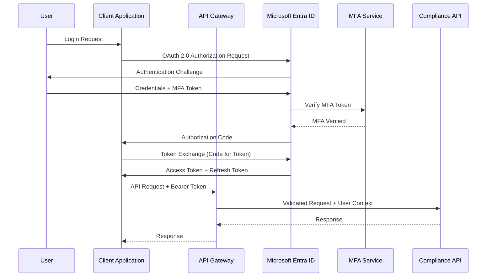

# Authentication and Authorization Patterns
## Banking RAG Compliance System - Multi-Sector Security Framework

**Project**: banking-rag-compliance
**Document**: Authentication and Authorization Architecture
**Date**: 2025-09-29
**Author**: Integration Researcher Agent

---

## Executive Summary

This document defines comprehensive authentication and authorization patterns for the Banking RAG Compliance System, designed to meet multi-sector compliance requirements across banking, insurance, and securities industries. The architecture implements zero-trust security principles with enterprise-grade identity management, multi-factor authentication, and fine-grained access controls.

**Key Security Components**:
- **Identity Provider Integration**: Microsoft Entra ID with FIDO2/MFA
- **Multi-Tenant Authentication**: Isolated tenant authentication with shared infrastructure
- **API Security**: OAuth 2.0, JWT tokens, and mTLS for high-security integrations
- **Regulatory Compliance**: FAPI compliance, GDPR adherence, audit trails
- **Zero-Trust Architecture**: Continuous verification and least-privilege access

---

## 1. Authentication Architecture Overview

### 1.1 Security Principles

- **Zero Trust**: Never trust, always verify
- **Defense in Depth**: Multiple layers of security controls
- **Least Privilege**: Minimum necessary access rights
- **Continuous Monitoring**: Real-time security event monitoring
- **Compliance by Design**: Built-in regulatory compliance features

### 1.2 Authentication Flow Architecture



### 1.3 Multi-Tenant Authentication Model

```python
from enum import Enum
from dataclasses import dataclass
from typing import Dict, List, Optional
import jwt
from azure.identity import DefaultAzureCredential

class TenantType(Enum):
    BANKING = "banking"
    INSURANCE = "insurance"
    SECURITIES = "securities"
    MIXED = "mixed"

@dataclass
class TenantConfig:
    tenant_id: str
    tenant_type: TenantType
    domain: str
    compliance_frameworks: List[str]
    mfa_required: bool
    session_timeout_minutes: int
    allowed_ip_ranges: List[str]
    data_residency: str

class MultiTenantAuthenticationManager:
    """Central authentication manager for multi-tenant deployment"""

    def __init__(self):
        self.credential = DefaultAzureCredential()
        self.tenant_configs = self._load_tenant_configurations()
        self.jwt_secrets = {}

    def _load_tenant_configurations(self) -> Dict[str, TenantConfig]:
        """Load tenant-specific authentication configurations"""
        return {
            "bank_001": TenantConfig(
                tenant_id="bank_001",
                tenant_type=TenantType.BANKING,
                domain="globalbank.com",
                compliance_frameworks=["Basel III", "PSD2", "GDPR"],
                mfa_required=True,
                session_timeout_minutes=60,
                allowed_ip_ranges=["192.168.0.0/16", "10.0.0.0/8"],
                data_residency="eu-west-1"
            ),
            "insurer_001": TenantConfig(
                tenant_id="insurer_001",
                tenant_type=TenantType.INSURANCE,
                domain="globalinsurance.com",
                compliance_frameworks=["Solvency II", "GDPR", "EIOPA Guidelines"],
                mfa_required=True,
                session_timeout_minutes=120,
                allowed_ip_ranges=["172.16.0.0/12"],
                data_residency="eu-central-1"
            )
        }

    async def authenticate_user(self, token: str, tenant_id: str) -> dict:
        """Authenticate user with tenant-specific validation"""

        tenant_config = self.tenant_configs.get(tenant_id)
        if not tenant_config:
            raise AuthenticationError(f"Unknown tenant: {tenant_id}")

        # Decode and verify JWT token
        try:
            payload = jwt.decode(
                token,
                self._get_tenant_secret(tenant_id),
                algorithms=['RS256'],
                audience=f"https://api.compliance.{tenant_config.domain}"
            )
        except jwt.InvalidTokenError as e:
            raise AuthenticationError(f"Token validation failed: {str(e)}")

        # Validate tenant-specific requirements
        await self._validate_tenant_requirements(payload, tenant_config)

        # Extract user context
        user_context = {
            "user_id": payload["sub"],
            "tenant_id": tenant_id,
            "email": payload.get("email"),
            "roles": payload.get("roles", []),
            "compliance_clearance": self._determine_compliance_clearance(
                payload.get("roles", []), tenant_config.compliance_frameworks
            ),
            "session_expires": payload["exp"],
            "mfa_verified": payload.get("mfa_verified", False)
        }

        return user_context
```

---

## 2. Microsoft Entra ID Integration

### 2.1 Enterprise Single Sign-On Configuration

Microsoft Entra ID serves as the primary identity provider with enterprise-grade features for banking compliance.

```python
from azure.identity import ClientSecretCredential
from microsoft.graph import GraphServiceClient
import asyncio

class EntraIDIntegration:
    """Microsoft Entra ID integration for enterprise authentication"""

    def __init__(self, tenant_id: str, client_id: str, client_secret: str):
        self.tenant_id = tenant_id
        self.credential = ClientSecretCredential(
            tenant_id=tenant_id,
            client_id=client_id,
            client_secret=client_secret
        )
        self.graph_client = GraphServiceClient(
            credentials=self.credential,
            scopes=['https://graph.microsoft.com/.default']
        )

    async def configure_conditional_access_policy(self, policy_config: dict) -> str:
        """Configure conditional access policy for banking compliance"""

        policy = {
            "displayName": f"Banking Compliance - {policy_config['name']}",
            "state": "enabled",
            "conditions": {
                "users": {
                    "includeGroups": policy_config.get("include_groups", []),
                    "excludeGroups": policy_config.get("exclude_groups", [])
                },
                "applications": {
                    "includeApplications": [policy_config["application_id"]]
                },
                "locations": {
                    "includeLocations": ["AllTrusted"],
                    "excludeLocations": []
                },
                "clientAppTypes": ["browser", "mobileAppsAndDesktopClients"],
                "signInRiskLevels": ["medium", "high"]
            },
            "grantControls": {
                "operator": "AND",
                "builtInControls": [
                    "mfa",
                    "compliantDevice",
                    "domainJoinedDevice"
                ],
                "customAuthenticationFactors": [],
                "termsOfUse": []
            },
            "sessionControls": {
                "applicationEnforcedRestrictions": None,
                "cloudAppSecurity": {
                    "isEnabled": True,
                    "cloudAppSecurityType": "monitorOnly"
                },
                "signInFrequency": {
                    "value": policy_config.get("session_timeout_hours", 8),
                    "type": "hours",
                    "isEnabled": True
                },
                "persistentBrowser": {
                    "isEnabled": False
                }
            }
        }

        # Create conditional access policy via Microsoft Graph
        response = await self.graph_client.identity.conditional_access.policies.post(policy)
        return response.id

    async def setup_mfa_requirements(self, user_id: str, tenant_config: TenantConfig) -> dict:
        """Configure MFA requirements based on tenant compliance needs"""

        mfa_config = {
            "methods": [
                {
                    "method": "microsoftAuthenticator",
                    "enabled": True,
                    "settings": {
                        "numberMatchingEnabled": True,
                        "locationInformationEnabled": True
                    }
                },
                {
                    "method": "fido2",
                    "enabled": True,
                    "settings": {
                        "isAttestationEnforced": True,
                        "keyRestrictions": {
                            "enforcementType": "allow",
                            "restrictionType": "aaguids",
                            "aaGuids": tenant_config.get("allowed_security_keys", [])
                        }
                    }
                }
            ],
            "excludeTargets": [],
            "registrationEnforcement": {
                "authenticationMethodsRegistrationCampaign": {
                    "snoozeDurationInDays": 3,
                    "includeTargets": [
                        {
                            "targetType": "user",
                            "id": user_id,
                            "targetedAuthenticationMethod": "microsoftAuthenticator"
                        }
                    ]
                }
            }
        }

        return mfa_config
```

### 2.2 FIDO2 and Passwordless Authentication

```python
from cryptography.hazmat.primitives import hashes
from cryptography.hazmat.primitives.asymmetric import padding
import base64
import cbor2
import json

class FIDO2AuthenticationHandler:
    """FIDO2 passwordless authentication for banking compliance"""

    def __init__(self, rp_id: str, rp_name: str):
        self.rp_id = rp_id  # Relying Party ID (domain)
        self.rp_name = rp_name  # Relying Party Name
        self.allowed_algorithms = [-7, -257]  # ES256, RS256

    async def initiate_registration(self, user_id: str, user_email: str) -> dict:
        """Initiate FIDO2 security key registration"""

        challenge = self._generate_challenge()

        registration_options = {
            "rp": {
                "id": self.rp_id,
                "name": self.rp_name
            },
            "user": {
                "id": base64.b64encode(user_id.encode()).decode(),
                "name": user_email,
                "displayName": user_email.split('@')[0]
            },
            "challenge": challenge,
            "pubKeyCredParams": [
                {"type": "public-key", "alg": alg}
                for alg in self.allowed_algorithms
            ],
            "timeout": 60000,
            "attestation": "direct",
            "authenticatorSelection": {
                "authenticatorAttachment": "cross-platform",
                "userVerification": "required",
                "residentKey": "required"
            },
            "excludeCredentials": await self._get_existing_credentials(user_id)
        }

        # Store challenge for verification
        await self._store_challenge(user_id, challenge, "registration")

        return registration_options

    async def verify_registration(self, user_id: str, credential_response: dict) -> dict:
        """Verify FIDO2 registration response"""

        stored_challenge = await self._get_stored_challenge(user_id, "registration")
        if not stored_challenge:
            raise AuthenticationError("Invalid or expired challenge")

        # Verify attestation
        attestation_object = base64.b64decode(credential_response["response"]["attestationObject"])
        client_data_json = base64.b64decode(credential_response["response"]["clientDataJSON"])

        # Parse client data
        client_data = json.loads(client_data_json.decode())

        # Verify challenge
        if client_data["challenge"] != stored_challenge:
            raise AuthenticationError("Challenge mismatch")

        # Verify origin
        if client_data["origin"] != f"https://{self.rp_id}":
            raise AuthenticationError("Origin mismatch")

        # Parse and verify attestation
        attestation_data = cbor2.loads(attestation_object)
        auth_data = attestation_data["authData"]

        # Extract credential data
        credential_data = {
            "credential_id": credential_response["id"],
            "public_key": self._extract_public_key(auth_data),
            "counter": int.from_bytes(auth_data[33:37], 'big'),
            "attestation_type": attestation_data.get("fmt", "none")
        }

        # Store credential
        await self._store_user_credential(user_id, credential_data)

        return {
            "credential_id": credential_response["id"],
            "verified": True,
            "attestation_type": credential_data["attestation_type"]
        }

    async def initiate_authentication(self, user_id: str) -> dict:
        """Initiate FIDO2 authentication ceremony"""

        challenge = self._generate_challenge()
        user_credentials = await self._get_user_credentials(user_id)

        authentication_options = {
            "challenge": challenge,
            "timeout": 60000,
            "rpId": self.rp_id,
            "allowCredentials": [
                {
                    "type": "public-key",
                    "id": cred["credential_id"],
                    "transports": ["usb", "nfc", "ble", "internal"]
                }
                for cred in user_credentials
            ],
            "userVerification": "required"
        }

        await self._store_challenge(user_id, challenge, "authentication")

        return authentication_options
```

---

## 3. OAuth 2.0 and JWT Token Management

### 3.1 Financial-grade API (FAPI) Compliance

The system implements FAPI 2.0 security profile for financial-grade APIs, providing enhanced security for banking applications.

```python
import jwt
from cryptography.hazmat.primitives import serialization, hashes
from cryptography.hazmat.primitives.asymmetric import rsa
from datetime import datetime, timedelta
import secrets
import hashlib

class FAPICompliantTokenManager:
    """FAPI 2.0 compliant token management for banking APIs"""

    def __init__(self, issuer: str, key_vault_client):
        self.issuer = issuer
        self.key_vault = key_vault_client
        self.private_key = None
        self.public_key = None
        self._load_signing_keys()

    async def create_access_token(self, user_context: dict, client_id: str, scope: str) -> dict:
        """Create FAPI-compliant access token"""

        # Generate unique token identifier
        jti = secrets.token_urlsafe(32)

        # Create token payload
        now = datetime.utcnow()
        payload = {
            "iss": self.issuer,
            "sub": user_context["user_id"],
            "aud": [f"https://api.compliance.{user_context['tenant_id']}.com"],
            "exp": int((now + timedelta(hours=1)).timestamp()),
            "nbf": int(now.timestamp()),
            "iat": int(now.timestamp()),
            "jti": jti,
            "client_id": client_id,
            "scope": scope,

            # Banking-specific claims
            "tenant_id": user_context["tenant_id"],
            "roles": user_context["roles"],
            "compliance_clearance": user_context["compliance_clearance"],
            "mfa_verified": user_context["mfa_verified"],
            "session_id": user_context.get("session_id"),

            # FAPI-specific claims
            "cnf": {  # Confirmation method (for mTLS)
                "x5t#S256": await self._get_client_cert_thumbprint(client_id)
            },
            "auth_time": user_context.get("auth_time", int(now.timestamp())),
            "acr": "urn:mace:incommon:iap:silver",  # Authentication Context Class Reference
            "amr": ["pwd", "mfa"]  # Authentication Methods References
        }

        # Sign token with RS256
        token = jwt.encode(payload, self.private_key, algorithm='RS256')

        # Store token for audit and revocation
        await self._store_token_audit(jti, user_context["user_id"], client_id, scope)

        return {
            "access_token": token,
            "token_type": "Bearer",
            "expires_in": 3600,
            "scope": scope,
            "jti": jti
        }

    async def validate_access_token(self, token: str, required_scope: str = None) -> dict:
        """Validate FAPI-compliant access token"""

        try:
            # Decode and verify token
            payload = jwt.decode(
                token,
                self.public_key,
                algorithms=['RS256'],
                audience=f"https://api.compliance.{payload.get('tenant_id', 'default')}.com",
                issuer=self.issuer
            )

            # Check if token is revoked
            if await self._is_token_revoked(payload["jti"]):
                raise jwt.InvalidTokenError("Token has been revoked")

            # Validate scope if required
            if required_scope:
                token_scopes = payload.get("scope", "").split()
                if required_scope not in token_scopes:
                    raise jwt.InvalidTokenError(f"Insufficient scope: {required_scope}")

            # Validate mTLS binding (FAPI requirement)
            await self._validate_mtls_binding(payload)

            return payload

        except jwt.InvalidTokenError as e:
            raise AuthenticationError(f"Token validation failed: {str(e)}")

    async def _validate_mtls_binding(self, payload: dict):
        """Validate mTLS certificate binding (FAPI 2.0 requirement)"""

        cnf_claim = payload.get("cnf", {})
        expected_thumbprint = cnf_claim.get("x5t#S256")

        if not expected_thumbprint:
            raise AuthenticationError("Missing certificate binding (cnf claim)")

        # In a real implementation, compare with actual client certificate
        # This would be done in the API gateway or load balancer
        pass

    async def create_refresh_token(self, user_context: dict, client_id: str) -> str:
        """Create secure refresh token"""

        refresh_token = secrets.token_urlsafe(64)

        # Store refresh token with metadata
        await self._store_refresh_token(
            refresh_token,
            user_context["user_id"],
            client_id,
            user_context["tenant_id"],
            expires_at=datetime.utcnow() + timedelta(days=30)
        )

        return refresh_token
```

### 3.2 Dynamic Client Registration

```python
from cryptography import x509
from cryptography.hazmat.backends import default_backend
import uuid

class DynamicClientRegistration:
    """OAuth 2.0 Dynamic Client Registration for banking applications"""

    def __init__(self, registration_endpoint: str):
        self.registration_endpoint = registration_endpoint
        self.supported_auth_methods = [
            "private_key_jwt",
            "tls_client_auth",
            "self_signed_tls_client_auth"
        ]

    async def register_client(self, registration_request: dict) -> dict:
        """Register new OAuth 2.0 client with FAPI compliance validation"""

        # Validate registration request
        await self._validate_registration_request(registration_request)

        # Generate client credentials
        client_id = f"banking_client_{uuid.uuid4().hex[:16]}"
        client_secret = None  # Not used in FAPI (certificate-based auth)

        # Extract and validate client certificate
        client_cert = await self._validate_client_certificate(
            registration_request.get("jwks", {})
        )

        # Create client registration
        client_config = {
            "client_id": client_id,
            "client_name": registration_request["client_name"],
            "client_uri": registration_request.get("client_uri"),
            "redirect_uris": registration_request["redirect_uris"],
            "response_types": ["code"],
            "grant_types": ["authorization_code", "refresh_token"],
            "token_endpoint_auth_method": "private_key_jwt",
            "application_type": "web",
            "scope": registration_request.get("scope", "compliance.read"),

            # FAPI-specific parameters
            "tls_client_certificate_bound_access_tokens": True,
            "require_pushed_authorization_requests": True,
            "require_signed_request_object": True,
            "authorization_signed_response_alg": "RS256",
            "id_token_signed_response_alg": "RS256",

            # Banking-specific parameters
            "sector_identifier_uri": registration_request.get("sector_identifier_uri"),
            "subject_type": "pairwise",
            "compliance_frameworks": registration_request.get("compliance_frameworks", []),
            "data_retention_period": registration_request.get("data_retention_period", 2555),  # 7 years in days

            # Certificate information
            "client_certificate": {
                "thumbprint": client_cert["thumbprint"],
                "subject_dn": client_cert["subject_dn"],
                "issuer_dn": client_cert["issuer_dn"],
                "not_before": client_cert["not_before"],
                "not_after": client_cert["not_after"]
            }
        }

        # Store client configuration
        await self._store_client_config(client_id, client_config)

        # Return registration response
        return {
            "client_id": client_id,
            "client_id_issued_at": int(datetime.utcnow().timestamp()),
            "client_secret_expires_at": 0,  # No client secret in FAPI
            "registration_access_token": await self._generate_registration_token(client_id),
            "registration_client_uri": f"{self.registration_endpoint}/{client_id}",
            **client_config
        }

    async def _validate_client_certificate(self, jwks: dict) -> dict:
        """Validate client certificate for FAPI compliance"""

        if not jwks or "keys" not in jwks:
            raise ValueError("Missing JWKS with client certificate")

        for key in jwks["keys"]:
            if key.get("use") == "sig" and "x5c" in key:
                # Extract certificate from x5c claim
                cert_der = base64.b64decode(key["x5c"][0])
                cert = x509.load_der_x509_certificate(cert_der, default_backend())

                # Validate certificate properties
                now = datetime.utcnow()
                if cert.not_valid_after < now:
                    raise ValueError("Client certificate has expired")

                if cert.not_valid_before > now:
                    raise ValueError("Client certificate is not yet valid")

                # Calculate certificate thumbprint
                thumbprint = hashlib.sha256(cert_der).digest()
                thumbprint_b64 = base64.b64encode(thumbprint).decode()

                return {
                    "certificate": cert,
                    "thumbprint": thumbprint_b64,
                    "subject_dn": cert.subject.rfc4514_string(),
                    "issuer_dn": cert.issuer.rfc4514_string(),
                    "not_before": cert.not_valid_before.isoformat(),
                    "not_after": cert.not_valid_after.isoformat()
                }

        raise ValueError("No valid signing certificate found in JWKS")
```

---

## 4. Multi-Sector Compliance Patterns

### 4.1 Banking Sector Authentication

```python
class BankingAuthenticationPattern:
    """Authentication patterns specific to banking sector compliance"""

    REQUIRED_FRAMEWORKS = ["PSD2", "Basel III", "GDPR", "AML5"]

    def __init__(self):
        self.risk_assessment_rules = {
            "high_risk_transactions": {
                "amount_threshold": 10000,
                "cross_border": True,
                "politically_exposed_person": True,
                "sanctions_screening": True
            },
            "enhanced_auth_triggers": [
                "first_time_device",
                "unusual_location",
                "high_value_query",
                "sensitive_regulation_access"
            ]
        }

    async def authenticate_banking_user(self, user_context: dict, request_context: dict) -> dict:
        """Banking-specific authentication with PSD2 SCA compliance"""

        # Perform Strong Customer Authentication (SCA) assessment
        sca_required = await self._assess_sca_requirements(user_context, request_context)

        if sca_required:
            # Require two-factor authentication
            mfa_result = await self._perform_sca_authentication(user_context)
            if not mfa_result["success"]:
                raise AuthenticationError("Strong Customer Authentication required")

        # Perform AML/CTF screening
        aml_screening = await self._perform_aml_screening(user_context)
        if aml_screening["risk_level"] == "high":
            # Enhanced due diligence required
            await self._trigger_enhanced_verification(user_context)

        # Create banking-specific session context
        session_context = {
            "user_id": user_context["user_id"],
            "compliance_clearance": await self._determine_banking_clearance(user_context),
            "sca_verified": sca_required,
            "aml_risk_level": aml_screening["risk_level"],
            "authorized_functions": await self._get_authorized_banking_functions(user_context),
            "transaction_limits": await self._get_transaction_limits(user_context),
            "session_monitoring": True
        }

        return session_context

    async def _assess_sca_requirements(self, user_context: dict, request_context: dict) -> bool:
        """Assess if Strong Customer Authentication is required (PSD2)"""

        sca_triggers = [
            request_context.get("amount", 0) > 30,  # €30 threshold
            request_context.get("remote_access", False),
            request_context.get("payment_initiation", False),
            request_context.get("account_information_access", False)
        ]

        # Check exemptions
        exemptions = [
            request_context.get("trusted_beneficiary", False),
            request_context.get("low_risk_transaction", False),
            user_context.get("corporate_payment", False) and request_context.get("amount", 0) < 10000
        ]

        return any(sca_triggers) and not any(exemptions)
```

### 4.2 Insurance Sector Authentication

```python
class InsuranceAuthenticationPattern:
    """Authentication patterns for insurance sector (Solvency II compliance)"""

    REQUIRED_FRAMEWORKS = ["Solvency II", "GDPR", "EIOPA Guidelines", "ICS"]

    def __init__(self):
        self.solvency_data_classification = {
            "public": 0,
            "internal": 1,
            "confidential": 2,
            "restricted": 3,
            "solvency_critical": 4
        }

    async def authenticate_insurance_user(self, user_context: dict, data_classification: str) -> dict:
        """Insurance-specific authentication with Solvency II data protection"""

        required_clearance = self.solvency_data_classification.get(data_classification, 0)
        user_clearance = user_context.get("solvency_clearance_level", 0)

        if user_clearance < required_clearance:
            raise AuthorizationError(f"Insufficient clearance for {data_classification} data")

        # Solvency II-specific validations
        validations = {
            "actuarial_certification": await self._check_actuarial_certification(user_context),
            "regulatory_approval": await self._check_regulatory_approvals(user_context),
            "fit_and_proper": await self._check_fit_and_proper_status(user_context),
            "continuing_education": await self._check_continuing_education(user_context)
        }

        # Create insurance-specific session
        session_context = {
            "user_id": user_context["user_id"],
            "solvency_clearance": user_clearance,
            "actuarial_certified": validations["actuarial_certification"],
            "regulatory_approved": validations["regulatory_approval"],
            "data_access_level": data_classification,
            "audit_requirements": {
                "log_all_calculations": True,
                "maintain_audit_trail": True,
                "periodic_review_required": True
            }
        }

        return session_context
```

### 4.3 Securities Sector Authentication

```python
class SecuritiesAuthenticationPattern:
    """Authentication patterns for securities sector (MiFID II compliance)"""

    REQUIRED_FRAMEWORKS = ["MiFID II", "ESMA Guidelines", "GDPR", "Market Abuse Regulation"]

    def __init__(self):
        self.mifid_classifications = {
            "retail_client": 1,
            "professional_client": 2,
            "eligible_counterparty": 3
        }

        self.investment_services = [
            "reception_and_transmission",
            "execution_of_orders",
            "dealing_on_own_account",
            "portfolio_management",
            "investment_advice",
            "underwriting",
            "placing_of_instruments",
            "operation_of_multilateral_trading"
        ]

    async def authenticate_securities_user(self, user_context: dict, service_type: str) -> dict:
        """Securities-specific authentication with MiFID II compliance"""

        if service_type not in self.investment_services:
            raise ValueError(f"Unknown investment service: {service_type}")

        # MiFID II specific checks
        mifid_compliance = {
            "client_classification": await self._determine_client_classification(user_context),
            "investment_firm_authorization": await self._check_firm_authorization(user_context),
            "conduct_rules_training": await self._check_conduct_training(user_context),
            "market_abuse_awareness": await self._check_market_abuse_training(user_context)
        }

        # Determine access permissions based on client classification
        client_classification = mifid_compliance["client_classification"]
        authorized_services = await self._get_authorized_services(client_classification, service_type)

        # Create securities-specific session
        session_context = {
            "user_id": user_context["user_id"],
            "client_classification": client_classification,
            "authorized_services": authorized_services,
            "investment_advice_qualified": await self._check_investment_advice_qualification(user_context),
            "dealing_authorization": await self._check_dealing_authorization(user_context),
            "market_data_entitlements": await self._get_market_data_entitlements(user_context),
            "transaction_reporting_required": True,
            "best_execution_monitoring": True
        }

        return session_context
```

---

## 5. API Security Patterns

### 5.1 Mutual TLS (mTLS) Implementation

```python
import ssl
from cryptography import x509
from cryptography.hazmat.backends import default_backend
import aiohttp

class MTLSSecurityHandler:
    """Mutual TLS implementation for high-security banking APIs"""

    def __init__(self, ca_cert_path: str, server_cert_path: str, server_key_path: str):
        self.ca_cert_path = ca_cert_path
        self.server_cert_path = server_cert_path
        self.server_key_path = server_key_path
        self.trusted_client_certs = {}

    async def create_mtls_context(self) -> ssl.SSLContext:
        """Create SSL context for mutual TLS authentication"""

        # Create SSL context
        context = ssl.create_default_context(ssl.Purpose.CLIENT_AUTH)

        # Load server certificate and key
        context.load_cert_chain(self.server_cert_path, self.server_key_path)

        # Load CA certificate for client verification
        context.load_verify_locations(self.ca_cert_path)

        # Require client certificates
        context.verify_mode = ssl.CERT_REQUIRED
        context.check_hostname = False  # We'll verify manually

        return context

    async def verify_client_certificate(self, cert_der: bytes) -> dict:
        """Verify client certificate and extract banking-specific information"""

        try:
            cert = x509.load_der_x509_certificate(cert_der, default_backend())

            # Extract certificate information
            subject = cert.subject
            issuer = cert.issuer

            # Verify certificate validity
            now = datetime.utcnow()
            if cert.not_valid_after < now or cert.not_valid_before > now:
                raise ValueError("Certificate is not valid")

            # Extract banking-specific attributes from certificate
            banking_attributes = {}
            for attribute in subject:
                oid = attribute.oid
                value = attribute.value

                # Map banking-specific OIDs
                if oid.dotted_string == "2.5.4.10":  # Organization Name
                    banking_attributes["institution_name"] = value
                elif oid.dotted_string == "2.5.4.11":  # Organizational Unit
                    banking_attributes["department"] = value
                elif oid.dotted_string == "1.3.6.1.4.1.311.20.2.3":  # User Principal Name
                    banking_attributes["user_principal_name"] = value

            # Calculate certificate thumbprint
            thumbprint = hashlib.sha256(cert_der).hexdigest()

            return {
                "valid": True,
                "thumbprint": thumbprint,
                "subject_dn": subject.rfc4514_string(),
                "issuer_dn": issuer.rfc4514_string(),
                "serial_number": str(cert.serial_number),
                "not_before": cert.not_valid_before.isoformat(),
                "not_after": cert.not_valid_after.isoformat(),
                "banking_attributes": banking_attributes
            }

        except Exception as e:
            return {
                "valid": False,
                "error": str(e)
            }

    async def create_client_session(self, client_cert_path: str, client_key_path: str) -> aiohttp.ClientSession:
        """Create HTTP client session with mTLS authentication"""

        # Create SSL context for client
        ssl_context = ssl.create_default_context(ssl.Purpose.SERVER_AUTH)
        ssl_context.load_cert_chain(client_cert_path, client_key_path)
        ssl_context.load_verify_locations(self.ca_cert_path)

        # Create connector with SSL context
        connector = aiohttp.TCPConnector(ssl_context=ssl_context)

        return aiohttp.ClientSession(connector=connector)
```

### 5.2 API Rate Limiting and Throttling

```python
import asyncio
import time
from typing import Dict, Tuple
import redis.asyncio as redis

class ComplianceAPIRateLimiter:
    """Advanced rate limiting for compliance APIs with tenant-specific limits"""

    def __init__(self, redis_url: str):
        self.redis = redis.from_url(redis_url)
        self.default_limits = {
            "requests_per_minute": 60,
            "requests_per_hour": 1000,
            "requests_per_day": 10000,
            "tokens_per_month": 1000000
        }

        # Tier-based rate limits
        self.tier_limits = {
            "developer": {
                "requests_per_minute": 60,
                "requests_per_day": 5000,
                "tokens_per_month": 100000
            },
            "professional": {
                "requests_per_minute": 300,
                "requests_per_day": 25000,
                "tokens_per_month": 1000000
            },
            "enterprise": {
                "requests_per_minute": 1000,
                "requests_per_day": 100000,
                "tokens_per_month": 10000000
            }
        }

    async def check_rate_limit(self, client_id: str, tenant_id: str, endpoint: str, tokens_requested: int = 0) -> dict:
        """Check if request is within rate limits"""

        # Get client tier and limits
        client_tier = await self._get_client_tier(client_id)
        limits = self.tier_limits.get(client_tier, self.default_limits)

        # Check different time windows
        checks = [
            ("minute", 60, limits["requests_per_minute"]),
            ("hour", 3600, limits.get("requests_per_hour", limits["requests_per_minute"] * 60)),
            ("day", 86400, limits["requests_per_day"])
        ]

        current_time = int(time.time())

        for window, duration, limit in checks:
            key = f"rate_limit:{tenant_id}:{client_id}:{endpoint}:{window}:{current_time // duration}"

            # Use Redis pipeline for atomic operations
            pipe = self.redis.pipeline()
            pipe.incr(key)
            pipe.expire(key, duration)
            results = await pipe.execute()

            current_count = results[0]

            if current_count > limit:
                # Calculate reset time
                reset_time = ((current_time // duration) + 1) * duration

                return {
                    "allowed": False,
                    "limit": limit,
                    "current": current_count,
                    "reset_time": reset_time,
                    "retry_after": reset_time - current_time,
                    "window": window
                }

        # Check token usage if applicable
        if tokens_requested > 0:
            token_result = await self._check_token_limit(client_id, tenant_id, tokens_requested, limits["tokens_per_month"])
            if not token_result["allowed"]:
                return token_result

        return {
            "allowed": True,
            "limits": limits,
            "current_usage": await self._get_current_usage(client_id, tenant_id)
        }

    async def _check_token_limit(self, client_id: str, tenant_id: str, tokens_requested: int, monthly_limit: int) -> dict:
        """Check monthly token usage limit"""

        current_time = int(time.time())
        month_key = f"tokens:{tenant_id}:{client_id}:{current_time // 2592000}"  # 30 days

        current_tokens = await self.redis.get(month_key) or 0
        current_tokens = int(current_tokens)

        if current_tokens + tokens_requested > monthly_limit:
            return {
                "allowed": False,
                "limit": monthly_limit,
                "current": current_tokens,
                "requested": tokens_requested,
                "limit_type": "monthly_tokens"
            }

        # Update token count
        pipe = self.redis.pipeline()
        pipe.incrby(month_key, tokens_requested)
        pipe.expire(month_key, 2592000)  # 30 days
        await pipe.execute()

        return {"allowed": True}
```

---

## 6. Session Management and Security

### 6.1 Secure Session Management

```python
import secrets
import json
from datetime import datetime, timedelta
from cryptography.fernet import Fernet

class SecureSessionManager:
    """Secure session management for banking compliance applications"""

    def __init__(self, encryption_key: bytes, redis_client):
        self.cipher = Fernet(encryption_key)
        self.redis = redis_client
        self.session_timeout = {
            "banking": 3600,      # 1 hour for banking
            "insurance": 7200,    # 2 hours for insurance
            "securities": 3600,   # 1 hour for securities
            "mixed": 3600         # 1 hour for mixed compliance
        }

    async def create_session(self, user_context: dict, client_info: dict) -> str:
        """Create secure session with banking-specific controls"""

        # Generate cryptographically secure session ID
        session_id = secrets.token_urlsafe(64)

        # Determine session timeout based on tenant type
        tenant_type = user_context.get("tenant_type", "banking")
        timeout = self.session_timeout.get(tenant_type, 3600)

        # Create session data
        session_data = {
            "user_id": user_context["user_id"],
            "tenant_id": user_context["tenant_id"],
            "email": user_context["email"],
            "roles": user_context["roles"],
            "compliance_clearance": user_context["compliance_clearance"],
            "mfa_verified": user_context["mfa_verified"],
            "created_at": datetime.utcnow().isoformat(),
            "last_activity": datetime.utcnow().isoformat(),
            "client_ip": client_info.get("ip_address"),
            "user_agent": client_info.get("user_agent"),
            "device_fingerprint": client_info.get("device_fingerprint"),
            "session_flags": {
                "high_security": user_context.get("high_security_required", False),
                "concurrent_session_limit": user_context.get("concurrent_sessions", 3),
                "require_periodic_reauth": True,
                "monitor_session_anomalies": True
            }
        }

        # Encrypt session data
        encrypted_data = self.cipher.encrypt(json.dumps(session_data).encode())

        # Store in Redis with expiration
        await self.redis.setex(
            f"session:{session_id}",
            timeout,
            encrypted_data
        )

        # Track concurrent sessions
        await self._track_concurrent_session(user_context["user_id"], session_id)

        return session_id

    async def validate_session(self, session_id: str, client_info: dict) -> dict:
        """Validate session and perform security checks"""

        # Retrieve encrypted session data
        encrypted_data = await self.redis.get(f"session:{session_id}")
        if not encrypted_data:
            raise SessionError("Session not found or expired")

        # Decrypt session data
        try:
            session_data = json.loads(self.cipher.decrypt(encrypted_data).decode())
        except Exception:
            raise SessionError("Invalid session data")

        # Perform security validations
        await self._validate_session_security(session_data, client_info)

        # Update last activity
        session_data["last_activity"] = datetime.utcnow().isoformat()

        # Re-encrypt and store updated data
        encrypted_data = self.cipher.encrypt(json.dumps(session_data).encode())
        await self.redis.setex(
            f"session:{session_id}",
            self.session_timeout.get(session_data.get("tenant_type", "banking"), 3600),
            encrypted_data
        )

        return session_data

    async def _validate_session_security(self, session_data: dict, client_info: dict):
        """Perform security validations on session"""

        # Check IP address consistency (if configured)
        if session_data.get("client_ip") != client_info.get("ip_address"):
            # IP address changed - could be legitimate or suspicious
            await self._handle_ip_change(session_data, client_info)

        # Check device fingerprint
        if session_data.get("device_fingerprint") != client_info.get("device_fingerprint"):
            raise SessionError("Device fingerprint mismatch - possible session hijack")

        # Check for session anomalies
        if session_data["session_flags"]["monitor_session_anomalies"]:
            await self._detect_session_anomalies(session_data, client_info)

        # Check if periodic re-authentication is required
        created_at = datetime.fromisoformat(session_data["created_at"])
        if session_data["session_flags"]["require_periodic_reauth"]:
            if datetime.utcnow() - created_at > timedelta(hours=8):
                raise SessionError("Periodic re-authentication required")

    async def terminate_session(self, session_id: str, reason: str = "user_logout"):
        """Securely terminate session"""

        # Get session data for audit logging
        encrypted_data = await self.redis.get(f"session:{session_id}")
        if encrypted_data:
            session_data = json.loads(self.cipher.decrypt(encrypted_data).decode())

            # Log session termination
            await self._audit_session_event(session_data, "session_terminated", {"reason": reason})

            # Remove from concurrent sessions tracking
            await self._remove_concurrent_session(session_data["user_id"], session_id)

        # Delete session from Redis
        await self.redis.delete(f"session:{session_id}")
```

### 6.2 Device Trust and Fingerprinting

```python
import hashlib
import json
from typing import Dict, List

class DeviceTrustManager:
    """Device trust and fingerprinting for banking security"""

    def __init__(self, redis_client):
        self.redis = redis_client
        self.trusted_device_duration = 86400 * 30  # 30 days

    async def generate_device_fingerprint(self, device_info: dict) -> str:
        """Generate device fingerprint from client information"""

        fingerprint_components = {
            "user_agent": device_info.get("user_agent", ""),
            "screen_resolution": device_info.get("screen_resolution", ""),
            "timezone": device_info.get("timezone", ""),
            "language": device_info.get("language", ""),
            "platform": device_info.get("platform", ""),
            "canvas_fingerprint": device_info.get("canvas_fingerprint", ""),
            "webgl_fingerprint": device_info.get("webgl_fingerprint", ""),
            "fonts": sorted(device_info.get("installed_fonts", [])),
            "plugins": sorted(device_info.get("plugins", []))
        }

        # Create hash of combined fingerprint data
        fingerprint_json = json.dumps(fingerprint_components, sort_keys=True)
        fingerprint_hash = hashlib.sha256(fingerprint_json.encode()).hexdigest()

        return fingerprint_hash

    async def assess_device_trust(self, user_id: str, device_fingerprint: str, ip_address: str) -> dict:
        """Assess trust level of device for banking operations"""

        # Check if device is known and trusted
        device_key = f"trusted_device:{user_id}:{device_fingerprint}"
        device_trust_data = await self.redis.get(device_key)

        trust_assessment = {
            "device_fingerprint": device_fingerprint,
            "is_known_device": device_trust_data is not None,
            "trust_score": 0.0,
            "risk_factors": [],
            "trust_level": "untrusted"
        }

        if device_trust_data:
            device_data = json.loads(device_trust_data)
            trust_assessment["trust_score"] = device_data.get("trust_score", 0.0)
            trust_assessment["first_seen"] = device_data.get("first_seen")
            trust_assessment["last_seen"] = device_data.get("last_seen")
            trust_assessment["usage_count"] = device_data.get("usage_count", 0)
        else:
            # New device - check for risk factors
            risk_factors = await self._assess_device_risks(user_id, device_fingerprint, ip_address)
            trust_assessment["risk_factors"] = risk_factors

        # Determine trust level
        if trust_assessment["trust_score"] > 0.8:
            trust_assessment["trust_level"] = "trusted"
        elif trust_assessment["trust_score"] > 0.5:
            trust_assessment["trust_level"] = "low_trust"
        elif len(trust_assessment["risk_factors"]) == 0:
            trust_assessment["trust_level"] = "neutral"
        else:
            trust_assessment["trust_level"] = "untrusted"

        return trust_assessment

    async def register_trusted_device(self, user_id: str, device_fingerprint: str, ip_address: str):
        """Register device as trusted after successful authentication"""

        device_key = f"trusted_device:{user_id}:{device_fingerprint}"

        # Get existing data or create new
        existing_data = await self.redis.get(device_key)
        if existing_data:
            device_data = json.loads(existing_data)
            device_data["usage_count"] += 1
            device_data["last_seen"] = datetime.utcnow().isoformat()
            device_data["last_ip"] = ip_address

            # Increase trust score based on usage
            device_data["trust_score"] = min(1.0, device_data["trust_score"] + 0.1)
        else:
            device_data = {
                "device_fingerprint": device_fingerprint,
                "first_seen": datetime.utcnow().isoformat(),
                "last_seen": datetime.utcnow().isoformat(),
                "first_ip": ip_address,
                "last_ip": ip_address,
                "usage_count": 1,
                "trust_score": 0.3  # Initial trust score for new devices
            }

        # Store device data
        await self.redis.setex(
            device_key,
            self.trusted_device_duration,
            json.dumps(device_data)
        )
```

---

## 7. Audit Logging and Compliance Monitoring

### 7.1 Comprehensive Audit Logging

```python
from dataclasses import dataclass, asdict
from enum import Enum
import uuid
from datetime import datetime
import json

class AuditEventType(Enum):
    AUTHENTICATION = "authentication"
    AUTHORIZATION = "authorization"
    DATA_ACCESS = "data_access"
    DATA_MODIFICATION = "data_modification"
    CONFIGURATION_CHANGE = "configuration_change"
    SECURITY_EVENT = "security_event"
    COMPLIANCE_VIOLATION = "compliance_violation"

class AuditSeverity(Enum):
    INFO = "info"
    WARNING = "warning"
    ERROR = "error"
    CRITICAL = "critical"

@dataclass
class AuditEvent:
    event_id: str
    timestamp: str
    event_type: AuditEventType
    severity: AuditSeverity
    user_id: str
    tenant_id: str
    source_ip: str
    user_agent: str
    action: str
    resource: str
    resource_id: str
    outcome: str
    details: dict
    compliance_frameworks: list
    data_classification: str
    retention_period_days: int

class ComplianceAuditLogger:
    """Comprehensive audit logging for banking compliance"""

    def __init__(self, storage_backend, encryption_key: bytes):
        self.storage = storage_backend
        self.encryption_key = encryption_key
        self.retention_policies = {
            "authentication": 2555,  # 7 years for banking
            "data_access": 2555,
            "financial_transaction": 3650,  # 10 years
            "regulatory_reporting": 2555,
            "security_event": 2555
        }

    async def log_authentication_event(self, user_context: dict, auth_result: dict, client_info: dict):
        """Log authentication events with banking compliance details"""

        event = AuditEvent(
            event_id=str(uuid.uuid4()),
            timestamp=datetime.utcnow().isoformat(),
            event_type=AuditEventType.AUTHENTICATION,
            severity=AuditSeverity.INFO if auth_result["success"] else AuditSeverity.WARNING,
            user_id=user_context.get("user_id", "unknown"),
            tenant_id=user_context.get("tenant_id", "unknown"),
            source_ip=client_info.get("ip_address", "unknown"),
            user_agent=client_info.get("user_agent", "unknown"),
            action="user_authentication",
            resource="authentication_service",
            resource_id=auth_result.get("session_id", ""),
            outcome="success" if auth_result["success"] else "failure",
            details={
                "authentication_method": auth_result.get("method", "unknown"),
                "mfa_required": auth_result.get("mfa_required", False),
                "mfa_verified": auth_result.get("mfa_verified", False),
                "risk_score": auth_result.get("risk_score", 0.0),
                "device_trusted": auth_result.get("device_trusted", False),
                "failure_reason": auth_result.get("failure_reason") if not auth_result["success"] else None
            },
            compliance_frameworks=user_context.get("compliance_frameworks", []),
            data_classification="confidential",
            retention_period_days=self.retention_policies["authentication"]
        )

        await self._store_audit_event(event)

    async def log_data_access_event(self, user_context: dict, resource_info: dict, access_result: dict):
        """Log data access events with regulatory details"""

        event = AuditEvent(
            event_id=str(uuid.uuid4()),
            timestamp=datetime.utcnow().isoformat(),
            event_type=AuditEventType.DATA_ACCESS,
            severity=AuditSeverity.INFO if access_result["allowed"] else AuditSeverity.WARNING,
            user_id=user_context["user_id"],
            tenant_id=user_context["tenant_id"],
            source_ip=user_context.get("source_ip", "unknown"),
            user_agent=user_context.get("user_agent", "unknown"),
            action="data_access",
            resource=resource_info["resource_type"],
            resource_id=resource_info["resource_id"],
            outcome="success" if access_result["allowed"] else "denied",
            details={
                "query": resource_info.get("query", ""),
                "documents_accessed": resource_info.get("documents_accessed", []),
                "data_classification": resource_info.get("data_classification", "unknown"),
                "access_method": resource_info.get("access_method", "api"),
                "processing_time_ms": resource_info.get("processing_time_ms", 0),
                "tokens_used": resource_info.get("tokens_used", 0),
                "regulatory_context": resource_info.get("regulatory_context", [])
            },
            compliance_frameworks=resource_info.get("compliance_frameworks", []),
            data_classification=resource_info.get("data_classification", "internal"),
            retention_period_days=self.retention_policies["data_access"]
        )

        await self._store_audit_event(event)

    async def log_compliance_violation(self, user_context: dict, violation_details: dict):
        """Log compliance violations for regulatory reporting"""

        event = AuditEvent(
            event_id=str(uuid.uuid4()),
            timestamp=datetime.utcnow().isoformat(),
            event_type=AuditEventType.COMPLIANCE_VIOLATION,
            severity=AuditSeverity.CRITICAL,
            user_id=user_context.get("user_id", "system"),
            tenant_id=user_context.get("tenant_id", "unknown"),
            source_ip=user_context.get("source_ip", "internal"),
            user_agent=user_context.get("user_agent", "system"),
            action="compliance_violation_detected",
            resource="compliance_monitor",
            resource_id=violation_details["rule_id"],
            outcome="violation_detected",
            details={
                "violation_type": violation_details["violation_type"],
                "rule_description": violation_details["rule_description"],
                "severity_level": violation_details["severity_level"],
                "affected_data": violation_details.get("affected_data", []),
                "remediation_required": violation_details.get("remediation_required", True),
                "regulatory_implications": violation_details.get("regulatory_implications", []),
                "notification_sent": violation_details.get("notification_sent", False)
            },
            compliance_frameworks=violation_details.get("compliance_frameworks", []),
            data_classification="restricted",
            retention_period_days=self.retention_policies["regulatory_reporting"]
        )

        await self._store_audit_event(event)

        # Trigger immediate notifications for critical violations
        if event.severity == AuditSeverity.CRITICAL:
            await self._send_compliance_alert(event)

    async def _store_audit_event(self, event: AuditEvent):
        """Store audit event with encryption and indexing"""

        # Convert to dictionary
        event_dict = asdict(event)

        # Encrypt sensitive fields
        sensitive_fields = ["details", "user_id", "source_ip"]
        for field in sensitive_fields:
            if field in event_dict and event_dict[field]:
                encrypted_value = self._encrypt_field(json.dumps(event_dict[field]))
                event_dict[f"{field}_encrypted"] = encrypted_value
                del event_dict[field]

        # Store in backend with appropriate indexing
        await self.storage.store_audit_event(event_dict)

        # Create indexes for compliance reporting
        await self._create_audit_indexes(event_dict)

    async def generate_compliance_report(self, tenant_id: str, date_range: tuple, frameworks: list) -> dict:
        """Generate compliance audit report"""

        start_date, end_date = date_range

        # Query audit events
        events = await self.storage.query_audit_events(
            tenant_id=tenant_id,
            start_date=start_date,
            end_date=end_date,
            compliance_frameworks=frameworks
        )

        # Analyze events for compliance metrics
        metrics = {
            "total_events": len(events),
            "authentication_events": 0,
            "data_access_events": 0,
            "security_events": 0,
            "compliance_violations": 0,
            "user_activity": {},
            "resource_access_patterns": {},
            "risk_indicators": []
        }

        for event in events:
            event_type = event["event_type"]

            if event_type == "authentication":
                metrics["authentication_events"] += 1
            elif event_type == "data_access":
                metrics["data_access_events"] += 1
            elif event_type == "security_event":
                metrics["security_events"] += 1
            elif event_type == "compliance_violation":
                metrics["compliance_violations"] += 1

            # Track user activity
            user_id = event.get("user_id", "unknown")
            if user_id not in metrics["user_activity"]:
                metrics["user_activity"][user_id] = 0
            metrics["user_activity"][user_id] += 1

        return {
            "report_id": str(uuid.uuid4()),
            "tenant_id": tenant_id,
            "period": {
                "start_date": start_date,
                "end_date": end_date
            },
            "compliance_frameworks": frameworks,
            "metrics": metrics,
            "generated_at": datetime.utcnow().isoformat()
        }
```

---

## Conclusion

This comprehensive authentication and authorization framework provides enterprise-grade security for the Banking RAG Compliance System across multiple financial sectors. The architecture implements:

- **Zero-trust security principles** with continuous verification
- **Multi-sector compliance** supporting banking, insurance, and securities regulations
- **Enterprise identity management** with Microsoft Entra ID integration
- **Financial-grade API security** with FAPI 2.0 compliance
- **Advanced threat protection** with device trust and behavioral analysis
- **Comprehensive audit trails** for regulatory compliance
- **Multi-tenant architecture** with isolated security domains

The implementation ensures compliance with major regulatory frameworks including PSD2, MiFID II, Solvency II, Basel III, and GDPR while maintaining scalability and usability for banking operations.

Key security features include:
- **Passwordless authentication** with FIDO2 support
- **Mutual TLS** for high-security API connections
- **Intelligent rate limiting** with tier-based controls
- **Session security** with anomaly detection
- **Device fingerprinting** and trust assessment
- **Real-time compliance monitoring** with automated violation detection

This architecture provides the security foundation necessary for handling sensitive regulatory data and ensuring compliance across the complex landscape of financial services regulation.