# Banking RAG Compliance System - PostgreSQL Database Schema Design

## Executive Summary

This document presents a comprehensive PostgreSQL database schema design optimized for the Banking RAG Compliance System. The design leverages the latest pgvector 0.8.0 features, including HNSW indexing for high-performance vector similarity search, and implements sophisticated row-level security policies for regulatory compliance. The schema supports the seven core features: Q&A, Report Generation, GAP Analysis, Cross-Jurisdiction Comparison, Regulatory Updates, Learning System, and External Integration.

### Key Features
- **Vector-optimized storage** with pgvector 0.8.0 HNSW indexing supporting up to 2,000 dimensions
- **Multi-jurisdiction regulatory data** with versioning and change tracking
- **Comprehensive audit trails** for GDPR and banking compliance
- **Role-based access control** with Supabase Auth integration
- **Conversation history management** with context preservation
- **Document versioning** with semantic chunking optimization
- **Performance-optimized indexes** for sub-5-second query responses

## Schema Diagram

```mermaid
erDiagram
    %% User Management & Authentication
    auth_users {
        uuid id PK
        text email UK
        timestamp created_at
        timestamp updated_at
        jsonb metadata
    }

    user_profiles {
        uuid id PK
        uuid user_id FK
        text full_name
        text organization
        text department
        text role
        text language_preference
        jsonb preferences
        timestamp created_at
        timestamp updated_at
    }

    user_roles {
        uuid id PK
        uuid user_id FK
        text role_name
        timestamp granted_at
        timestamp expires_at
        uuid granted_by FK
    }

    %% Regulatory Authorities & Jurisdictions
    regulatory_authorities {
        uuid id PK
        text code UK "ESMA, EBA, EIOPA, etc."
        text name
        text jurisdiction
        text base_url
        jsonb contact_info
        boolean is_active
        timestamp created_at
        timestamp updated_at
    }

    %% Document Management
    documents {
        uuid id PK
        text title
        text document_type "regulation, guideline, consultation, etc."
        uuid authority_id FK
        text authority_reference
        text language
        text format "PDF, HTML, DOCX"
        text status "published, draft, withdrawn"
        date publication_date
        date effective_date
        date superseded_date
        text source_url
        text checksum
        bigint file_size
        jsonb metadata
        vector_type content_summary_embedding
        timestamp created_at
        timestamp updated_at
        uuid created_by FK
    }

    document_versions {
        uuid id PK
        uuid document_id FK
        integer version_number
        text version_type "major, minor, patch"
        text change_summary
        jsonb change_details
        text checksum
        timestamp version_date
        uuid created_by FK
        boolean is_current
    }

    document_chunks {
        uuid id PK
        uuid document_id FK
        uuid version_id FK
        integer chunk_index
        text chunk_type "header, paragraph, table, list"
        text content
        text content_hash
        integer token_count
        integer character_count
        jsonb structural_metadata
        vector content_embedding
        timestamp created_at
        timestamp updated_at
    }

    %% Vector Storage Optimization
    chunk_embeddings {
        uuid id PK
        uuid chunk_id FK
        text embedding_model
        integer dimensions
        vector embedding
        float_array sparse_embedding
        jsonb embedding_metadata
        timestamp created_at
    }

    %% Conversation Management
    conversations {
        uuid id PK
        uuid user_id FK
        text title
        text conversation_type "query, analysis, report_generation"
        text status "active, completed, archived"
        jsonb context_window
        jsonb session_metadata
        timestamp started_at
        timestamp last_activity_at
        timestamp completed_at
    }

    messages {
        uuid id PK
        uuid conversation_id FK
        uuid user_id FK
        text role "user, assistant, system"
        text content
        jsonb metadata
        timestamp created_at
        integer message_index
    }

    message_sources {
        uuid id PK
        uuid message_id FK
        uuid document_id FK
        uuid chunk_id FK
        float relevance_score
        text citation_text
        jsonb citation_metadata
        timestamp created_at
    }

    %% GAP Analysis
    gap_analyses {
        uuid id PK
        uuid user_id FK
        text analysis_name
        text analysis_type "policy_vs_regulation, regulation_vs_regulation"
        text status "running, completed, failed"
        jsonb analysis_parameters
        jsonb results_summary
        timestamp started_at
        timestamp completed_at
        uuid created_by FK
    }

    gap_analysis_documents {
        uuid id PK
        uuid analysis_id FK
        uuid document_id FK
        text document_role "source, target, reference"
        jsonb processing_metadata
        timestamp added_at
    }

    gap_findings {
        uuid id PK
        uuid analysis_id FK
        uuid source_chunk_id FK
        uuid target_chunk_id FK
        text gap_type "missing, partial, conflicting, superseded"
        text severity "critical, high, medium, low"
        text finding_summary
        text detailed_description
        jsonb evidence
        jsonb remediation_suggestions
        float confidence_score
        timestamp identified_at
    }

    %% Report Generation
    report_templates {
        uuid id PK
        text name UK
        text template_type
        text version
        jsonb template_structure
        jsonb default_parameters
        text author
        boolean is_active
        timestamp created_at
        timestamp updated_at
    }

    reports {
        uuid id PK
        uuid user_id FK
        uuid template_id FK
        text report_name
        text report_type
        text status "generating, completed, failed"
        jsonb generation_parameters
        text output_format
        text file_path
        jsonb report_metadata
        timestamp requested_at
        timestamp completed_at
        uuid generated_by FK
    }

    report_sections {
        uuid id PK
        uuid report_id FK
        text section_name
        integer section_order
        text content_type "text, table, chart"
        text content
        jsonb formatting_options
        timestamp generated_at
    }

    %% Regulatory Updates & Monitoring
    regulatory_sources {
        uuid id PK
        uuid authority_id FK
        text source_name
        text source_type "website, rss, api"
        text source_url
        jsonb scraping_config
        text status "active, inactive, error"
        timestamp last_checked_at
        timestamp last_successful_check_at
        integer check_frequency_hours
        timestamp created_at
        timestamp updated_at
    }

    regulatory_updates {
        uuid id PK
        uuid authority_id FK
        uuid source_id FK
        text update_type "new_document, document_update, consultation"
        text title
        text summary
        text impact_assessment
        date publication_date
        date consultation_deadline
        jsonb change_details
        text priority "urgent, high, medium, low"
        text status "new, processed, archived"
        timestamp detected_at
        timestamp processed_at
    }

    update_notifications {
        uuid id PK
        uuid update_id FK
        uuid user_id FK
        text notification_type "email, in_app, webhook"
        text status "pending, sent, failed"
        jsonb notification_content
        timestamp scheduled_at
        timestamp sent_at
        jsonb delivery_metadata
    }

    %% User Feedback & Learning
    feedback {
        uuid id PK
        uuid user_id FK
        uuid conversation_id FK
        uuid message_id FK
        text feedback_type "rating, comment, correction"
        integer rating
        text comment
        jsonb feedback_data
        timestamp created_at
    }

    user_preferences {
        uuid id PK
        uuid user_id FK
        text preference_type
        jsonb preference_value
        timestamp created_at
        timestamp updated_at
    }

    %% External Integration
    api_keys {
        uuid id PK
        uuid user_id FK
        text key_name
        text api_key_hash
        text permissions
        boolean is_active
        timestamp expires_at
        timestamp created_at
        timestamp last_used_at
        jsonb usage_statistics
    }

    webhooks {
        uuid id PK
        uuid user_id FK
        text webhook_url
        text event_types
        jsonb headers
        boolean is_active
        integer retry_count
        timestamp created_at
        timestamp updated_at
    }

    webhook_deliveries {
        uuid id PK
        uuid webhook_id FK
        text event_type
        jsonb payload
        integer response_status
        text response_body
        integer attempt_number
        timestamp attempted_at
        timestamp delivered_at
    }

    %% Audit & Compliance
    audit_logs {
        uuid id PK
        uuid user_id FK
        text action_type
        text resource_type
        text resource_id
        jsonb action_details
        text ip_address
        text user_agent
        jsonb session_info
        timestamp created_at
    }

    data_retention_policies {
        uuid id PK
        text policy_name
        text table_name
        integer retention_days
        text retention_criteria
        boolean is_active
        timestamp created_at
        timestamp updated_at
    }

    %% Performance Optimization
    query_performance_logs {
        uuid id PK
        uuid user_id FK
        text query_type
        text query_hash
        float execution_time_ms
        integer result_count
        jsonb query_metadata
        timestamp executed_at
    }

    %% Relationships
    auth_users ||--o{ user_profiles : "has profile"
    auth_users ||--o{ user_roles : "has roles"
    auth_users ||--o{ conversations : "creates"
    auth_users ||--o{ messages : "sends"
    auth_users ||--o{ gap_analyses : "performs"
    auth_users ||--o{ reports : "generates"
    auth_users ||--o{ feedback : "provides"
    auth_users ||--o{ api_keys : "manages"
    auth_users ||--o{ webhooks : "configures"
    auth_users ||--o{ audit_logs : "generates"

    regulatory_authorities ||--o{ documents : "publishes"
    regulatory_authorities ||--o{ regulatory_sources : "has sources"
    regulatory_authorities ||--o{ regulatory_updates : "provides updates"

    documents ||--o{ document_versions : "has versions"
    documents ||--o{ document_chunks : "chunked into"
    documents ||--o{ message_sources : "cited in"
    documents ||--o{ gap_analysis_documents : "analyzed in"

    document_versions ||--o{ document_chunks : "contains chunks"
    document_chunks ||--o{ chunk_embeddings : "has embeddings"
    document_chunks ||--o{ message_sources : "cited as"
    document_chunks ||--o{ gap_findings : "referenced in"

    conversations ||--o{ messages : "contains"
    messages ||--o{ message_sources : "references"
    messages ||--o{ feedback : "receives feedback"

    gap_analyses ||--o{ gap_analysis_documents : "analyzes"
    gap_analyses ||--o{ gap_findings : "produces"

    report_templates ||--o{ reports : "generates"
    reports ||--o{ report_sections : "contains"

    regulatory_sources ||--o{ regulatory_updates : "detects"
    regulatory_updates ||--o{ update_notifications : "triggers"

    webhooks ||--o{ webhook_deliveries : "delivers"
```



## Core Table Definitions

### 1. User Management & Authentication

```sql
-- Extend Supabase auth.users with custom profile data
CREATE TABLE user_profiles (
    id UUID PRIMARY KEY DEFAULT gen_random_uuid(),
    user_id UUID NOT NULL REFERENCES auth.users(id) ON DELETE CASCADE,
    full_name TEXT NOT NULL,
    organization TEXT,
    department TEXT,
    role TEXT CHECK (role IN ('compliance_officer', 'legal_analyst', 'risk_manager', 'executive', 'admin')),
    language_preference TEXT DEFAULT 'en' CHECK (language_preference IN ('en', 'es', 'fr', 'de')),
    preferences JSONB DEFAULT '{}',
    created_at TIMESTAMP WITH TIME ZONE DEFAULT NOW(),
    updated_at TIMESTAMP WITH TIME ZONE DEFAULT NOW(),

    CONSTRAINT unique_user_profile UNIQUE (user_id)
);

-- Role-based access control
CREATE TABLE user_roles (
    id UUID PRIMARY KEY DEFAULT gen_random_uuid(),
    user_id UUID NOT NULL REFERENCES auth.users(id) ON DELETE CASCADE,
    role_name TEXT NOT NULL CHECK (role_name IN ('viewer', 'analyst', 'manager', 'admin', 'super_admin')),
    granted_at TIMESTAMP WITH TIME ZONE DEFAULT NOW(),
    expires_at TIMESTAMP WITH TIME ZONE,
    granted_by UUID REFERENCES auth.users(id),

    CONSTRAINT unique_active_role UNIQUE (user_id, role_name)
        DEFERRABLE INITIALLY DEFERRED
);

-- Comments for documentation
COMMENT ON TABLE user_profiles IS 'Extended user profile information beyond Supabase auth';
COMMENT ON TABLE user_roles IS 'Role-based access control with time-bound assignments';
COMMENT ON COLUMN user_roles.expires_at IS 'NULL means permanent role assignment';
```

### 2. Regulatory Authority Management

```sql
-- Regulatory authorities (ESMA, EBA, EIOPA, etc.)
CREATE TABLE regulatory_authorities (
    id UUID PRIMARY KEY DEFAULT gen_random_uuid(),
    code TEXT NOT NULL UNIQUE,
    name TEXT NOT NULL,
    jurisdiction TEXT NOT NULL,
    base_url TEXT,
    contact_info JSONB DEFAULT '{}',
    is_active BOOLEAN DEFAULT TRUE,
    created_at TIMESTAMP WITH TIME ZONE DEFAULT NOW(),
    updated_at TIMESTAMP WITH TIME ZONE DEFAULT NOW(),

    CONSTRAINT valid_authority_code CHECK (LENGTH(code) BETWEEN 2 AND 10)
);

-- Seed data for regulatory authorities
INSERT INTO regulatory_authorities (code, name, jurisdiction, base_url) VALUES
('ESMA', 'European Securities and Markets Authority', 'EU', 'https://www.esma.europa.eu'),
('EBA', 'European Banking Authority', 'EU', 'https://www.eba.europa.eu'),
('EIOPA', 'European Insurance and Occupational Pensions Authority', 'EU', 'https://www.eiopa.europa.eu'),
('EC', 'European Commission', 'EU', 'https://ec.europa.eu'),
('BOS', 'Bank of Spain', 'ES', 'https://www.bde.es'),
('CNMV', 'Comisión Nacional del Mercado de Valores', 'ES', 'https://www.cnmv.es'),
('IOSCO', 'International Organization of Securities Commissions', 'International', 'https://www.iosco.org');

COMMENT ON TABLE regulatory_authorities IS 'Master list of regulatory authorities and their jurisdictions';
```

### 3. Document Management with Versioning

```sql
-- Main documents table
CREATE TABLE documents (
    id UUID PRIMARY KEY DEFAULT gen_random_uuid(),
    title TEXT NOT NULL,
    document_type TEXT NOT NULL CHECK (document_type IN ('regulation', 'directive', 'guideline', 'consultation', 'opinion', 'report', 'standard')),
    authority_id UUID NOT NULL REFERENCES regulatory_authorities(id),
    authority_reference TEXT,
    language TEXT NOT NULL DEFAULT 'en' CHECK (language IN ('en', 'es', 'fr', 'de', 'it')),
    format TEXT NOT NULL CHECK (format IN ('PDF', 'HTML', 'DOCX', 'TXT')),
    status TEXT NOT NULL DEFAULT 'published' CHECK (status IN ('draft', 'published', 'withdrawn', 'superseded')),
    publication_date DATE,
    effective_date DATE,
    superseded_date DATE,
    source_url TEXT,
    checksum TEXT NOT NULL,
    file_size BIGINT,
    metadata JSONB DEFAULT '{}',
    content_summary_embedding vector(1536), -- OpenAI embedding dimension
    created_at TIMESTAMP WITH TIME ZONE DEFAULT NOW(),
    updated_at TIMESTAMP WITH TIME ZONE DEFAULT NOW(),
    created_by UUID REFERENCES auth.users(id),

    CONSTRAINT valid_dates CHECK (
        effective_date IS NULL OR publication_date IS NULL OR effective_date >= publication_date
    ),
    CONSTRAINT valid_checksum CHECK (LENGTH(checksum) = 64) -- SHA-256 hash
);

-- Document versioning
CREATE TABLE document_versions (
    id UUID PRIMARY KEY DEFAULT gen_random_uuid(),
    document_id UUID NOT NULL REFERENCES documents(id) ON DELETE CASCADE,
    version_number INTEGER NOT NULL,
    version_type TEXT NOT NULL CHECK (version_type IN ('major', 'minor', 'patch')),
    change_summary TEXT,
    change_details JSONB DEFAULT '{}',
    checksum TEXT NOT NULL,
    version_date TIMESTAMP WITH TIME ZONE DEFAULT NOW(),
    created_by UUID REFERENCES auth.users(id),
    is_current BOOLEAN DEFAULT FALSE,

    CONSTRAINT unique_document_version UNIQUE (document_id, version_number),
    CONSTRAINT valid_version_number CHECK (version_number > 0)
);

-- Document chunking for optimal RAG retrieval
CREATE TABLE document_chunks (
    id UUID PRIMARY KEY DEFAULT gen_random_uuid(),
    document_id UUID NOT NULL REFERENCES documents(id) ON DELETE CASCADE,
    version_id UUID REFERENCES document_versions(id),
    chunk_index INTEGER NOT NULL,
    chunk_type TEXT NOT NULL CHECK (chunk_type IN ('header', 'paragraph', 'table', 'list', 'footnote', 'section')),
    content TEXT NOT NULL,
    content_hash TEXT NOT NULL,
    token_count INTEGER NOT NULL,
    character_count INTEGER NOT NULL,
    structural_metadata JSONB DEFAULT '{}', -- Headers, page numbers, etc.
    content_embedding vector(1536), -- Primary embedding
    created_at TIMESTAMP WITH TIME ZONE DEFAULT NOW(),
    updated_at TIMESTAMP WITH TIME ZONE DEFAULT NOW(),

    CONSTRAINT unique_document_chunk UNIQUE (document_id, chunk_index),
    CONSTRAINT valid_chunk_size CHECK (token_count > 0 AND character_count > 0),
    CONSTRAINT valid_content_hash CHECK (LENGTH(content_hash) = 64)
);

COMMENT ON TABLE documents IS 'Master document registry with metadata and embeddings';
COMMENT ON TABLE document_versions IS 'Version control for regulatory documents';
COMMENT ON TABLE document_chunks IS 'Semantically chunked content optimized for vector retrieval';
COMMENT ON COLUMN document_chunks.structural_metadata IS 'JSON containing headers, page numbers, section info';
```

### 4. Advanced Vector Storage Optimization

```sql
-- Optimized embedding storage with multiple vector types
CREATE TABLE chunk_embeddings (
    id UUID PRIMARY KEY DEFAULT gen_random_uuid(),
    chunk_id UUID NOT NULL REFERENCES document_chunks(id) ON DELETE CASCADE,
    embedding_model TEXT NOT NULL,
    dimensions INTEGER NOT NULL,
    embedding vector(1536), -- Dense embedding
    sparse_embedding FLOAT4[], -- Sparse/keyword-based embedding
    embedding_metadata JSONB DEFAULT '{}',
    created_at TIMESTAMP WITH TIME ZONE DEFAULT NOW(),

    CONSTRAINT valid_dimensions CHECK (dimensions > 0 AND dimensions <= 2000),
    CONSTRAINT unique_chunk_embedding UNIQUE (chunk_id, embedding_model)
);

-- Materialized view for fast similarity searches
CREATE MATERIALIZED VIEW chunk_search_view AS
SELECT
    dc.id,
    dc.document_id,
    dc.content,
    dc.chunk_type,
    dc.content_embedding,
    d.title,
    d.document_type,
    d.authority_id,
    ra.code as authority_code,
    ra.jurisdiction,
    d.publication_date,
    d.language
FROM document_chunks dc
JOIN documents d ON dc.document_id = d.id
JOIN regulatory_authorities ra ON d.authority_id = ra.id
WHERE d.status = 'published';

-- Refresh materialized view
CREATE OR REPLACE FUNCTION refresh_chunk_search_view()
RETURNS void AS $$
BEGIN
    REFRESH MATERIALIZED VIEW CONCURRENTLY chunk_search_view;
END;
$$ LANGUAGE plpgsql;

COMMENT ON TABLE chunk_embeddings IS 'Multi-model embeddings for advanced retrieval strategies';
COMMENT ON VIEW chunk_search_view IS 'Optimized view for RAG similarity searches';
```

### 5. Conversation Management

```sql
-- Conversation tracking
CREATE TABLE conversations (
    id UUID PRIMARY KEY DEFAULT gen_random_uuid(),
    user_id UUID NOT NULL REFERENCES auth.users(id) ON DELETE CASCADE,
    title TEXT,
    conversation_type TEXT NOT NULL DEFAULT 'query' CHECK (conversation_type IN ('query', 'analysis', 'report_generation', 'gap_analysis')),
    status TEXT NOT NULL DEFAULT 'active' CHECK (status IN ('active', 'completed', 'archived')),
    context_window JSONB DEFAULT '{}', -- Maintains conversation context
    session_metadata JSONB DEFAULT '{}',
    started_at TIMESTAMP WITH TIME ZONE DEFAULT NOW(),
    last_activity_at TIMESTAMP WITH TIME ZONE DEFAULT NOW(),
    completed_at TIMESTAMP WITH TIME ZONE
);

-- Message storage with full conversation context
CREATE TABLE messages (
    id UUID PRIMARY KEY DEFAULT gen_random_uuid(),
    conversation_id UUID NOT NULL REFERENCES conversations(id) ON DELETE CASCADE,
    user_id UUID NOT NULL REFERENCES auth.users(id),
    role TEXT NOT NULL CHECK (role IN ('user', 'assistant', 'system')),
    content TEXT NOT NULL,
    metadata JSONB DEFAULT '{}',
    created_at TIMESTAMP WITH TIME ZONE DEFAULT NOW(),
    message_index INTEGER NOT NULL,

    CONSTRAINT unique_message_index UNIQUE (conversation_id, message_index)
);

-- Source citations for message responses
CREATE TABLE message_sources (
    id UUID PRIMARY KEY DEFAULT gen_random_uuid(),
    message_id UUID NOT NULL REFERENCES messages(id) ON DELETE CASCADE,
    document_id UUID NOT NULL REFERENCES documents(id),
    chunk_id UUID REFERENCES document_chunks(id),
    relevance_score FLOAT NOT NULL CHECK (relevance_score >= 0 AND relevance_score <= 1),
    citation_text TEXT,
    citation_metadata JSONB DEFAULT '{}',
    created_at TIMESTAMP WITH TIME ZONE DEFAULT NOW()
);

COMMENT ON TABLE conversations IS 'User conversation sessions with context preservation';
COMMENT ON TABLE messages IS 'Individual messages within conversations';
COMMENT ON TABLE message_sources IS 'Document sources and citations for AI responses';
```

### 6. GAP Analysis System

```sql
-- GAP analysis management
CREATE TABLE gap_analyses (
    id UUID PRIMARY KEY DEFAULT gen_random_uuid(),
    user_id UUID NOT NULL REFERENCES auth.users(id),
    analysis_name TEXT NOT NULL,
    analysis_type TEXT NOT NULL CHECK (analysis_type IN ('policy_vs_regulation', 'regulation_vs_regulation', 'multi_jurisdiction')),
    status TEXT NOT NULL DEFAULT 'running' CHECK (status IN ('running', 'completed', 'failed', 'cancelled')),
    analysis_parameters JSONB NOT NULL DEFAULT '{}',
    results_summary JSONB DEFAULT '{}',
    started_at TIMESTAMP WITH TIME ZONE DEFAULT NOW(),
    completed_at TIMESTAMP WITH TIME ZONE,
    created_by UUID NOT NULL REFERENCES auth.users(id)
);

-- Documents involved in GAP analysis
CREATE TABLE gap_analysis_documents (
    id UUID PRIMARY KEY DEFAULT gen_random_uuid(),
    analysis_id UUID NOT NULL REFERENCES gap_analyses(id) ON DELETE CASCADE,
    document_id UUID NOT NULL REFERENCES documents(id),
    document_role TEXT NOT NULL CHECK (document_role IN ('source', 'target', 'reference')),
    processing_metadata JSONB DEFAULT '{}',
    added_at TIMESTAMP WITH TIME ZONE DEFAULT NOW(),

    CONSTRAINT unique_analysis_document UNIQUE (analysis_id, document_id, document_role)
);

-- GAP findings and recommendations
CREATE TABLE gap_findings (
    id UUID PRIMARY KEY DEFAULT gen_random_uuid(),
    analysis_id UUID NOT NULL REFERENCES gap_analyses(id) ON DELETE CASCADE,
    source_chunk_id UUID REFERENCES document_chunks(id),
    target_chunk_id UUID REFERENCES document_chunks(id),
    gap_type TEXT NOT NULL CHECK (gap_type IN ('missing', 'partial', 'conflicting', 'superseded', 'enhanced')),
    severity TEXT NOT NULL CHECK (severity IN ('critical', 'high', 'medium', 'low')),
    finding_summary TEXT NOT NULL,
    detailed_description TEXT,
    evidence JSONB DEFAULT '{}',
    remediation_suggestions JSONB DEFAULT '{}',
    confidence_score FLOAT CHECK (confidence_score >= 0 AND confidence_score <= 1),
    identified_at TIMESTAMP WITH TIME ZONE DEFAULT NOW()
);

COMMENT ON TABLE gap_analyses IS 'GAP analysis sessions for compliance comparison';
COMMENT ON TABLE gap_findings IS 'Individual findings from GAP analysis with remediation suggestions';
```

### 7. Report Generation

```sql
-- Report templates
CREATE TABLE report_templates (
    id UUID PRIMARY KEY DEFAULT gen_random_uuid(),
    name TEXT NOT NULL UNIQUE,
    template_type TEXT NOT NULL CHECK (template_type IN ('compliance_status', 'regulatory_update', 'gap_analysis', 'risk_assessment', 'executive_summary')),
    version TEXT NOT NULL,
    template_structure JSONB NOT NULL,
    default_parameters JSONB DEFAULT '{}',
    author TEXT,
    is_active BOOLEAN DEFAULT TRUE,
    created_at TIMESTAMP WITH TIME ZONE DEFAULT NOW(),
    updated_at TIMESTAMP WITH TIME ZONE DEFAULT NOW()
);

-- Generated reports
CREATE TABLE reports (
    id UUID PRIMARY KEY DEFAULT gen_random_uuid(),
    user_id UUID NOT NULL REFERENCES auth.users(id),
    template_id UUID REFERENCES report_templates(id),
    report_name TEXT NOT NULL,
    report_type TEXT NOT NULL,
    status TEXT NOT NULL DEFAULT 'generating' CHECK (status IN ('generating', 'completed', 'failed', 'cancelled')),
    generation_parameters JSONB DEFAULT '{}',
    output_format TEXT NOT NULL DEFAULT 'docx' CHECK (output_format IN ('docx', 'pdf', 'html', 'markdown')),
    file_path TEXT,
    report_metadata JSONB DEFAULT '{}',
    requested_at TIMESTAMP WITH TIME ZONE DEFAULT NOW(),
    completed_at TIMESTAMP WITH TIME ZONE,
    generated_by UUID NOT NULL REFERENCES auth.users(id)
);

-- Report sections for structured content
CREATE TABLE report_sections (
    id UUID PRIMARY KEY DEFAULT gen_random_uuid(),
    report_id UUID NOT NULL REFERENCES reports(id) ON DELETE CASCADE,
    section_name TEXT NOT NULL,
    section_order INTEGER NOT NULL,
    content_type TEXT NOT NULL CHECK (content_type IN ('text', 'table', 'chart', 'list', 'image')),
    content TEXT,
    formatting_options JSONB DEFAULT '{}',
    generated_at TIMESTAMP WITH TIME ZONE DEFAULT NOW(),

    CONSTRAINT unique_section_order UNIQUE (report_id, section_order)
);

COMMENT ON TABLE report_templates IS 'Reusable templates for regulatory report generation';
COMMENT ON TABLE reports IS 'Generated reports with metadata and file paths';
```

### 8. Regulatory Update Monitoring

```sql
-- Sources for regulatory updates
CREATE TABLE regulatory_sources (
    id UUID PRIMARY KEY DEFAULT gen_random_uuid(),
    authority_id UUID NOT NULL REFERENCES regulatory_authorities(id),
    source_name TEXT NOT NULL,
    source_type TEXT NOT NULL CHECK (source_type IN ('website', 'rss', 'api', 'email')),
    source_url TEXT NOT NULL,
    scraping_config JSONB DEFAULT '{}',
    status TEXT NOT NULL DEFAULT 'active' CHECK (status IN ('active', 'inactive', 'error')),
    last_checked_at TIMESTAMP WITH TIME ZONE,
    last_successful_check_at TIMESTAMP WITH TIME ZONE,
    check_frequency_hours INTEGER NOT NULL DEFAULT 24,
    created_at TIMESTAMP WITH TIME ZONE DEFAULT NOW(),
    updated_at TIMESTAMP WITH TIME ZONE DEFAULT NOW(),

    CONSTRAINT valid_check_frequency CHECK (check_frequency_hours > 0)
);

-- Detected regulatory updates
CREATE TABLE regulatory_updates (
    id UUID PRIMARY KEY DEFAULT gen_random_uuid(),
    authority_id UUID NOT NULL REFERENCES regulatory_authorities(id),
    source_id UUID REFERENCES regulatory_sources(id),
    update_type TEXT NOT NULL CHECK (update_type IN ('new_document', 'document_update', 'consultation', 'deadline_reminder')),
    title TEXT NOT NULL,
    summary TEXT,
    impact_assessment TEXT,
    publication_date DATE,
    consultation_deadline DATE,
    change_details JSONB DEFAULT '{}',
    priority TEXT NOT NULL DEFAULT 'medium' CHECK (priority IN ('urgent', 'high', 'medium', 'low')),
    status TEXT NOT NULL DEFAULT 'new' CHECK (status IN ('new', 'processed', 'archived', 'dismissed')),
    detected_at TIMESTAMP WITH TIME ZONE DEFAULT NOW(),
    processed_at TIMESTAMP WITH TIME ZONE
);

-- User notifications for updates
CREATE TABLE update_notifications (
    id UUID PRIMARY KEY DEFAULT gen_random_uuid(),
    update_id UUID NOT NULL REFERENCES regulatory_updates(id) ON DELETE CASCADE,
    user_id UUID NOT NULL REFERENCES auth.users(id) ON DELETE CASCADE,
    notification_type TEXT NOT NULL CHECK (notification_type IN ('email', 'in_app', 'webhook', 'sms')),
    status TEXT NOT NULL DEFAULT 'pending' CHECK (status IN ('pending', 'sent', 'failed', 'dismissed')),
    notification_content JSONB DEFAULT '{}',
    scheduled_at TIMESTAMP WITH TIME ZONE DEFAULT NOW(),
    sent_at TIMESTAMP WITH TIME ZONE,
    delivery_metadata JSONB DEFAULT '{}'
);

COMMENT ON TABLE regulatory_sources IS 'Sources for automated regulatory monitoring';
COMMENT ON TABLE regulatory_updates IS 'Detected regulatory changes and updates';
COMMENT ON TABLE update_notifications IS 'User notifications for regulatory updates';
```

### 9. User Feedback & Learning System

```sql
-- User feedback collection
CREATE TABLE feedback (
    id UUID PRIMARY KEY DEFAULT gen_random_uuid(),
    user_id UUID NOT NULL REFERENCES auth.users(id),
    conversation_id UUID REFERENCES conversations(id),
    message_id UUID REFERENCES messages(id),
    feedback_type TEXT NOT NULL CHECK (feedback_type IN ('rating', 'comment', 'correction', 'feature_request')),
    rating INTEGER CHECK (rating >= 1 AND rating <= 5),
    comment TEXT,
    feedback_data JSONB DEFAULT '{}',
    created_at TIMESTAMP WITH TIME ZONE DEFAULT NOW()
);

-- User preferences for personalization
CREATE TABLE user_preferences (
    id UUID PRIMARY KEY DEFAULT gen_random_uuid(),
    user_id UUID NOT NULL REFERENCES auth.users(id) ON DELETE CASCADE,
    preference_type TEXT NOT NULL,
    preference_value JSONB NOT NULL,
    created_at TIMESTAMP WITH TIME ZONE DEFAULT NOW(),
    updated_at TIMESTAMP WITH TIME ZONE DEFAULT NOW(),

    CONSTRAINT unique_user_preference UNIQUE (user_id, preference_type)
);

COMMENT ON TABLE feedback IS 'User feedback for system improvement and learning';
COMMENT ON TABLE user_preferences IS 'Personalized user preferences and settings';
```

### 10. External Integration

```sql
-- API key management
CREATE TABLE api_keys (
    id UUID PRIMARY KEY DEFAULT gen_random_uuid(),
    user_id UUID NOT NULL REFERENCES auth.users(id) ON DELETE CASCADE,
    key_name TEXT NOT NULL,
    api_key_hash TEXT NOT NULL UNIQUE, -- Hashed API key
    permissions TEXT[] NOT NULL DEFAULT '{}',
    is_active BOOLEAN DEFAULT TRUE,
    expires_at TIMESTAMP WITH TIME ZONE,
    created_at TIMESTAMP WITH TIME ZONE DEFAULT NOW(),
    last_used_at TIMESTAMP WITH TIME ZONE,
    usage_statistics JSONB DEFAULT '{}',

    CONSTRAINT unique_user_key_name UNIQUE (user_id, key_name)
);

-- Webhook configuration
CREATE TABLE webhooks (
    id UUID PRIMARY KEY DEFAULT gen_random_uuid(),
    user_id UUID NOT NULL REFERENCES auth.users(id) ON DELETE CASCADE,
    webhook_url TEXT NOT NULL,
    event_types TEXT[] NOT NULL DEFAULT '{}',
    headers JSONB DEFAULT '{}',
    is_active BOOLEAN DEFAULT TRUE,
    retry_count INTEGER DEFAULT 3 CHECK (retry_count >= 0),
    created_at TIMESTAMP WITH TIME ZONE DEFAULT NOW(),
    updated_at TIMESTAMP WITH TIME ZONE DEFAULT NOW()
);

-- Webhook delivery tracking
CREATE TABLE webhook_deliveries (
    id UUID PRIMARY KEY DEFAULT gen_random_uuid(),
    webhook_id UUID NOT NULL REFERENCES webhooks(id) ON DELETE CASCADE,
    event_type TEXT NOT NULL,
    payload JSONB NOT NULL,
    response_status INTEGER,
    response_body TEXT,
    attempt_number INTEGER NOT NULL DEFAULT 1,
    attempted_at TIMESTAMP WITH TIME ZONE DEFAULT NOW(),
    delivered_at TIMESTAMP WITH TIME ZONE,

    CONSTRAINT valid_attempt_number CHECK (attempt_number > 0)
);

COMMENT ON TABLE api_keys IS 'API key management for external integrations';
COMMENT ON TABLE webhooks IS 'Webhook configuration for event notifications';
COMMENT ON TABLE webhook_deliveries IS 'Webhook delivery tracking and retry management';
```

### 11. Audit & Compliance

```sql
-- Comprehensive audit logging
CREATE TABLE audit_logs (
    id UUID PRIMARY KEY DEFAULT gen_random_uuid(),
    user_id UUID REFERENCES auth.users(id),
    action_type TEXT NOT NULL,
    resource_type TEXT NOT NULL,
    resource_id TEXT,
    action_details JSONB DEFAULT '{}',
    ip_address INET,
    user_agent TEXT,
    session_info JSONB DEFAULT '{}',
    created_at TIMESTAMP WITH TIME ZONE DEFAULT NOW()
);

-- Data retention policies for GDPR compliance
CREATE TABLE data_retention_policies (
    id UUID PRIMARY KEY DEFAULT gen_random_uuid(),
    policy_name TEXT NOT NULL UNIQUE,
    table_name TEXT NOT NULL,
    retention_days INTEGER NOT NULL,
    retention_criteria JSONB DEFAULT '{}',
    is_active BOOLEAN DEFAULT TRUE,
    created_at TIMESTAMP WITH TIME ZONE DEFAULT NOW(),
    updated_at TIMESTAMP WITH TIME ZONE DEFAULT NOW(),

    CONSTRAINT valid_retention_days CHECK (retention_days > 0)
);

-- Performance monitoring
CREATE TABLE query_performance_logs (
    id UUID PRIMARY KEY DEFAULT gen_random_uuid(),
    user_id UUID REFERENCES auth.users(id),
    query_type TEXT NOT NULL,
    query_hash TEXT NOT NULL,
    execution_time_ms FLOAT NOT NULL,
    result_count INTEGER,
    query_metadata JSONB DEFAULT '{}',
    executed_at TIMESTAMP WITH TIME ZONE DEFAULT NOW(),

    CONSTRAINT valid_execution_time CHECK (execution_time_ms >= 0)
);

COMMENT ON TABLE audit_logs IS 'Complete audit trail for compliance and security';
COMMENT ON TABLE data_retention_policies IS 'GDPR-compliant data retention management';
COMMENT ON TABLE query_performance_logs IS 'Query performance monitoring for optimization';
```

## Optimized Index Strategy

### 1. Vector Search Indexes (HNSW)

```sql
-- HNSW indexes for vector similarity search (pgvector 0.8.0)
CREATE INDEX CONCURRENTLY idx_document_chunks_embedding_hnsw
ON document_chunks USING hnsw (content_embedding vector_cosine_ops)
WITH (m = 16, ef_construction = 64);

CREATE INDEX CONCURRENTLY idx_chunk_embeddings_embedding_hnsw
ON chunk_embeddings USING hnsw (embedding vector_cosine_ops)
WITH (m = 16, ef_construction = 64);

-- Alternative L2 distance index for different similarity metrics
CREATE INDEX CONCURRENTLY idx_document_chunks_embedding_l2
ON document_chunks USING hnsw (content_embedding vector_l2_ops)
WITH (m = 16, ef_construction = 64);

-- Enable iterative scan for better filtering performance
SET hnsw.iterative_scan = ON;
```

### 2. Full-Text Search Indexes

```sql
-- Full-text search on document content
CREATE INDEX CONCURRENTLY idx_document_chunks_content_fts
ON document_chunks USING GIN (to_tsvector('english', content));

CREATE INDEX CONCURRENTLY idx_documents_title_fts
ON documents USING GIN (to_tsvector('english', title));

-- Multi-language support
CREATE INDEX CONCURRENTLY idx_document_chunks_content_fts_spanish
ON document_chunks USING GIN (to_tsvector('spanish', content))
WHERE EXISTS (
    SELECT 1 FROM documents d
    WHERE d.id = document_chunks.document_id
    AND d.language = 'es'
);
```

### 3. Performance Indexes

```sql
-- High-performance indexes for common queries
CREATE INDEX CONCURRENTLY idx_documents_authority_type_date
ON documents (authority_id, document_type, publication_date DESC)
WHERE status = 'published';

CREATE INDEX CONCURRENTLY idx_document_chunks_document_index
ON document_chunks (document_id, chunk_index);

CREATE INDEX CONCURRENTLY idx_conversations_user_activity
ON conversations (user_id, last_activity_at DESC)
WHERE status = 'active';

CREATE INDEX CONCURRENTLY idx_messages_conversation_index
ON messages (conversation_id, message_index);

CREATE INDEX CONCURRENTLY idx_gap_findings_analysis_severity
ON gap_findings (analysis_id, severity, confidence_score DESC);

CREATE INDEX CONCURRENTLY idx_regulatory_updates_priority_date
ON regulatory_updates (priority, detected_at DESC)
WHERE status = 'new';

-- Composite index for user role checking
CREATE INDEX CONCURRENTLY idx_user_roles_active
ON user_roles (user_id, role_name)
WHERE expires_at IS NULL OR expires_at > NOW();
```

### 4. Audit and Performance Indexes

```sql
-- Audit trail indexes
CREATE INDEX CONCURRENTLY idx_audit_logs_user_time
ON audit_logs (user_id, created_at DESC);

CREATE INDEX CONCURRENTLY idx_audit_logs_resource_type_time
ON audit_logs (resource_type, created_at DESC);

-- Performance monitoring indexes
CREATE INDEX CONCURRENTLY idx_query_performance_type_time
ON query_performance_logs (query_type, executed_at DESC);

CREATE INDEX CONCURRENTLY idx_query_performance_slow_queries
ON query_performance_logs (execution_time_ms DESC)
WHERE execution_time_ms > 1000; -- Queries slower than 1 second
```

## Row-Level Security (RLS) Policies

### 1. User Profile Security

```sql
-- Enable RLS on user-specific tables
ALTER TABLE user_profiles ENABLE ROW LEVEL SECURITY;
ALTER TABLE user_roles ENABLE ROW LEVEL SECURITY;
ALTER TABLE conversations ENABLE ROW LEVEL SECURITY;
ALTER TABLE messages ENABLE ROW LEVEL SECURITY;
ALTER TABLE gap_analyses ENABLE ROW LEVEL SECURITY;
ALTER TABLE reports ENABLE ROW LEVEL SECURITY;
ALTER TABLE feedback ENABLE ROW LEVEL SECURITY;
ALTER TABLE api_keys ENABLE ROW LEVEL SECURITY;
ALTER TABLE webhooks ENABLE ROW LEVEL SECURITY;
ALTER TABLE audit_logs ENABLE ROW LEVEL SECURITY;

-- User profile access policies
CREATE POLICY user_profiles_self_access ON user_profiles
    FOR ALL
    TO authenticated
    USING (user_id = auth.uid());

CREATE POLICY user_profiles_admin_access ON user_profiles
    FOR ALL
    TO authenticated
    USING (
        EXISTS (
            SELECT 1 FROM user_roles ur
            WHERE ur.user_id = auth.uid()
            AND ur.role_name IN ('admin', 'super_admin')
            AND (ur.expires_at IS NULL OR ur.expires_at > NOW())
        )
    );
```

### 2. Document Access Control

```sql
-- Document access based on user roles and organization
ALTER TABLE documents ENABLE ROW LEVEL SECURITY;

CREATE POLICY documents_read_access ON documents
    FOR SELECT
    TO authenticated
    USING (
        -- Allow access if user has appropriate role
        EXISTS (
            SELECT 1 FROM user_roles ur
            WHERE ur.user_id = auth.uid()
            AND ur.role_name IN ('analyst', 'manager', 'admin')
            AND (ur.expires_at IS NULL OR ur.expires_at > NOW())
        )
        -- Or if document is public
        OR metadata->>'access_level' = 'public'
    );

CREATE POLICY documents_write_access ON documents
    FOR INSERT, UPDATE, DELETE
    TO authenticated
    USING (
        EXISTS (
            SELECT 1 FROM user_roles ur
            WHERE ur.user_id = auth.uid()
            AND ur.role_name IN ('manager', 'admin')
            AND (ur.expires_at IS NULL OR ur.expires_at > NOW())
        )
    );
```

### 3. Conversation Privacy

```sql
-- Conversation privacy policies
CREATE POLICY conversations_owner_access ON conversations
    FOR ALL
    TO authenticated
    USING (user_id = auth.uid());

CREATE POLICY conversations_admin_access ON conversations
    FOR SELECT
    TO authenticated
    USING (
        EXISTS (
            SELECT 1 FROM user_roles ur
            WHERE ur.user_id = auth.uid()
            AND ur.role_name IN ('admin', 'super_admin')
            AND (ur.expires_at IS NULL OR ur.expires_at > NOW())
        )
    );

CREATE POLICY messages_conversation_access ON messages
    FOR ALL
    TO authenticated
    USING (
        EXISTS (
            SELECT 1 FROM conversations c
            WHERE c.id = conversation_id
            AND (c.user_id = auth.uid() OR EXISTS (
                SELECT 1 FROM user_roles ur
                WHERE ur.user_id = auth.uid()
                AND ur.role_name IN ('admin', 'super_admin')
                AND (ur.expires_at IS NULL OR ur.expires_at > NOW())
            ))
        )
    );
```

### 4. Audit Log Protection

```sql
-- Audit logs - read-only for admins, append-only for system
CREATE POLICY audit_logs_admin_read ON audit_logs
    FOR SELECT
    TO authenticated
    USING (
        EXISTS (
            SELECT 1 FROM user_roles ur
            WHERE ur.user_id = auth.uid()
            AND ur.role_name IN ('admin', 'super_admin')
            AND (ur.expires_at IS NULL OR ur.expires_at > NOW())
        )
    );

CREATE POLICY audit_logs_self_read ON audit_logs
    FOR SELECT
    TO authenticated
    USING (user_id = auth.uid());

-- No update or delete policies - audit logs are immutable
```

## Database Functions & Triggers

### 1. Automated Timestamp Updates

```sql
-- Generic update timestamp function
CREATE OR REPLACE FUNCTION update_updated_at_column()
RETURNS TRIGGER AS $$
BEGIN
    NEW.updated_at = NOW();
    RETURN NEW;
END;
$$ language 'plpgsql';

-- Apply to all tables with updated_at columns
CREATE TRIGGER update_user_profiles_updated_at
    BEFORE UPDATE ON user_profiles
    FOR EACH ROW EXECUTE FUNCTION update_updated_at_column();

CREATE TRIGGER update_documents_updated_at
    BEFORE UPDATE ON documents
    FOR EACH ROW EXECUTE FUNCTION update_updated_at_column();

CREATE TRIGGER update_regulatory_authorities_updated_at
    BEFORE UPDATE ON regulatory_authorities
    FOR EACH ROW EXECUTE FUNCTION update_updated_at_column();
```

### 2. Audit Trail Automation

```sql
-- Automatic audit logging function
CREATE OR REPLACE FUNCTION create_audit_log()
RETURNS TRIGGER AS $$
BEGIN
    INSERT INTO audit_logs (
        user_id,
        action_type,
        resource_type,
        resource_id,
        action_details,
        ip_address,
        session_info
    ) VALUES (
        auth.uid(),
        TG_OP,
        TG_TABLE_NAME,
        COALESCE(NEW.id, OLD.id)::TEXT,
        CASE
            WHEN TG_OP = 'DELETE' THEN row_to_json(OLD)
            ELSE row_to_json(NEW)
        END,
        inet_client_addr(),
        jsonb_build_object(
            'table', TG_TABLE_NAME,
            'operation', TG_OP,
            'timestamp', NOW()
        )
    );

    RETURN COALESCE(NEW, OLD);
END;
$$ LANGUAGE plpgsql SECURITY DEFINER;

-- Apply audit triggers to sensitive tables
CREATE TRIGGER audit_documents AFTER INSERT OR UPDATE OR DELETE ON documents
    FOR EACH ROW EXECUTE FUNCTION create_audit_log();

CREATE TRIGGER audit_user_roles AFTER INSERT OR UPDATE OR DELETE ON user_roles
    FOR EACH ROW EXECUTE FUNCTION create_audit_log();

CREATE TRIGGER audit_gap_analyses AFTER INSERT OR UPDATE OR DELETE ON gap_analyses
    FOR EACH ROW EXECUTE FUNCTION create_audit_log();
```

### 3. Document Version Management

```sql
-- Automatic document versioning
CREATE OR REPLACE FUNCTION create_document_version()
RETURNS TRIGGER AS $$
DECLARE
    next_version INTEGER;
BEGIN
    -- Only create version if content actually changed
    IF TG_OP = 'UPDATE' AND OLD.checksum != NEW.checksum THEN
        -- Get next version number
        SELECT COALESCE(MAX(version_number), 0) + 1
        INTO next_version
        FROM document_versions
        WHERE document_id = NEW.id;

        -- Mark previous version as not current
        UPDATE document_versions
        SET is_current = FALSE
        WHERE document_id = NEW.id;

        -- Create new version record
        INSERT INTO document_versions (
            document_id,
            version_number,
            version_type,
            change_summary,
            checksum,
            created_by,
            is_current
        ) VALUES (
            NEW.id,
            next_version,
            'minor', -- Default to minor version
            'Automatic version creation',
            NEW.checksum,
            auth.uid(),
            TRUE
        );
    END IF;

    RETURN NEW;
END;
$$ LANGUAGE plpgsql;

CREATE TRIGGER document_versioning AFTER UPDATE ON documents
    FOR EACH ROW EXECUTE FUNCTION create_document_version();
```

### 4. Vector Search Optimization Functions

```sql
-- Hybrid search function combining vector and full-text search
CREATE OR REPLACE FUNCTION hybrid_search(
    query_text TEXT,
    query_embedding vector(1536),
    similarity_threshold FLOAT DEFAULT 0.7,
    limit_count INTEGER DEFAULT 10
)
RETURNS TABLE (
    chunk_id UUID,
    document_id UUID,
    content TEXT,
    similarity_score FLOAT,
    text_rank FLOAT,
    combined_score FLOAT
) AS $$
BEGIN
    RETURN QUERY
    WITH vector_results AS (
        SELECT
            dc.id as chunk_id,
            dc.document_id,
            dc.content,
            1 - (dc.content_embedding <=> query_embedding) as similarity_score
        FROM document_chunks dc
        JOIN documents d ON dc.document_id = d.id
        WHERE d.status = 'published'
            AND (dc.content_embedding <=> query_embedding) < (1 - similarity_threshold)
        ORDER BY dc.content_embedding <=> query_embedding
        LIMIT limit_count * 2
    ),
    text_results AS (
        SELECT
            dc.id as chunk_id,
            dc.document_id,
            dc.content,
            ts_rank(to_tsvector('english', dc.content), plainto_tsquery(query_text)) as text_rank
        FROM document_chunks dc
        JOIN documents d ON dc.document_id = d.id
        WHERE d.status = 'published'
            AND to_tsvector('english', dc.content) @@ plainto_tsquery(query_text)
        ORDER BY ts_rank(to_tsvector('english', dc.content), plainto_tsquery(query_text)) DESC
        LIMIT limit_count * 2
    )
    SELECT
        COALESCE(v.chunk_id, t.chunk_id) as chunk_id,
        COALESCE(v.document_id, t.document_id) as document_id,
        COALESCE(v.content, t.content) as content,
        COALESCE(v.similarity_score, 0) as similarity_score,
        COALESCE(t.text_rank, 0) as text_rank,
        -- Combine scores with weighted average
        (COALESCE(v.similarity_score, 0) * 0.7 + COALESCE(t.text_rank, 0) * 0.3) as combined_score
    FROM vector_results v
    FULL OUTER JOIN text_results t ON v.chunk_id = t.chunk_id
    ORDER BY combined_score DESC
    LIMIT limit_count;
END;
$$ LANGUAGE plpgsql;
```

### 5. Data Cleanup and Maintenance

```sql
-- Automatic cleanup based on retention policies
CREATE OR REPLACE FUNCTION apply_retention_policies()
RETURNS void AS $$
DECLARE
    policy RECORD;
    delete_sql TEXT;
BEGIN
    FOR policy IN SELECT * FROM data_retention_policies WHERE is_active = TRUE LOOP
        delete_sql := format(
            'DELETE FROM %I WHERE created_at < NOW() - INTERVAL ''%s days''',
            policy.table_name,
            policy.retention_days
        );

        EXECUTE delete_sql;

        -- Log retention policy execution
        INSERT INTO audit_logs (
            action_type,
            resource_type,
            action_details
        ) VALUES (
            'RETENTION_CLEANUP',
            policy.table_name,
            jsonb_build_object(
                'policy_name', policy.policy_name,
                'retention_days', policy.retention_days
            )
        );
    END LOOP;
END;
$$ LANGUAGE plpgsql;

-- Schedule retention cleanup (requires pg_cron extension)
SELECT cron.schedule('retention-cleanup', '0 2 * * *', 'SELECT apply_retention_policies();');
```

## Sample Queries for Common RAG Operations

### 1. Semantic Search with Context

```sql
-- Find relevant regulatory content for a user query
WITH user_context AS (
    SELECT
        up.organization,
        up.role,
        up.language_preference
    FROM user_profiles up
    WHERE up.user_id = 'user-uuid-here'
)
SELECT
    dc.content,
    d.title,
    d.authority_reference,
    ra.name as authority_name,
    1 - (dc.content_embedding <=> $1) as similarity_score,
    d.publication_date,
    d.effective_date
FROM document_chunks dc
JOIN documents d ON dc.document_id = d.id
JOIN regulatory_authorities ra ON d.authority_id = ra.id
CROSS JOIN user_context uc
WHERE d.status = 'published'
    AND d.language = uc.language_preference
    AND (dc.content_embedding <=> $1) < 0.3
ORDER BY dc.content_embedding <=> $1
LIMIT 10;
```

### 2. Cross-Jurisdiction Comparison

```sql
-- Compare requirements across different regulatory authorities
WITH requirement_comparison AS (
    SELECT
        ra.code as authority_code,
        ra.name as authority_name,
        d.title,
        d.document_type,
        dc.content,
        dc.content_embedding
    FROM documents d
    JOIN regulatory_authorities ra ON d.authority_id = ra.id
    JOIN document_chunks dc ON d.id = dc.document_id
    WHERE d.status = 'published'
        AND d.document_type IN ('regulation', 'directive')
        AND ra.code IN ('ESMA', 'EBA', 'BOS', 'CNMV')
        AND dc.content ILIKE '%capital requirement%'
)
SELECT DISTINCT ON (authority_code)
    authority_code,
    authority_name,
    title,
    content
FROM requirement_comparison
ORDER BY authority_code, length(content) DESC;
```

### 3. GAP Analysis Query

```sql
-- Comprehensive GAP analysis results
SELECT
    ga.analysis_name,
    gf.gap_type,
    gf.severity,
    gf.finding_summary,
    gf.confidence_score,
    d_source.title as source_document,
    d_target.title as target_document,
    dc_source.content as source_content,
    dc_target.content as target_content,
    gf.remediation_suggestions
FROM gap_analyses ga
JOIN gap_findings gf ON ga.id = gf.analysis_id
LEFT JOIN document_chunks dc_source ON gf.source_chunk_id = dc_source.id
LEFT JOIN document_chunks dc_target ON gf.target_chunk_id = dc_target.id
LEFT JOIN documents d_source ON dc_source.document_id = d_source.id
LEFT JOIN documents d_target ON dc_target.document_id = d_target.id
WHERE ga.id = $1
    AND ga.status = 'completed'
ORDER BY
    CASE gf.severity
        WHEN 'critical' THEN 1
        WHEN 'high' THEN 2
        WHEN 'medium' THEN 3
        WHEN 'low' THEN 4
    END,
    gf.confidence_score DESC;
```

### 4. Regulatory Update Impact Analysis

```sql
-- Recent updates with impact assessment
SELECT
    ru.title,
    ru.summary,
    ru.impact_assessment,
    ru.priority,
    ra.name as authority_name,
    ru.publication_date,
    ru.consultation_deadline,
    COUNT(un.id) as notification_count
FROM regulatory_updates ru
JOIN regulatory_authorities ra ON ru.authority_id = ra.id
LEFT JOIN update_notifications un ON ru.id = un.update_id
WHERE ru.detected_at >= NOW() - INTERVAL '30 days'
    AND ru.status = 'new'
GROUP BY ru.id, ra.name
ORDER BY
    CASE ru.priority
        WHEN 'urgent' THEN 1
        WHEN 'high' THEN 2
        WHEN 'medium' THEN 3
        WHEN 'low' THEN 4
    END,
    ru.detected_at DESC;
```

### 5. User Activity and Performance Analysis

```sql
-- User engagement and system performance metrics
SELECT
    DATE(c.started_at) as date,
    COUNT(DISTINCT c.user_id) as active_users,
    COUNT(c.id) as total_conversations,
    COUNT(m.id) as total_messages,
    AVG(qpl.execution_time_ms) as avg_query_time,
    COUNT(f.id) as feedback_count,
    AVG(f.rating) as avg_rating
FROM conversations c
LEFT JOIN messages m ON c.id = m.conversation_id
LEFT JOIN query_performance_logs qpl ON c.user_id = qpl.user_id
    AND DATE(qpl.executed_at) = DATE(c.started_at)
LEFT JOIN feedback f ON c.id = f.conversation_id
WHERE c.started_at >= NOW() - INTERVAL '30 days'
GROUP BY DATE(c.started_at)
ORDER BY date DESC;
```

## Migration Strategy

### Phase 1: Core Infrastructure (Week 1-2)
1. Create base tables for user management and authentication
2. Set up regulatory authorities and document structure
3. Implement basic RLS policies
4. Create audit logging framework

### Phase 2: Vector Search Foundation (Week 3-4)
1. Set up pgvector extension and vector tables
2. Create HNSW indexes for similarity search
3. Implement document chunking and embedding storage
4. Test vector search performance

### Phase 3: Advanced Features (Week 5-6)
1. Implement conversation management
2. Set up GAP analysis framework
3. Create report generation tables
4. Add regulatory update monitoring

### Phase 4: Integration & Optimization (Week 7-8)
1. Add external integration support (API keys, webhooks)
2. Implement learning system tables
3. Performance optimization and index tuning
4. Complete testing and validation

## Performance Considerations

### 1. Vector Search Optimization
- **HNSW Index Configuration**: Use `m=16, ef_construction=64` for balanced performance
- **Embedding Dimensions**: Optimize for 1536 dimensions (OpenAI standard)
- **Similarity Metrics**: Use cosine similarity for semantic search
- **Index Maintenance**: Regular VACUUM and ANALYZE on vector tables

### 2. Query Performance
- **Connection Pooling**: Use PgBouncer with 100-200 connections
- **Prepared Statements**: Cache frequent queries
- **Materialized Views**: Pre-compute expensive aggregations
- **Partitioning**: Partition large tables by date (conversations, audit_logs)

### 3. Storage Optimization
- **Compression**: Enable table compression for large text fields
- **Archival Strategy**: Move old conversations and logs to separate partitions
- **Index Bloat**: Monitor and rebuild indexes regularly
- **VACUUM Strategy**: Configure automatic vacuum for high-churn tables

### 4. Memory Configuration
```sql
-- Recommended PostgreSQL configuration for RAG workload
-- postgresql.conf settings
shared_buffers = '4GB'
effective_cache_size = '12GB'
work_mem = '256MB'
maintenance_work_mem = '1GB'
max_connections = 200
random_page_cost = 1.1
```

## Security and Compliance

### 1. Data Encryption
- **At Rest**: All sensitive data encrypted with AES-256
- **In Transit**: TLS 1.3 for all connections
- **Key Management**: Integration with cloud key management services

### 2. Access Control
- **Multi-factor Authentication**: Required for admin users
- **Role-based Access**: Granular permissions based on user roles
- **Session Management**: Secure session handling with timeout
- **API Security**: Rate limiting and API key validation

### 3. GDPR Compliance
- **Data Minimization**: Store only necessary data
- **Right to Erasure**: Automated data deletion procedures
- **Data Portability**: Export capabilities for user data
- **Consent Management**: User consent tracking and management

### 4. Audit Requirements
- **Complete Audit Trail**: All user actions logged
- **Immutable Logs**: Audit logs cannot be modified
- **Retention Policies**: Configurable data retention
- **Compliance Reporting**: Automated compliance report generation

## Maintenance Guidelines

### 1. Regular Maintenance Tasks
- **Daily**: Monitor query performance and system health
- **Weekly**: Review audit logs and security events
- **Monthly**: Update statistics and rebuild fragmented indexes
- **Quarterly**: Performance review and capacity planning

### 2. Backup and Recovery
- **Continuous Backup**: Point-in-time recovery capability
- **Cross-region Replication**: Disaster recovery setup
- **Backup Testing**: Monthly restore testing
- **RTO/RPO**: 4-hour recovery time, 1-hour recovery point objectives

### 3. Monitoring and Alerting
- **Performance Metrics**: Query execution time, connection count
- **Resource Utilization**: CPU, memory, disk space monitoring
- **Security Events**: Failed login attempts, suspicious activity
- **Business Metrics**: User engagement, system usage patterns

---

This comprehensive database schema provides a solid foundation for the Banking RAG Compliance System, optimized for performance, security, and regulatory compliance while supporting all seven core features outlined in the PRD.