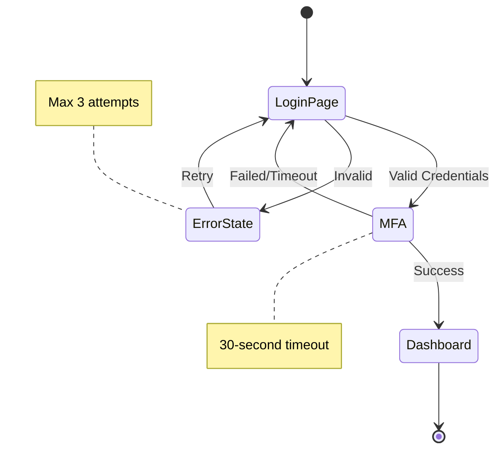

# Workflow Specifications
## User Workflows & Interaction Patterns - Banking RAG Compliance System
### Version 1.0 | 2025-09-29

---

## Table of Contents
1. [Core User Workflows](#1-core-user-workflows)
2. [Compliance Officer Workflows](#2-compliance-officer-workflows)
3. [Legal Analyst Workflows](#3-legal-analyst-workflows)
4. [Risk Manager Workflows](#4-risk-manager-workflows)
5. [Executive Workflows](#5-executive-workflows)
6. [Cross-Functional Workflows](#6-cross-functional-workflows)
7. [Interaction Patterns](#7-interaction-patterns)
8. [Error Handling & Recovery](#8-error-handling--recovery)
9. [Notification & Alert Workflows](#9-notification--alert-workflows)
10. [Mobile Workflow Adaptations](#10-mobile-workflow-adaptations)

---

## 1. Core User Workflows

### 1.1 User Journey Map Overview
```
User Journey Phases:
┌──────────┬───────────┬────────────┬─────────────┬──────────┐
│ DISCOVER │  EXPLORE  │   ENGAGE   │   ANALYZE   │  ACTION  │
├──────────┼───────────┼────────────┼─────────────┼──────────┤
│ • Login  │ • Browse  │ • Query    │ • Review    │ • Export │
│ • Alerts │ • Search  │ • Upload   │ • Compare   │ • Report │
│ • Dashbd │ • Filter  │ • Configure│ • Interpret │ • Share  │
└──────────┴───────────┴────────────┴─────────────┴──────────┘

Emotional Journey:
😟 Concerned → 🤔 Curious → 😊 Engaged → 💡 Informed → ✅ Confident
```

### 1.2 Universal Workflow Components
```
Standard Workflow Pattern:
┌────────────┐     ┌────────────┐     ┌────────────┐
│   INPUT    │ --> │  PROCESS   │ --> │   OUTPUT   │
│            │     │            │     │            │
│ • Form     │     │ • Validate │     │ • Display  │
│ • Upload   │     │ • Analyze  │     │ • Download │
│ • Select   │     │ • Generate │     │ • Share    │
└────────────┘     └────────────┘     └────────────┘
      ↑                   │                  │
      └───────────────────┴──────────────────┘
              Feedback Loop
```

### 1.3 Authentication Flow


---

## 2. Compliance Officer Workflows

### 2.1 Daily Compliance Check Workflow
```
WORKFLOW: Daily Compliance Review
━━━━━━━━━━━━━━━━━━━━━━━━━━━━━━━━━━━━━━━━━━━━━━━━━━━━━━

Step 1: Dashboard Review (2 min)
┌────────────────────────────────────────┐
│ • Check overall compliance score       │
│ • Review critical alerts               │
│ • Note trending issues                 │
│ Action: [Acknowledge] or [Investigate] │
└────────────────────────────────────────┘
                    ↓
Step 2: Alert Triage (5 min)
┌────────────────────────────────────────┐
│ For each critical alert:              │
│ • Read summary                         │
│ • Assess impact                        │
│ • Assign priority                      │
│ Action: [Delegate] [Escalate] [Resolve]│
└────────────────────────────────────────┘
                    ↓
Step 3: Regulatory Updates (10 min)
┌────────────────────────────────────────┐
│ • Review new publications              │
│ • Check deadlines                      │
│ • Identify affected areas              │
│ Action: [Create Task] [Set Reminder]   │
└────────────────────────────────────────┘
                    ↓
Step 4: Team Assignment (5 min)
┌────────────────────────────────────────┐
│ • Distribute tasks                     │
│ • Set deadlines                        │
│ • Add instructions                     │
│ Action: [Assign] [Notify Team]         │
└────────────────────────────────────────┘
                    ↓
Step 5: Documentation (3 min)
┌────────────────────────────────────────┐
│ • Log decisions                        │
│ • Update status                        │
│ • Schedule follow-ups                  │
│ Action: [Save] [Schedule Review]       │
└────────────────────────────────────────┘

Total Time: ~25 minutes
Success Metrics: All alerts triaged, tasks assigned
```

### 2.2 Regulatory Query Resolution Workflow
```
WORKFLOW: Answer Regulatory Question
━━━━━━━━━━━━━━━━━━━━━━━━━━━━━━━━━━━━━━━━━━━━━━━━━━━━━━

[START] → User receives query from business unit

Step 1: Query Input
┌────────────────────────────────────────┐
│ Navigate to Q&A Interface              │
│ ↓                                      │
│ Type or paste question                 │
│ ↓                                      │
│ Select context filters:                │
│ • Jurisdiction: [EU] [Spain]           │
│ • Date range: [Last 12 months]         │
│ • Document types: [All]                │
└────────────────────────────────────────┘
                    ↓
Step 2: Review AI Response
┌────────────────────────────────────────┐
│ Read generated answer                  │
│ ↓                                      │
│ Check confidence score (>90%?)         │
│ ├─ YES → Proceed to verification      │
│ └─ NO → Ask follow-up questions       │
└────────────────────────────────────────┘
                    ↓
Step 3: Verify Sources
┌────────────────────────────────────────┐
│ Click citation links                   │
│ ↓                                      │
│ Verify context accuracy                │
│ ↓                                      │
│ Cross-reference if needed              │
│ Decision: [Accept] [Modify] [Research] │
└────────────────────────────────────────┘
                    ↓
Step 4: Format Response
┌────────────────────────────────────────┐
│ Customize for audience:                │
│ • Technical → Include citations        │
│ • Executive → Summarize key points     │
│ • Operational → Add action items       │
└────────────────────────────────────────┘
                    ↓
Step 5: Deliver & Document
┌────────────────────────────────────────┐
│ Actions:                               │
│ [📧 Email] [💬 Teams] [📋 Add to FAQ]  │
│ [📁 Save to Knowledge Base]            │
└────────────────────────────────────────┘

[END] → Query resolved and documented

Time: 5-15 minutes | SLA: <4 hours
```

### 2.3 Quarterly Report Generation Workflow
```
WORKFLOW: Generate Quarterly Compliance Report
━━━━━━━━━━━━━━━━━━━━━━━━━━━━━━━━━━━━━━━━━━━━━━━━━━━━━━

Phase 1: PREPARATION (Day 1)
┌────────────────────────────────────────┐
│ 1. Navigate to Reports → New Report    │
│ 2. Select "Quarterly Compliance"       │
│ 3. Set parameters:                     │
│    • Period: Q3 2024                   │
│    • Jurisdictions: All                │
│    • Include: All sections             │
└────────────────────────────────────────┘
                    ↓
Phase 2: GENERATION (Day 1-2)
┌────────────────────────────────────────┐
│ 1. Click [Generate Report]             │
│ 2. System processes (~2 min)           │
│ 3. Preview generated content           │
│ 4. Review each section:                │
│    □ Executive Summary                 │
│    □ Compliance Status                 │
│    □ Regulatory Changes                │
│    □ Gap Analysis                      │
│    □ Recommendations                   │
└────────────────────────────────────────┘
                    ↓
Phase 3: CUSTOMIZATION (Day 2-3)
┌────────────────────────────────────────┐
│ For each section:                      │
│ 1. Click [Edit]                        │
│ 2. Modify content as needed            │
│ 3. Add specific examples               │
│ 4. Include department feedback         │
│ 5. Update charts/graphs                │
│ 6. Save changes                        │
└────────────────────────────────────────┘
                    ↓
Phase 4: REVIEW & APPROVAL (Day 3-4)
┌────────────────────────────────────────┐
│ 1. Share draft with stakeholders       │
│ 2. Collect feedback                    │
│ 3. Incorporate changes                 │
│ 4. Get manager approval                │
│ Status: [Draft] → [Review] → [Final]   │
└────────────────────────────────────────┘
                    ↓
Phase 5: DISTRIBUTION (Day 5)
┌────────────────────────────────────────┐
│ 1. Export final version:               │
│    [Word] [PDF] [HTML]                 │
│ 2. Upload to document repository       │
│ 3. Email to distribution list          │
│ 4. Schedule presentation               │
│ 5. Archive in system                   │
└────────────────────────────────────────┘

Timeline: 5 business days
Stakeholders: 15+ reviewers
Output: 30-50 page report
```

---

## 3. Legal Analyst Workflows

### 3.1 Cross-Jurisdiction Comparison Workflow
```
WORKFLOW: Compare Regulations Across Jurisdictions
━━━━━━━━━━━━━━━━━━━━━━━━━━━━━━━━━━━━━━━━━━━━━━━━━━━━━━

Step 1: SELECT TOPIC
┌────────────────────────────────────────┐
│ Choose regulatory area:                │
│ ○ Capital Requirements                 │
│ ● Data Protection                      │
│ ○ Market Conduct                       │
│ [Continue →]                           │
└────────────────────────────────────────┘
                    ↓
Step 2: SELECT JURISDICTIONS
┌────────────────────────────────────────┐
│ Compare between: (select 2-4)          │
│ ☑ EU (GDPR)                           │
│ ☑ Spain (National Law)                │
│ ☑ UK (UK GDPR)                        │
│ ☐ US (CCPA)                           │
│ [Start Comparison →]                   │
└────────────────────────────────────────┘
                    ↓
Step 3: ANALYSIS IN PROGRESS
┌────────────────────────────────────────┐
│ ⟳ Analyzing regulations...             │
│ ████████░░ 80%                         │
│                                        │
│ • Extracting requirements ✓            │
│ • Mapping similarities ✓               │
│ • Identifying differences ⟳            │
│ • Generating matrix...                 │
└────────────────────────────────────────┘
                    ↓
Step 4: REVIEW RESULTS
┌────────────────────────────────────────┐
│ Comparison Matrix:                     │
│ ┌─────────┬──────┬───────┬────────┐   │
│ │Aspect   │ EU   │ Spain │ UK     │   │
│ ├─────────┼──────┼───────┼────────┤   │
│ │Consent  │ Opt-in│ Opt-in│ Opt-in │   │
│ │Retention│ 5 yrs│ 6 yrs │ 5 yrs  │   │
│ │Penalties│ 4%   │ 3%    │ 4%     │   │
│ └─────────┴──────┴───────┴────────┘   │
│                                        │
│ Key Differences: [View Details]        │
│ Harmonization Score: 78%               │
└────────────────────────────────────────┘
                    ↓
Step 5: EXPORT & ACTION
┌────────────────────────────────────────┐
│ Actions:                               │
│ [📥 Download Matrix]                   │
│ [📊 Create Presentation]               │
│ [📝 Generate Memo]                     │
│ [🔗 Share with Team]                   │
└────────────────────────────────────────┘

Duration: 15-30 minutes
Output: Comparison matrix & recommendations
```

### 3.2 Regulatory Interpretation Workflow
```
WORKFLOW: Interpret Complex Regulation
━━━━━━━━━━━━━━━━━━━━━━━━━━━━━━━━━━━━━━━━━━━━━━━━━━━━━━

TRIGGER: Business unit requests interpretation

Step 1: DOCUMENT INTAKE
┌────────────────────────────────────────┐
│ Input regulation reference:            │
│ [EBA/GL/2020/06 Section 5.2.3]        │
│                                        │
│ Add business context:                  │
│ [Loan origination for SMEs_____]      │
│                                        │
│ Specific questions:                    │
│ [How does this apply to...______]     │
└────────────────────────────────────────┘
                    ↓
Step 2: AI-ASSISTED ANALYSIS
┌────────────────────────────────────────┐
│ System provides:                       │
│ • Plain language interpretation        │
│ • Key requirements breakdown           │
│ • Related provisions                   │
│ • Industry practice examples           │
│                                        │
│ Confidence: 94% ████████████░          │
└────────────────────────────────────────┘
                    ↓
Step 3: DEEP DIVE RESEARCH
┌────────────────────────────────────────┐
│ Additional research needed? [Yes]      │
│                                        │
│ • Check precedents                     │
│ • Review guidance notes                │
│ • Consult legal database               │
│ • Contact regulatory body              │
│                                        │
│ [Add Research Notes]                   │
└────────────────────────────────────────┘
                    ↓
Step 4: FORMULATE OPINION
┌────────────────────────────────────────┐
│ Legal Opinion Builder:                 │
│                                        │
│ Summary: [________________]           │
│ Requirements: [• _________]           │
│ Risks: [• _________]                  │
│ Recommendations: [• _______]          │
│                                        │
│ [Generate Document]                    │
└────────────────────────────────────────┘
                    ↓
Step 5: QUALITY CHECK & DELIVERY
┌────────────────────────────────────────┐
│ Review checklist:                      │
│ ☑ Citations complete                   │
│ ☑ Language appropriate                 │
│ ☑ Actionable recommendations           │
│ ☑ Risk assessment included             │
│                                        │
│ [Submit for Review] [Send to Requester]│
└────────────────────────────────────────┘

SLA: 24-48 hours for complex interpretations
```

---

## 4. Risk Manager Workflows

### 4.1 GAP Analysis Workflow
```
WORKFLOW: Conduct Compliance GAP Analysis
━━━━━━━━━━━━━━━━━━━━━━━━━━━━━━━━━━━━━━━━━━━━━━━━━━━━━━

Step 1: PREPARATION
┌────────────────────────────────────────┐
│ Select analysis type:                  │
│ ● Full compliance assessment           │
│ ○ Targeted review (specific area)     │
│ ○ Quick scan (high-level)             │
│                                        │
│ [Continue →]                           │
└────────────────────────────────────────┘
                    ↓
Step 2: DOCUMENT UPLOAD
┌────────────────────────────────────────┐
│ Upload internal policies:              │
│ ┌─────────────────────────────┐        │
│ │ 📎 Drop files or browse     │        │
│ │                             │        │
│ │ Files uploaded (3):         │        │
│ │ • credit_policy.pdf ✓       │        │
│ │ • risk_framework.docx ✓     │        │
│ │ • procedures_manual.pdf ✓   │        │
│ └─────────────────────────────┘        │
│                                        │
│ [Next: Select Regulations →]           │
└────────────────────────────────────────┘
                    ↓
Step 3: REGULATION SELECTION
┌────────────────────────────────────────┐
│ Choose applicable regulations:         │
│ ☑ EBA Guidelines on Loan Origination  │
│ ☑ Basel III - Credit Risk             │
│ ☑ GDPR - Data Protection              │
│ ☐ MiFID II - Investment Services      │
│ ☐ PSD2 - Payment Services             │
│                                        │
│ [Start Analysis →]                     │
└────────────────────────────────────────┘
                    ↓
Step 4: ANALYSIS EXECUTION
┌────────────────────────────────────────┐
│ Analysis Progress:                     │
│                                        │
│ Document parsing     ████████ 100%    │
│ Requirement mapping  ████████ 100%    │
│ Gap identification   ██████░░  75%    │
│ Risk assessment      ████░░░░  45%    │
│ Report generation    ░░░░░░░░   0%    │
│                                        │
│ Estimated time: 3 minutes remaining    │
└────────────────────────────────────────┘
                    ↓
Step 5: RESULTS REVIEW
┌────────────────────────────────────────┐
│ GAP ANALYSIS RESULTS                   │
│                                        │
│ Overall Compliance: 78% ████████░░     │
│                                        │
│ Gaps by Severity:                     │
│ 🔴 Critical: 3  → View Details        │
│ 🟠 High: 7      → View Details        │
│ 🟡 Medium: 15   → View Details        │
│ 🟢 Low: 23      → View Details        │
│                                        │
│ [Detailed Report] [Export] [Action Plan]│
└────────────────────────────────────────┘
                    ↓
Step 6: ACTION PLANNING
┌────────────────────────────────────────┐
│ Create Remediation Plan:               │
│                                        │
│ For each critical gap:                │
│ 1. Missing credit assessment process   │
│    Owner: [Select ▼]                  │
│    Deadline: [Date picker]            │
│    Priority: [Critical]               │
│    Actions: [Add tasks...]            │
│                                        │
│ [Save Plan] [Assign Tasks] [Schedule]  │
└────────────────────────────────────────┘

Total Duration: 30-45 minutes
Output: Detailed gap report + action plan
```

### 4.2 Risk Assessment Workflow
```
WORKFLOW: Regulatory Risk Assessment
━━━━━━━━━━━━━━━━━━━━━━━━━━━━━━━━━━━━━━━━━━━━━━━━━━━━━━

Step 1: DEFINE SCOPE
┌────────────────────────────────────────┐
│ Risk Assessment Parameters:            │
│                                        │
│ Business Area: [Retail Banking ▼]     │
│ Time Horizon: [12 months ▼]           │
│ Risk Types: ☑ Regulatory ☑ Operational│
│            ☑ Financial ☐ Reputational │
│                                        │
│ [Continue →]                           │
└────────────────────────────────────────┘
                    ↓
Step 2: IDENTIFY RISKS
┌────────────────────────────────────────┐
│ System-Identified Risks:              │
│                                        │
│ • New GDPR enforcement - HIGH          │
│ • Basel III implementation - MEDIUM   │
│ • Cyber resilience act - HIGH         │
│                                        │
│ Add Manual Risks:                     │
│ [+ Add Risk]                          │
│                                        │
│ Total Risks: 12                       │
└────────────────────────────────────────┘
                    ↓
Step 3: ASSESS PROBABILITY & IMPACT
┌────────────────────────────────────────┐
│ For: "GDPR Enforcement Risk"          │
│                                        │
│ Probability: [●●●●○] High (4/5)       │
│ Impact:      [●●●●●] Critical (5/5)   │
│                                        │
│ Risk Score: 20 (Critical)             │
│                                        │
│ Potential Loss: €[2,500,000]          │
│ Affected Areas: [All departments]     │
│                                        │
│ [Next Risk →]                         │
└────────────────────────────────────────┘
                    ↓
Step 4: MITIGATION PLANNING
┌────────────────────────────────────────┐
│ Mitigation Strategies:                │
│                                        │
│ Risk: GDPR Enforcement                │
│ Current Controls: [60%] effectiveness │
│                                        │
│ Proposed Actions:                     │
│ 1. Enhanced training program          │
│ 2. Automated compliance checks        │
│ 3. Third-party audit                  │
│                                        │
│ Residual Risk: [●●○○○] Low            │
│                                        │
│ [Save Strategy]                       │
└────────────────────────────────────────┘
                    ↓
Step 5: GENERATE RISK REPORT
┌────────────────────────────────────────┐
│ Risk Assessment Summary:              │
│                                        │
│ Total Risk Exposure: €8.5M            │
│ After Mitigation: €1.2M               │
│                                        │
│ Risk Heat Map:                        │
│ [Visual heat map displayed]           │
│                                        │
│ [Download Report] [Present] [Share]    │
└────────────────────────────────────────┘

Assessment Duration: 2-3 hours
Review Cycle: Quarterly
```

---

## 5. Executive Workflows

### 5.1 Executive Briefing Workflow
```
WORKFLOW: Prepare Executive Compliance Briefing
━━━━━━━━━━━━━━━━━━━━━━━━━━━━━━━━━━━━━━━━━━━━━━━━━━━━━━

Step 1: ACCESS EXECUTIVE DASHBOARD
┌────────────────────────────────────────┐
│ Executive Summary View                 │
│                                        │
│ Key Metrics:                          │
│ • Compliance Score: 92% ↑             │
│ • Risk Exposure: €2.3M ↓              │
│ • Open Issues: 18 →                   │
│                                        │
│ [Generate Briefing]                    │
└────────────────────────────────────────┘
                    ↓
Step 2: SELECT BRIEFING TYPE
┌────────────────────────────────────────┐
│ Briefing Format:                      │
│ ○ Board Meeting (Comprehensive)       │
│ ● Weekly Update (Summary)             │
│ ○ Emergency Brief (Critical only)     │
│                                        │
│ Include sections:                     │
│ ☑ Compliance Status                   │
│ ☑ Risk Overview                       │
│ ☑ Key Initiatives                     │
│ ☑ Regulatory Changes                  │
│                                        │
│ [Generate →]                          │
└────────────────────────────────────────┘
                    ↓
Step 3: REVIEW GENERATED CONTENT
┌────────────────────────────────────────┐
│ Executive Briefing - DRAFT             │
│                                        │
│ 1. Headlines (30 seconds)             │
│    • 92% compliant (↑3%)             │
│    • 0 critical issues                │
│    • €2.3M risk exposure             │
│                                        │
│ 2. Key Developments                   │
│    • ESMA guidelines implemented     │
│    • Basel III on track              │
│                                        │
│ [Edit] [Approve]                      │
└────────────────────────────────────────┘
                    ↓
Step 4: FORMAT FOR PRESENTATION
┌────────────────────────────────────────┐
│ Export Options:                       │
│                                        │
│ Format: [PowerPoint ▼]                │
│ ☑ Include speaker notes               │
│ ☑ Add appendix with details          │
│ ☐ Create handout version             │
│                                        │
│ Delivery: [Email] [Teams] [Print]     │
│                                        │
│ [Export & Send]                       │
└────────────────────────────────────────┘

Preparation Time: 15 minutes
Frequency: Weekly/As needed
```

### 5.2 Strategic Decision Support Workflow
```
WORKFLOW: Strategic Compliance Decision
━━━━━━━━━━━━━━━━━━━━━━━━━━━━━━━━━━━━━━━━━━━━━━━━━━━━━━

SCENARIO: New product launch compliance check

Step 1: INITIATE ASSESSMENT
┌────────────────────────────────────────┐
│ Strategic Decision Request:           │
│                                        │
│ Type: [New Product Launch ▼]          │
│ Product: [Digital Lending Platform]   │
│ Markets: [EU, Spain]                  │
│ Timeline: [Q1 2025]                   │
│                                        │
│ [Start Assessment]                     │
└────────────────────────────────────────┘
                    ↓
Step 2: REGULATORY IMPACT ANALYSIS
┌────────────────────────────────────────┐
│ Applicable Regulations:               │
│ • PSD2 - Payment services            │
│ • GDPR - Data protection             │
│ • Consumer Credit Directive          │
│ • AML Directive                      │
│                                        │
│ Compliance Requirements: 47           │
│ Estimated Compliance Cost: €450K      │
│                                        │
│ [View Details]                        │
└────────────────────────────────────────┘
                    ↓
Step 3: RISK-BENEFIT ANALYSIS
┌────────────────────────────────────────┐
│ Decision Matrix:                      │
│                                        │
│ Benefits:              Risks:         │
│ • Revenue: €12M/year  • Compliance: M │
│ • Market share: +5%   • Operational: L│
│ • Innovation leader   • Reputation: L │
│                                        │
│ Go/No-Go Score: 8.2/10 ✓             │
│                                        │
│ [Detailed Analysis]                   │
└────────────────────────────────────────┘
                    ↓
Step 4: RECOMMENDATIONS
┌────────────────────────────────────────┐
│ Executive Recommendations:            │
│                                        │
│ ✓ PROCEED with conditions:           │
│ 1. Complete compliance audit Q4 2024  │
│ 2. Allocate €500K compliance budget  │
│ 3. Hire 2 compliance specialists     │
│ 4. Implement phased rollout          │
│                                        │
│ [Approve] [Modify] [Reject]          │
└────────────────────────────────────────┘

Decision Time: 1-2 hours
Impact: Strategic/High
```

---

## 6. Cross-Functional Workflows

### 6.1 Collaborative Report Creation
```
WORKFLOW: Multi-Department Report Collaboration
━━━━━━━━━━━━━━━━━━━━━━━━━━━━━━━━━━━━━━━━━━━━━━━━━━━━━━

Step 1: INITIATE COLLABORATION
┌────────────────────────────────────────┐
│ Create Collaborative Report:          │
│                                        │
│ Title: [Annual Compliance Report]     │
│ Contributors:                         │
│ • Maria C. (Compliance) - Owner       │
│ • Carlos R. (Legal) - Contributor     │
│ • Elena M. (Risk) - Reviewer          │
│ • David L. (Executive) - Approver     │
│                                        │
│ [Create & Notify]                     │
└────────────────────────────────────────┘
                    ↓
Step 2: ASSIGN SECTIONS
┌────────────────────────────────────────┐
│ Section Assignments:                  │
│                                        │
│ Executive Summary → David L.          │
│ Regulatory Updates → Maria C.         │
│ Legal Analysis → Carlos R.            │
│ Risk Assessment → Elena M.            │
│                                        │
│ Deadline: Oct 15, 2024                │
│ [Send Assignments]                    │
└────────────────────────────────────────┘
                    ↓
Step 3: CONCURRENT EDITING
┌────────────────────────────────────────┐
│ Live Collaboration View:              │
│                                        │
│ Currently Editing:                    │
│ • Maria C. - Section 2.1 🟢           │
│ • Carlos R. - Section 3.4 🟢          │
│                                        │
│ Progress: ████████░░ 75% Complete     │
│                                        │
│ [View Changes] [Add Comment] [Chat]    │
└────────────────────────────────────────┘
                    ↓
Step 4: REVIEW & CONSOLIDATION
┌────────────────────────────────────────┐
│ Review Queue:                         │
│                                        │
│ Section 2.1 - Ready for review ✓      │
│ Section 3.4 - In progress ⟳           │
│ Section 4.2 - Needs revision ⚠        │
│                                        │
│ Comments: 12 unresolved               │
│ [Review All] [Merge Sections]         │
└────────────────────────────────────────┘
                    ↓
Step 5: FINAL APPROVAL
┌────────────────────────────────────────┐
│ Approval Workflow:                    │
│                                        │
│ Maria C. ✓ Approved                   │
│ Carlos R. ✓ Approved                  │
│ Elena M. ⟳ Reviewing...               │
│ David L. ⏳ Pending                    │
│                                        │
│ [Send Reminder] [View Report]         │
└────────────────────────────────────────┘

Timeline: 5-10 days
Participants: 4-8 team members
```

### 6.2 Regulatory Change Implementation
```
WORKFLOW: Implement New Regulation
━━━━━━━━━━━━━━━━━━━━━━━━━━━━━━━━━━━━━━━━━━━━━━━━━━━━━━

Phase 1: IMPACT ASSESSMENT (Week 1)
┌────────────────────────────────────────┐
│ New Regulation: ESMA/2024/10          │
│                                        │
│ Affected Departments:                 │
│ ☑ Trading ☑ Risk ☑ IT ☑ Compliance   │
│                                        │
│ Impact Level: HIGH                    │
│ Implementation Deadline: Dec 31, 2024 │
│                                        │
│ [Create Project]                      │
└────────────────────────────────────────┘
                    ↓
Phase 2: TASK CREATION (Week 1-2)
┌────────────────────────────────────────┐
│ Implementation Tasks:                 │
│                                        │
│ 1. System Updates (IT)                │
│    □ Update trading system            │
│    □ Modify reporting module          │
│                                        │
│ 2. Process Changes (Operations)       │
│    □ Revise procedures                │
│    □ Update documentation             │
│                                        │
│ 3. Training (HR/Compliance)          │
│    □ Create training materials        │
│    □ Schedule sessions                │
│                                        │
│ Total Tasks: 23                       │
└────────────────────────────────────────┘
                    ↓
Phase 3: EXECUTION TRACKING (Week 2-8)
┌────────────────────────────────────────┐
│ Project Dashboard:                    │
│                                        │
│ Overall Progress: ████████░░ 72%      │
│                                        │
│ By Department:                        │
│ IT:         ██████████ 100%          │
│ Operations: ████████░░  80%          │
│ Training:   ████░░░░░░  40%          │
│ Compliance: ████████░░  75%          │
│                                        │
│ [View Gantt] [Risk Register] [Issues] │
└────────────────────────────────────────┘
                    ↓
Phase 4: TESTING & VALIDATION (Week 8-10)
┌────────────────────────────────────────┐
│ Compliance Testing:                   │
│                                        │
│ Test Scenarios: 15                    │
│ ✓ Passed: 12                         │
│ ⚠ Failed: 2                          │
│ ⟳ In Progress: 1                     │
│                                        │
│ [View Results] [Retest Failed]        │
└────────────────────────────────────────┘
                    ↓
Phase 5: GO-LIVE (Week 11)
┌────────────────────────────────────────┐
│ Implementation Checklist:             │
│ ☑ All systems updated                 │
│ ☑ Staff trained (98% completion)     │
│ ☑ Documentation approved              │
│ ☑ Contingency plan ready             │
│ ☑ Management sign-off                │
│                                        │
│ Status: READY FOR GO-LIVE ✓           │
│                                        │
│ [Activate] [Schedule] [Postpone]      │
└────────────────────────────────────────┘

Total Duration: 11 weeks
Resources: 15+ team members
```

---

## 7. Interaction Patterns

### 7.1 Progressive Disclosure Pattern
```
Information Reveal Stages:
┌─────────────────────────────────────┐
│ Level 1: Summary Only               │
│ "3 Critical Compliance Issues"      │
│                [▼ Expand]           │
└─────────────────────────────────────┘
              ↓ Click
┌─────────────────────────────────────┐
│ Level 2: List View                  │
│ • GDPR Article 17 violation         │
│ • Basel III capital shortfall       │
│ • MiFID reporting gap               │
│                [▼ Show Details]      │
└─────────────────────────────────────┘
              ↓ Click
┌─────────────────────────────────────┐
│ Level 3: Full Details               │
│ GDPR Article 17 Violation:         │
│ Description: [Full text...]         │
│ Impact: High                        │
│ Required Action: [Steps...]         │
│ Deadline: Oct 15, 2024             │
│                [△ Collapse]         │
└─────────────────────────────────────┘
```

### 7.2 Contextual Help Pattern
```
Help System Layers:
┌─────────────────────────────────────┐
│ Hover for tooltip:                  │
│ ┌────────────┐                      │
│ │ Compliance │ (?) ←─ Hover         │
│ │   Score    │                      │
│ └────────────┘                      │
│        ↓                            │
│ [Compliance Score: A measure of     │
│  adherence to all applicable        │
│  regulations, calculated as...]     │
└─────────────────────────────────────┘

Click for detailed help:
┌─────────────────────────────────────┐
│ 📖 Help: Compliance Score          │
│                                     │
│ Definition, calculation method,     │
│ interpretation guide, FAQ...        │
│                                     │
│ Related: [Metrics] [Reports]        │
│                         [Close X]   │
└─────────────────────────────────────┘
```

### 7.3 Feedback Loop Pattern
```
User Action → System Response → Confirmation
┌─────────────────────────────────────┐
│ User Action:                        │
│ [Generate Report] ← Click           │
└─────────────────────────────────────┘
              ↓
┌─────────────────────────────────────┐
│ System Response:                    │
│ ⟳ Generating report...              │
│ ████████░░ 75%                      │
│ Estimated time: 30 seconds          │
└─────────────────────────────────────┘
              ↓
┌─────────────────────────────────────┐
│ Confirmation:                       │
│ ✓ Report generated successfully     │
│ "Q3 Compliance Report.pdf"         │
│ [Open] [Download] [Share]           │
└─────────────────────────────────────┘
```

---

## 8. Error Handling & Recovery

### 8.1 Error Prevention
```
Input Validation Pattern:
┌─────────────────────────────────────┐
│ Email Input:                        │
│ ┌─────────────────────────────┐     │
│ │ user@domain.co              │     │
│ └─────────────────────────────┘     │
│ ✓ Valid format                      │
│                                     │
│ Date Range:                        │
│ ┌───────────┐ to ┌───────────┐     │
│ │ Oct 1     │    │ Sep 15    │     │
│ └───────────┘    └───────────┘     │
│ ⚠ End date before start date       │
│   Please select a valid range       │
└─────────────────────────────────────┘
```

### 8.2 Error Recovery
```
Error States & Recovery Options:
┌─────────────────────────────────────┐
│ ⚠️ Connection Error                 │
│                                     │
│ Unable to fetch regulatory updates  │
│                                     │
│ What would you like to do?         │
│                                     │
│ [🔄 Retry]  Try again now          │
│ [📥 Offline] Work with cached data │
│ [⏰ Later]  Remind me in 1 hour    │
│ [💬 Help]   Contact support        │
└─────────────────────────────────────┘

Recovery Success:
┌─────────────────────────────────────┐
│ ✓ Connection restored               │
│ Updates are now syncing...         │
│ 3 new regulations found            │
└─────────────────────────────────────┘
```

### 8.3 Graceful Degradation
```
System Degradation Levels:
┌─────────────────────────────────────┐
│ Full Functionality                  │
│ All features available ✓            │
└─────────────────────────────────────┘
              ↓ Issue
┌─────────────────────────────────────┐
│ Limited Mode                        │
│ ⚠ AI features temporarily limited   │
│ • Manual search available ✓         │
│ • Basic reports available ✓        │
│ • AI analysis unavailable ✗        │
└─────────────────────────────────────┘
              ↓ Critical
┌─────────────────────────────────────┐
│ Maintenance Mode                    │
│ 🔧 System under maintenance         │
│ • Read-only access ✓               │
│ • Downloads available ✓            │
│ • Updates paused ✗                 │
│ Expected recovery: 15 minutes      │
└─────────────────────────────────────┘
```

---

## 9. Notification & Alert Workflows

### 9.1 Alert Triage Workflow
```
WORKFLOW: Critical Alert Response
━━━━━━━━━━━━━━━━━━━━━━━━━━━━━━━━━━━━━━━━━━━━━━━━━━━━━━

TRIGGER: Critical compliance alert received

Step 1: NOTIFICATION
┌─────────────────────────────────────┐
│ 🔴 CRITICAL ALERT                   │
│                                     │
│ New ESMA enforcement action         │
│ Immediate attention required        │
│                                     │
│ [View Now] [Snooze 15m] [Dismiss]  │
└─────────────────────────────────────┘
              ↓ View
Step 2: ASSESSMENT
┌─────────────────────────────────────┐
│ Alert Details:                      │
│                                     │
│ Type: Regulatory Enforcement        │
│ Authority: ESMA                    │
│ Deadline: 48 hours                 │
│ Impact: All trading operations     │
│                                     │
│ Required Actions:                  │
│ 1. Review trading procedures       │
│ 2. Submit compliance attestation   │
│                                     │
│ [Accept & Action] [Delegate]        │
└─────────────────────────────────────┘
              ↓
Step 3: ACTION ASSIGNMENT
┌─────────────────────────────────────┐
│ Create Action Items:               │
│                                     │
│ Task 1: Review procedures          │
│ Assign to: [Trading Team ▼]        │
│ Due: [Tomorrow 5 PM]               │
│                                     │
│ Task 2: Prepare attestation        │
│ Assign to: [Legal Team ▼]          │
│ Due: [Oct 3, 12 PM]               │
│                                     │
│ [Create & Notify Teams]             │
└─────────────────────────────────────┘
              ↓
Step 4: TRACKING
┌─────────────────────────────────────┐
│ Alert Status Dashboard:            │
│                                     │
│ ESMA Enforcement Response          │
│ Progress: ████████░░ 75%           │
│                                     │
│ ✓ Alert acknowledged               │
│ ✓ Teams notified                   │
│ ⟳ Review in progress               │
│ ⏳ Attestation pending              │
│                                     │
│ Time remaining: 36 hours           │
└─────────────────────────────────────┘

Response SLA: 1 hour for critical
Resolution SLA: As per regulatory deadline
```

### 9.2 Notification Preferences
```
User Notification Settings:
┌─────────────────────────────────────┐
│ Configure Notifications             │
│                                     │
│ Critical Alerts:                   │
│ ☑ Email (immediate)                │
│ ☑ SMS (immediate)                  │
│ ☑ In-app (immediate)               │
│ ☑ Desktop push                     │
│                                     │
│ High Priority:                     │
│ ☑ Email (immediate)                │
│ ☐ SMS                              │
│ ☑ In-app (immediate)               │
│                                     │
│ Regular Updates:                   │
│ ☑ Daily digest (9 AM)              │
│ ☐ Weekly summary                   │
│                                     │
│ Quiet Hours:                       │
│ ☑ Enabled (10 PM - 7 AM)          │
│ Exception: Critical alerts only    │
│                                     │
│ [Save Preferences]                  │
└─────────────────────────────────────┘
```

---

## 10. Mobile Workflow Adaptations

### 10.1 Mobile Quick Actions
```
Mobile-Optimized Workflow:
┌─────────────────────────┐
│ Quick Compliance Check  │
│                         │
│ [Swipe down to refresh] │
│                         │
│ Score: 92% ████████░    │
│                         │
│ Critical Alerts (3)     │
│ ┌─────────────────────┐ │
│ │ ESMA Update        │ │
│ │ Swipe → Action     │ │
│ └─────────────────────┘ │
│                         │
│ Quick Actions:          │
│ ┌──────┬──────┬──────┐ │
│ │ Ask  │Report│ Scan │ │
│ │  Q   │      │ Doc  │ │
│ └──────┴──────┴──────┘ │
│                         │
│ [View Full Dashboard]   │
└─────────────────────────┘
```

### 10.2 Mobile Document Review
```
Document Review on Mobile:
┌─────────────────────────┐
│ < EBA Guidelines   ⋮    │
├─────────────────────────┤
│ Pinch to zoom          │
│ ┌─────────────────────┐ │
│ │                     │ │
│ │   [Document View]   │ │
│ │                     │ │
│ │  Double tap to      │ │
│ │  fit text           │ │
│ │                     │ │
│ └─────────────────────┘ │
│                         │
│ Key Points:             │
│ • Requirement 1         │
│ • Requirement 2         │
│                         │
│ Actions:                │
│ [💬 Ask] [📤 Share]     │
└─────────────────────────┘
```

### 10.3 Mobile Voice Input
```
Voice-Enabled Workflow:
┌─────────────────────────┐
│ Regulatory Assistant    │
│                         │
│ Tap to speak:           │
│ ┌─────────────────────┐ │
│ │      🎤             │ │
│ │  "What are the..."  │ │
│ │                     │ │
│ └─────────────────────┘ │
│                         │
│ Listening...            │
│ ████████████            │
│                         │
│ Transcription:          │
│ "What are the capital  │
│ requirements for credit │
│ risk under Basel III?"  │
│                         │
│ [Send] [Edit] [Cancel]  │
└─────────────────────────┘
```

---

## Workflow Performance Metrics

### Key Performance Indicators
```
Workflow Efficiency Metrics:
┌─────────────────────────────────────────┐
│ Workflow            Avg Time  Success% │
│ ──────────────────────────────────────  │
│ Daily Check         18 min    98%      │
│ Query Resolution    8 min     95%      │
│ Report Generation   45 min    92%      │
│ GAP Analysis       35 min     89%      │
│ Alert Response     12 min     97%      │
│                                         │
│ User Satisfaction: 4.3/5.0             │
│ Task Completion Rate: 94%              │
│ Error Recovery Rate: 98%               │
└─────────────────────────────────────────┘
```

---

## Implementation Priorities

### Phase 1: Core Workflows (Weeks 1-4)
1. Authentication and onboarding
2. Daily compliance checks
3. Regulatory Q&A
4. Basic reporting

### Phase 2: Advanced Workflows (Weeks 5-8)
1. GAP analysis
2. Cross-jurisdiction comparison
3. Collaborative features
4. Risk assessment

### Phase 3: Optimization (Weeks 9-12)
1. Mobile adaptations
2. Voice interfaces
3. Advanced analytics
4. Performance tuning

---

## Conclusion

These workflow specifications provide a comprehensive guide for implementing user-centric interaction patterns in the Banking RAG Compliance System. The designs prioritize:

1. **Efficiency**: Streamlined workflows reduce task completion time
2. **Clarity**: Clear steps and feedback at every stage
3. **Flexibility**: Multiple paths to accomplish goals
4. **Recovery**: Robust error handling and recovery options
5. **Accessibility**: Mobile and voice-enabled alternatives

The workflows are designed to scale across different user roles while maintaining consistency in interaction patterns, ensuring a cohesive user experience throughout the platform.

---

*End of Workflow Specifications Document*